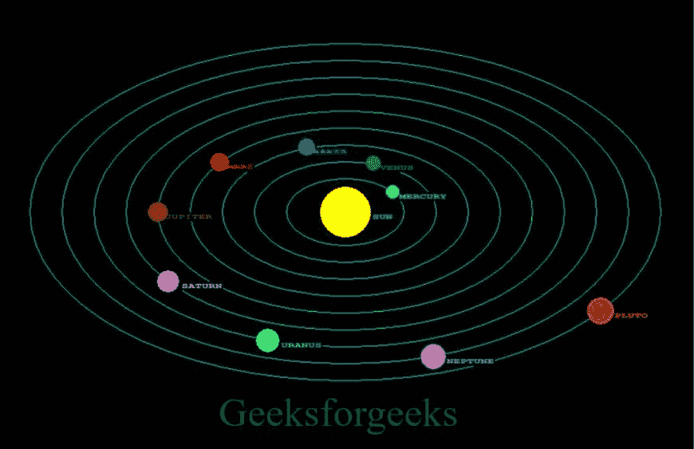

# 利用计算机图形学绘制太阳系的 C 程序

> 原文:[https://www . geesforgeks . org/c-program-to-draw-a-solar-system-use-computer-graphics/](https://www.geeksforgeeks.org/c-program-to-draw-a-solar-system-using-computer-graphics/)

**先决条件:** [图形. h](https://www.geeksforgeeks.org/include-graphics-h-codeblocks/)[在代码块](https://www.geeksforgeeks.org/include-graphics-h-codeblocks/)中包含图形. h

**所需头文件:**

*   #包括<stdio.h></stdio.h>
*   #包括
*   #包括<graphics.h></graphics.h>
*   #包括
*   #包括<math.h></math.h>

[**功能**](https://www.geeksforgeeks.org/functions-in-c/) **使用:**

*   [getmaxx()](https://www.geeksforgeeks.org/getmaxx-function-c/) :返回当前图形模式和驱动的最大 X 坐标。
*   [setcolor()](https://www.geeksforgeeks.org/setcolor-function-c) :用于将当前绘图颜色设置为新颜色。
*   [outextxy()](https://www.geeksforgeeks.org/outtextxy-function-c/):用于显示屏幕上指定点(x，y)的文本或字符串。
*   [矩形()](https://www.geeksforgeeks.org/draw-rectangle-c-graphics/):用于绘制矩形。
    *   绘制矩形需要左上角和右下角的坐标。
    *   左指定左上角的 X 坐标，上指定左上角的 Y 坐标，右指定右下角的 X 坐标，下指定右下角的 Y 坐标。

**进场:**

*   要画一个太阳系，从一个同心椭圆开始，因为所有行星的路径都是椭圆的。
*   在椭圆的中心做一个圆，用黄色颜料填充，代表太阳。
*   [画不同的圆](https://www.geeksforgeeks.org/draw-circle-c-graphics/)，用不同的颜色填充它们，然后选择正确的坐标将这些都放置在椭圆的路径中。
*   改变所有行星的位置，使它们看起来像是在椭圆上运动。

下面是 [C 程序](https://www.geeksforgeeks.org/c/)使用上面讨论的函数绘制太阳系:

## C

```
// C program to draw solar system using
// computer graphics
#include <conio.h>
#include <dos.h>
#include <graphics.h>
#include <math.h>
#include <stdio.h>

// Function to manipulates the position
// of planets on the orbit
void planetMotion(int xrad, int yrad,
                  int midx, int midy,
                  int x[70], int y[70])
{
    int i, j = 0;

    // Positions of planets in their
    // corresponding orbits
    for (i = 360; i > 0; i = i - 6) {
        x[j] = midx - (xrad * cos((i * 3.14) / 180));
        y[j++] = midy - (yrad * sin((i * 3.14) / 180));
    }

    return;
}

// Driver Code
int main()
{

    // Initialize graphic driver
    int gdriver = DETECT, gmode, err;
    int i = 0, midx, midy;
    int xrad[9], yrad[9], x[9][70], y[9][70];
    int pos[9], planet[9], tmp;

    // Initialize graphics mode by
    // passing the three arguments
    // to initgraph()

    // &gdriver is the address of gdriver
    // variable, &gmode is the address of
    // gmode and  "C:\\Turboc3\\BGI" is the
    // directory path where BGI files
    // are stored
    initgraph(&gdriver, &gmode, "");
    err = graphresult();

    if (err ! = grOk) {

        // Error occurred
        printf("Graphics Error: %s",
               grapherrormsg(err));
        return 0;
    }

    // Mid positions at x and y-axis
    midx = getmaxx() - 220;
    midy = getmaxy() - 150;

    // Manipulating radius of all
    // the nine planets
    Planet[0] = 8;
    for (i = 1; i < 9; i++) {
        planet[i] = planet[i - 1] + 1;
    }

    // Offset position for the planets
    // on their corresponding orbit
    for (i = 0; i < 9; i++) {
        pos[i] = i * 6;
    }

    // Orbits for all 9 planets
    Xrad[0] = 70, yrad[0] = 40;
    for (i = 1; i < 9; i++) {
        xrad[i] = xrad[i - 1] + 38;
        yrad[i] = yrad[i - 1] + 20;
    }

    // Positions of planets on their
    // corresponding orbits
    for (i = 0; i < 9; i++) {
        planetMotion(xrad[i], yrad[i],
                     midx, midy, x[i],
                     y[i]);
    }

    while (!kbhit()) {

        // Drawing 9 orbits
        Setcolor(WHITE);
        for (i = 0; i < 9; i++) {
            setcolor(CYAN);
            ellipse(midx, midy, 0, 360,
                    xrad[i], yrad[i]);
        }

        // Sun at the mid of solar system
        outtextxy(midx, midy, "    SUN");
        setcolor(YELLOW);
        setfillstyle(SOLID_FILL, YELLOW);
        circle(midx, midy, 30);
        floodfill(midx, midy, YELLOW);

        // Mercury in first orbit
        Setcolor(CYAN);

        Setfillstyle(SOLID_FILL, CYAN);
        Outtextxy(x[0][pos[0]],
                  y[0][pos[0]],
                  " MERCURY");

        Pieslice(x[0][pos[0]],
                 y[0][pos[0]],
                 0, 360, planet[0]);

        // Venus in second orbit
        Setcolor(GREEN);
        Setfillstyle(SOLID_FILL, GREEN);
        Outtextxy(x[1][pos[1]],
                  y[1][pos[1]],
                  " VENUS");
        Pieslice(x[1][pos[1]],
                 y[1][pos[1]],
                 0, 360, planet[1]);

        // Earth in third orbit
        Setcolor(BLUE);
        Setfillstyle(SOLID_FILL, BLUE);
        Outtextxy(x[2][pos[2]],
                  y[2][pos[2]],
                  " EARTH");
        Pieslice(x[2][pos[2]],
                 y[2][pos[2]],
                 0, 360, planet[2]);

        // Mars in fourth orbit
        Setcolor(RED);
        Setfillstyle(SOLID_FILL, RED);
        Outtextxy(x[3][pos[3]],
                  y[3][pos[3]],
                  " MARS");
        Pieslice(x[3][pos[3]],
                 y[3][pos[3]],
                 0, 360, planet[3]);

        // Jupiter in fifth orbit
        setcolor(BROWN);
        setfillstyle(SOLID_FILL, BROWN);
        outtextxy(x[4][pos[4]],
                  y[4][pos[4]],
                  " JUPITER");
        pieslice(x[4][pos[4]],
                 y[4][pos[4]],
                 0, 360, planet[4]);

        // Saturn in sixth orbit
        Setcolor(LIGHTGRAY);
        Setfillstyle(SOLID_FILL, LIGHTGRAY);
        Outtextxy(x[5][pos[5]],
                  y[5][pos[5]],
                  "  SATURN");
        Pieslice(x[5][pos[5]],
                 y[5][pos[5]],
                 0, 360, planet[5]);

        // Uranus in seventh orbit
        Setcolor(LIGHTGREEN);
        Setfillstyle(SOLID_FILL, LIGHTGREEN);
                Outtextxy (x [6] [pos [6]],
                           y [6] [pos [6]],
                           “  URANUS");
                pieslice (x [6] [pos [6]],
                          y [6] [pos [6]],
                          0, 360, planet [6]);

        // Neptune in eighth orbit
        Setcolor (LIGHTBLUE);
        Setfillstyle (SOLID_FILL, LIGHTBLUE);
        Outtextxy (x [7] [pos [7]],
                   y [7] [pos [7]],
                   "  NEPTUNE");
        Pieslice (x [7] [pos [7]],
                  y [7] [pos [7]],
                  0, 360, planet [7]);

        // Pluto in ninth orbit
        Setcolor (LIGHTRED);
        Setfillstyle (SOLID_FILL, LIGHTRED);
        Outtextxy (x [8] [pos [8]],
                   y [8] [pos [8]],
                   "  PLUTO");
        Pieslice (x [8] [pos [8]],
                  y [8] [pos [8]],
                  0, 360, planet [8]);

        // Checking for one complete
        // rotation
        for (i = 0; i < 9; i++) {
            if (pos[i] <= 0) {
                pos[i] = 59;
            }
            else {
                pos[i] = pos[i] - 1;
            }
        }

        // Sleep for 100 milliseconds
        Delay (100);

        // Clears graphic screen
        Cleardevice ();
    }

    // Deallocate memory allocated
    // for graphic screen
    closegraph();

    return 0;
}
```

**输出:**

[](https://media.geeksforgeeks.org/wp-content/uploads/20210422122934/out.JPG)