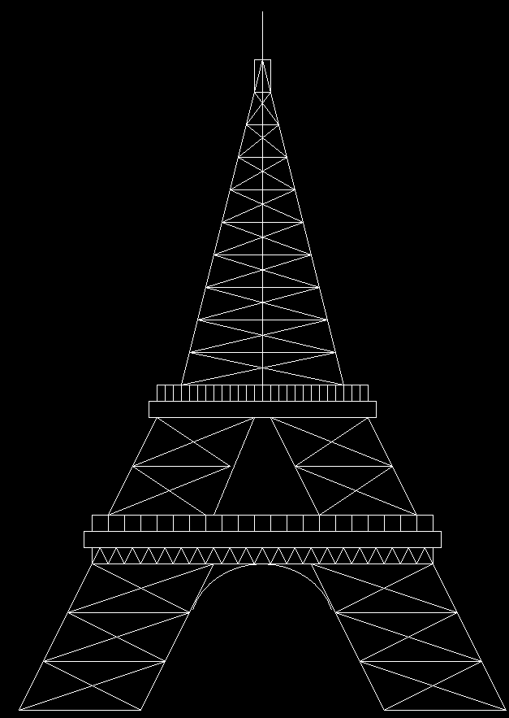

# 用计算机图形学绘制埃菲尔铁塔的 C 程序

> 原文:[https://www . geeksforgeeks . org/c-程序绘制-埃菲尔铁塔-使用计算机绘图/](https://www.geeksforgeeks.org/c-program-to-draw-eiffel-tower-using-computer-graphics/)

在 [<u>C 图形</u>](https://www.geeksforgeeks.org/add-graphics-h-c-library-gcc-compiler-linux/) 中， [<u>graphics.h</u>](https://www.geeksforgeeks.org/include-graphics-h-codeblocks/) 函数用于绘制不同的形状，如圆形、矩形等，以不同的格式(不同的字体和颜色)显示文本(任何消息)。通过使用**图形。h** 可以制作程序、动画和游戏。

**使用的功能:**

*   [**矩形(l，t，r，b)**](https://www.geeksforgeeks.org/draw-rectangle-c-graphics/)**:**graphics . h 头文件中的一个函数，从左(l)到右(r) &从上(t)到下(b)绘制一个矩形。
*   [**线(a1，b1，a2，b2)**](https://www.geeksforgeeks.org/draw-line-c-graphics/)**:**graphics . h 头文件中的一个函数，从(a1，b1)点到(a2，B2)点绘制一条线。
*   [**椭圆(int x，int y，int start_angle，int end_angle，int x_radius，int y_radius)**](https://www.geeksforgeeks.org/draw-ellipse-c-graphics/) **:** 一个来自 graphics.h 头文件的函数，其中 x，y 是椭圆的位置。x_radius 和 y_radius 决定了表格 x 和 y 的半径，start_angle 是角度的起点，end_angle 是角度的终点。角度值可以在 0 到 360 度之间变化。

**进场:**

*   第一步是制作塔的左侧底座。左侧底座完全由 line()函数构建而成。
*   在底座的左侧，总共构建四条线。这些线条相互平铺。然后用一条切线连接线的左侧，用另一条切线连接线的右侧。此外，通过用一条线连接每个底座的相对侧来进行内部装饰。这项工作必须通过使用 line()函数来完成。
*   右侧也要做同样的事情，类似于左侧。但不同的是，需要倾斜对面的底座。
*   然后用线()连接两边[功能](https://www.geeksforgeeks.org/functions-in-c/)。
*   下一步是用椭圆()函数做一个半圆。
*   使用矩形()函数实现三个矩形。所有这些矩形都将用于装饰功能。
*   在矩形中，一个将被装饰成一个连续的三角形，这个三角形将由 line()函数实现。这些连续的三角形装饰将使用[同时循环](https://www.geeksforgeeks.org/c-c-while-loop-with-examples/)来完成。
*   另一个矩形将被以相同距离分开的垂直线装饰。这些垂直线由另一个 while 循环中的 line()函数实现。
*   下面的步骤也必须在这里进行。完整的方法在这里也完全一样。但是在这里，我们实现了三个基地，而不是四个。
*   用 line()函数连接两边。
*   使用 rectangle()函数实现两个矩形。在它们之间，上面的一个要用一些相互间隔相同距离的垂直线来装饰。这些行将由 while 循环中的 line()函数实现。
*   做一个 while 循环，它将划分剩余塔的高度，并在一个 while 循环中创建一些装饰。整个操作将由 line()函数实现。
*   用直线函数连接两边。使用上方的矩形()函数创建一个矩形，使用直线()函数创建一条直线。

下面是上述方法的实现:

## C

```cpp
// C program for the above approach
#include <conio.h>
#include <graphics.h>
#include <stdio.h>

// Driver Code
void main()
{
    int gd = DETECT, gm;

    // Initialize of gdriver with
    // DETECT macros
    initgraph(&gd, &gm, "C:\\turboc3\\bgi");

    // Declared Variables
    int a = 390, b = 390, c = 700;

    // Left Side
    // Lower Base
    line(300, 1000, 450, 1000);

    // Inside Decoration
    line(300, 1000, 480, 940);
    line(450, 1000, 330, 940);

    // 1st Base
    line(330, 940, 480, 940);

    // Inside Decoration
    line(330, 940, 510, 880);
    line(480, 940, 360, 880);

    // 2nd Base
    line(360, 880, 510, 880);

    // Inside Decoration
    line(360, 880, 540, 820);
    line(390, 820, 510, 880);

    // 3rd Base
    line(390, 820, 540, 820);

    // Left Tangent
    line(300, 1000, 390, 820);

    // Right Tangent
    line(450, 1000, 540, 820);

    // Joining Line
    line(390, 820, 810, 820);

    // Half Circle
    ellipse(600, 900, 15, 165, 90, 80);

    // Right Side
    // Lower Base
    line(750, 1000, 900, 1000);

    // Inside Decoration
    line(750, 1000, 870, 940);
    line(720, 940, 900, 1000);

    // 1st Base
    line(720, 940, 870, 940);

    // Inside Decoration
    line(720, 940, 840, 880);
    line(870, 940, 690, 880);

    // 2nd Base
    line(690, 880, 840, 880);

    // Inside Decoration
    line(690, 880, 810, 820);
    line(840, 880, 660, 820);

    // 3rd Base
    line(660, 820, 810, 820);

    // Left Tangent
    line(750, 1000, 660, 820);

    // Right Tangent
    line(900, 1000, 810, 820);

    // Rectangles For Decoration
    rectangle(390, 800, 810, 820);
    rectangle(380, 780, 820, 800);
    rectangle(390, 760, 810, 780);

    // Triangle Decoration
    while (a <= 790) {
        line(a, 820, a + 10, 800);
        line(a + 10, 800, a + 20, 820);
        a = a + 20;
    }

    // Vertical Line Decoration
    while (b <= 810) {
        line(b, 760, b, 780);
        b = b + 20;
    }

    // Left Side
    // Upper Base
    line(410, 760, 530, 760);

    // Inside Decoration
    line(410, 760, 560, 700);
    line(530, 760, 440, 700);

    // 1st Base
    line(440, 700, 560, 700);

    // Inside Decoration
    line(440, 700, 590, 640);
    line(560, 700, 470, 640);

    // 2nd base
    line(470, 640, 590, 640);

    // Left Tangent
    line(410, 760, 470, 640);

    // Right Tangent
    line(540, 760, 590, 640);

    // Right Side
    // Upper Base
    line(670, 760, 790, 760);

    // Inside Decoration
    line(670, 760, 760, 700);
    line(790, 760, 640, 700);

    // 1st Base
    line(640, 700, 760, 700);

    // Inside Decoration
    line(640, 700, 730, 640);
    line(760, 700, 610, 640);

    // 2nd Base
    line(610, 640, 730, 640);

    // Left Tangent
    line(670, 760, 610, 640);

    // Right Tangent
    line(790, 760, 730, 640);

    // Joining Line
    line(470, 640, 730, 640);

    // Rectangle For Decoration
    rectangle(460, 620, 740, 640);
    rectangle(470, 600, 730, 620);

    // Redeclaring Variable
    b = 470;

    // Vertical Line Decoration
    while (b <= 730) {
        line(b, 600, b, 620);
        b = b + 10;
    }

    // Redeclaring Variable
    a = 600;
    b = 500;

    // Middle Line
    line(600, 600, 600, 140);

    // Upper Most Decoration
    while (b >= 240) {
        if (b == c)
            break;
        else {
            line(b, a, c, a);
            line(b, a, c - 10, a - 40);
            line(b + 10, a - 40, c, a);
            a = a - 40;
            b = b + 10;
            c = c - 10;
        }
    }

    // Tangent Lines
    line(500, 600, 590, 240);
    line(700, 600, 610, 240);
    rectangle(590, 200, 610, 240);

    // Holding The Screen For A While
    getch();

    // Close the initialized gdriver
    closegraph();
}
```

**输出:**

