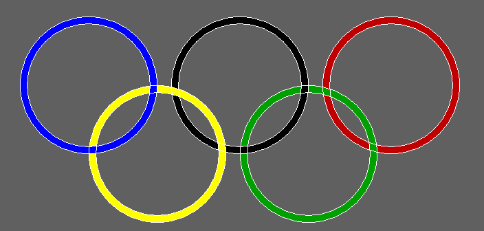

# 用图形绘制奥运标志的 C 程序

> 原文:[https://www . geesforgeks . org/c-program-to-draw-the-Olympics-logo-use-graphics/](https://www.geeksforgeeks.org/c-program-to-draw-the-olympics-logo-using-graphics/)

在这篇文章中，我们将讨论如何使用[图形](https://www.geeksforgeeks.org/basic-graphic-programming-in-c/)设计奥林匹克标志。

#### 方法:

*   使用[圆()](https://www.geeksforgeeks.org/draw-circle-c-graphics/)功能，根据标志中的位置画五个圆。
*   为了达到轮廓效果，在上面画 5 个小圆圈。
*   徽标中也有一个黑色圆圈，为了防止它混入，请更改背景颜色。
*   使用功能 [setfillstyle()和 floodfill()](https://www.geeksforgeeks.org/setfillstyle-floodfill-c/) 将所有圆圈和背景涂上各自的颜色。

下面是上述方法的实现:

## C

```
// C program for the above approach

#include <conio.h>
#include <graphics.h>
#include <stdio.h>

// Driver Code
void main()
{
    int gd = DETECT, gm;

    // Initialize of gdriver
    initgraph(&gd, &gm, "C:\\turboc3\\bgi");

    // Create Background color as Grey
    setfillstyle(SOLID_FILL, DARKGRAY);
    floodfill(50, 50, 15);

    // Create two circles in each
    // another & color Blue
    setfillstyle(SOLID_FILL, BLUE);
    circle(300, 300, 100);
    circle(300, 300, 90);
    floodfill(202, 300, 15);

    // Create two circles in each
    // another & color Yellow
    setfillstyle(SOLID_FILL, YELLOW);
    circle(400, 400, 100);
    circle(400, 400, 90);
    floodfill(322, 350, 15);
    floodfill(302, 400, 15);

    // Create two circles in each
    // another & color Black
    setfillstyle(SOLID_FILL, BLACK);
    circle(520, 300, 100);
    circle(520, 300, 90);
    floodfill(442, 350, 15);
    floodfill(422, 300, 15);

    // Create two circles in each
    // another & color Green
    setfillstyle(SOLID_FILL, GREEN);
    circle(620, 400, 100);
    circle(620, 400, 90);
    floodfill(522, 400, 15);
    floodfill(542, 350, 15);

    // Create two circles in each
    // another & color Red
    setfillstyle(SOLID_FILL, RED);
    circle(740, 300, 100);
    circle(740, 300, 90);
    floodfill(642, 300, 15);
    floodfill(662, 350, 15);

    // Hold the screen for a while
    getch();

    // Close the initialized gdriver
    closegraph();
}
```

**输出:**

[](https://media.geeksforgeeks.org/wp-content/uploads/20210404171819/OUTPUT.png)