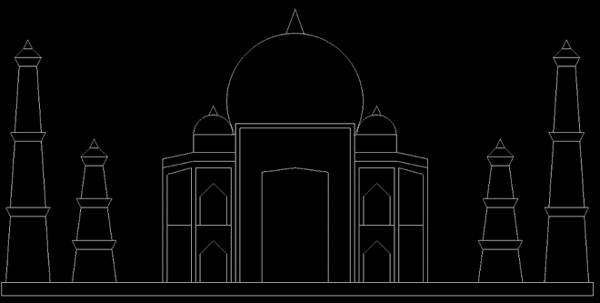

# 使用图形绘制泰姬陵的 C 程序

> 原文:[https://www . geesforgeks . org/c-program-to-draw-Taj-Mahal-using-graphics/](https://www.geeksforgeeks.org/c-program-to-draw-the-taj-mahal-using-graphics/)

在 Turbo C 图形中， [**graphics.h**](https://www.geeksforgeeks.org/include-graphics-h-codeblocks/) 函数用于绘制不同的形状(如圆形、矩形等)，以不同的格式(不同的字体和颜色)显示文本(任何消息)。通过使用 graphics.h 程序，可以设计动画和游戏。这些对初学者很有用。

**使用的功能:**

*   **弧(x，y，start_ang，end_ang，r):**graphics . h 头文件中的一个函数，它画一个以(x，y)为中心的弧，start_ang 为其起始角，end_ang 为其终止角，r 为半径。
*   [**矩形(l，t，r，b)**](https://www.geeksforgeeks.org/draw-rectangle-c-graphics/?ref=rp)**:**graphics . h 头文件中的一个函数，它从左(l)到右(r)和从上(t)到下(b)绘制一个矩形。
*   [**线(a1，b1，a2，b2)**](https://www.geeksforgeeks.org/draw-line-c-graphics/?ref=rp)**:**graphics . h 头文件中的一个函数，从(a1，b1)点到(a2，B2)点绘制一条线。

**进场:**

*   这里定义了三个函数 taj_body()，left _ minars()和 right _ minars()。
*   在 main()函数中，调用第一个 taj_body()函数。在这个函数中，泰姬陵的建筑是使用矩形()函数从矩形基底开始创建的。
*   然后使用矩形()函数制作两个矩形。在较小的矩形中，门是使用 line()函数制作的。
*   然后使用 arc()函数制作洋葱圆顶。在那个圆顶上，通过使用 line()函数创建了一个顶点。
*   在圆顶的两侧，使用 arc()函数创建了两个较小的圆顶，并且使用 line()函数绘制了一个 Finial。
*   然后在少数情况下主要使用 line()函数和 rectangle()函数实现了其他装饰。这些装饰必须在泰姬陵的两侧实施。
*   完成 taj_body()函数后，调用 left_minars()函数来实现 Left Side Minarets。这两座尖塔完全是通过使用 line()函数和计算制作的。
*   然后调用 right_minars()函数实现 Right Side Minarets。这两座宣礼塔也完全是通过使用 line()函数和计算制作的。

## C

```
// C program to implement
// the above approach
#include <conio.h>
#include <graphics.h>
#include <stdio.h>

// Declaring functions used
// in this program
void taj_body();
void left_minars();
void right_minars();

// Driver Code
void main()
{
    int gd = DETECT, gm;

    // Initialize of gdriver with
    // DETECT macros
    initgraph(&gd, &gm, "C:\\turboc3\\bgi");

    // Calling taj_body() function
    taj_body();

    // Calling left_minars() function
    left_minars();

    // Calling right_minars() function
    right_minars();

    // Holding screen for a while
    getch();

    // Close the initialized gdriver
    closegraph();
}

void taj_body()
{
    // Main Base
    rectangle(10, 650, 1350, 680);
    rectangle(550, 300, 800, 650);
    rectangle(540, 290, 810, 650);

    // Left Door Line
    line(600, 650, 600, 400);

    // Right Door Line
    line(750, 650, 750, 400);

    line(600, 400, 675, 390);
    line(675, 390, 750, 400);
    arc(675, 240, 330, 210, 155);

    // Main Finial
    line(655, 85, 675, 30);
    line(675, 30, 695, 87);

    // Left Side
    line(540, 315, 445, 315);
    arc(490, 315, 0, 180, 45);

    // Left Finial
    line(480, 270, 490, 250);
    line(490, 250, 500, 270);

    // Left Vertical Line
    line(445, 315, 445, 355);

    // Lower Left Join
    line(445, 355, 540, 355);

    // Again Lower Left Join
    line(445, 375, 540, 375);

    // Left Tangent
    line(445, 355, 375, 370);

    // Lower Left Tangent
    line(445, 375, 375, 390);

    // Left Last Vertical
    line(375, 370, 375, 650);

    // Middle Left Rectangle
    rectangle(450, 390, 530, 650);

    // Left Rectangle Divider
    line(450, 520, 530, 520);

    // Left Rectangle Side Structure
    line(440, 650, 440, 390);
    line(385, 650, 385, 405);
    line(440, 390, 385, 405);

    // Divider
    line(440, 520, 385, 520);

    // Creating Left Lower Spike
    line(460, 650, 460, 585);
    line(520, 650, 520, 585);
    line(460, 585, 490, 555);
    line(520, 585, 490, 555);

    // Creating Left Upper Spike
    line(460, 520, 460, 455);
    line(520, 520, 520, 455);
    line(460, 455, 490, 425);
    line(520, 455, 490, 425);

    // Right Side
    line(810, 315, 905, 315);
    arc(860, 315, 0, 180, 45);

    // Right Finial
    line(850, 270, 860, 250);
    line(860, 250, 870, 270);

    // Right Vertical Line
    line(905, 315, 905, 355);
    line(905, 355, 810, 355);

    // Lower Right Join
    line(905, 355, 810, 355);

    // Again Right Left Join
    line(905, 375, 810, 375);

    // Right Tangent
    line(905, 355, 975, 370);

    // Lower Right Tangent
    line(905, 375, 975, 390);

    // Right Last Vertical
    line(975, 370, 975, 650);

    // Middle Right Rectangle
    rectangle(820, 390, 900, 650);

    // Right Rectangle Divider
    line(820, 520, 900, 520);

    // Right Rectangle Side Structure
    line(910, 650, 910, 390);
    line(965, 650, 965, 405);
    line(910, 390, 965, 405);

    // Divider
    line(910, 520, 965, 520);

    // Creating Right Lower Spike
    line(830, 650, 830, 585);
    line(890, 650, 890, 585);
    line(830, 585, 860, 555);
    line(890, 585, 860, 555);

    // Creating Right Upper Spike
    line(830, 520, 830, 455);
    line(890, 520, 890, 455);
    line(830, 455, 860, 425);
    line(890, 455, 860, 425);
}

void left_minars()
{
    // 1st Left Minar
    // 1st Step
    line(20, 650, 30, 500);
    line(120, 650, 110, 500);
    line(110, 500, 30, 500);

    // 2nd Step
    line(30, 500, 20, 480);
    line(110, 500, 120, 480);
    line(120, 480, 20, 480);
    line(30, 480, 40, 330);
    line(110, 480, 100, 330);
    line(40, 330, 100, 330);
    line(40, 330, 30, 310);
    line(100, 330, 110, 310);
    line(110, 310, 30, 310);

    // 3rd Step
    line(40, 310, 50, 160);
    line(100, 310, 90, 160);
    line(50, 160, 90, 160);
    line(50, 160, 40, 140);
    line(90, 160, 100, 140);
    line(40, 140, 100, 140);
    line(40, 140, 60, 120);
    line(100, 140, 80, 120);
    line(60, 120, 80, 120);
    line(60, 120, 70, 100);
    line(70, 100, 80, 120);

    // 2nd Left Minar
    // 1st Step
    line(170, 650, 180, 575);
    line(270, 650, 260, 575);
    line(180, 575, 260, 575);

    // 2nd Step
    line(180, 575, 170, 555);
    line(260, 575, 270, 555);
    line(170, 555, 270, 555);
    line(180, 555, 190, 480);
    line(260, 555, 250, 480);
    line(190, 480, 250, 480);

    // 3rd Step
    line(190, 480, 180, 460);
    line(250, 480, 260, 460);
    line(180, 460, 260, 460);
    line(190, 460, 200, 385);
    line(250, 460, 240, 385);
    line(200, 385, 240, 385);
    line(200, 385, 190, 365);
    line(240, 385, 250, 365);
    line(190, 365, 250, 365);
    line(190, 365, 210, 345);
    line(250, 365, 230, 345);
    line(210, 345, 230, 345);
    line(210, 345, 220, 325);
    line(220, 325, 230, 345);
}

void right_minars()
{
    // 1st Right Minar
    // 1st Step
    line(1340, 650, 1330, 500);
    line(1240, 650, 1250, 500);
    line(1330, 500, 1250, 500);

    // 2nd Step
    line(1330, 500, 1340, 480);
    line(1250, 500, 1240, 480);
    line(1240, 480, 1340, 480);
    line(1330, 480, 1320, 330);
    line(1250, 480, 1260, 330);
    line(1320, 330, 1260, 330);
    line(1320, 330, 1330, 310);
    line(1260, 330, 1250, 310);
    line(1250, 310, 1330, 310);

    // 3rd Step
    line(1320, 310, 1310, 160);
    line(1260, 310, 1270, 160);
    line(1310, 160, 1270, 160);
    line(1310, 160, 1320, 140);
    line(1270, 160, 1260, 140);
    line(1320, 140, 1260, 140);
    line(1320, 140, 1300, 120);
    line(1260, 140, 1280, 120);
    line(1300, 120, 1280, 120);
    line(1280, 120, 1290, 100);
    line(1290, 100, 1300, 120);

    // 2nd Right Minar
    // 1st Step
    line(1090, 650, 1100, 575);
    line(1190, 650, 1180, 575);
    line(1100, 575, 1180, 575);

    // 2nd Step
    line(1100, 575, 1090, 555);
    line(1180, 575, 1190, 555);
    line(1090, 555, 1190, 555);
    line(1100, 555, 1110, 480);
    line(1180, 555, 1170, 480);
    line(1110, 480, 1170, 480);

    // 3rd Step
    line(1110, 480, 1100, 460);
    line(1170, 480, 1180, 460);
    line(1180, 460, 1100, 460);
    line(1110, 460, 1120, 385);
    line(1170, 460, 1160, 385);
    line(1120, 385, 1160, 385);
    line(1110, 365, 1120, 385);
    line(1160, 385, 1170, 365);
    line(1110, 365, 1170, 365);
    line(1110, 365, 1130, 345);
    line(1170, 365, 1150, 345);
    line(1130, 345, 1150, 345);
    line(1130, 345, 1140, 325);
    line(1140, 325, 1150, 345);
}
```

**输出:**



泰姬陵