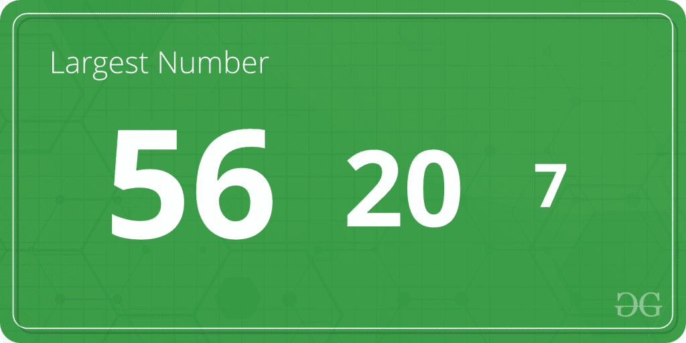
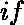
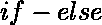
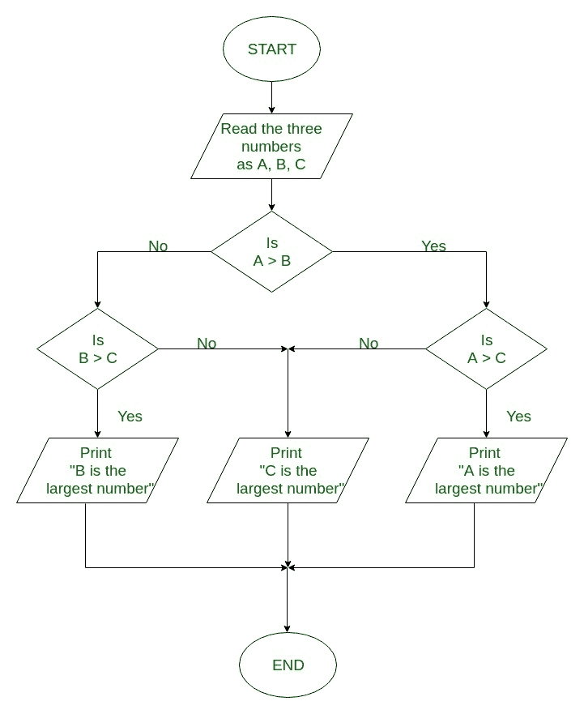

# C 程序寻找三个数字中最大的数字

> 原文:[https://www . geesforgeks . org/c-program-寻找三个数字中最大的数字/](https://www.geeksforgeeks.org/c-program-to-find-the-largest-number-among-three-numbers/)

给定三个数字 A、B 和 C；任务是在三者中找出最大的数字。



**示例**:

```
Input: A = 2, B = 8, C = 1
Output: Largest number = 8

Input: A = 231, B = 4751, C = 75821
Output: Largest number = 75821

```

在下面的程序中，为了找到三个数字中最大的一个，使用了、、和。

**求三个数中最大值的算法:**

```
1. Start
2. Read the three numbers to be compared, as A, B and C.
3. Check if A is greater than B.

  3.1 If true, then check if A is greater than C.
    3.1.1 If true, print 'A' as the greatest number.
    3.1.2 If false, print 'C' as the greatest number.

  3.2 If false, then check if B is greater than C.
    3.1.1 If true, print 'B' as the greatest number.
    3.1.2 If false, print 'C' as the greatest number.
4. End

```

**流程图找到三个数字中最大的:**


下面是在三个数字中找出最大值的 C 程序:

**示例 1:** 仅使用 if 语句查找最大数。

```
#include <stdio.h>

int main()
{
    int A, B, C;

    printf("Enter the numbers A, B and C: ");
    scanf("%d %d %d", &A, &B, &C);

    if (A >= B && A >= C)
        printf("%d is the largest number.", A);

    if (B >= A && B >= C)
        printf("%d is the largest number.", B);

    if (C >= A && C >= B)
        printf("%d is the largest number.", C);

    return 0;
}
```

**输出:**

```
Enter the numbers A, B and C: 2 8 1 
8 is the largest number.

```

**例 2:** 用 if-else 语句求最大数。

```
#include <stdio.h>
int main()
{
    int A, B, C;

    printf("Enter three numbers: ");
    scanf("%d %d %d", &A, &B, &C);

    if (A >= B) {
        if (A >= C)
            printf("%d is the largest number.", A);
        else
            printf("%d is the largest number.", C);
    }
    else {
        if (B >= C)
            printf("%d is the largest number.", B);
        else
            printf("%d is the largest number.", C);
    }

    return 0;
}
```

**输出:**

```
Enter the numbers A, B and C: 2 8 1 
8 is the largest number.

```

**示例 3:** 使用嵌套的 if-else 语句查找最大数。

```
#include <stdio.h>
int main()
{
    int A, B, C;

    printf("Enter three numbers: ");
    scanf("%d %d %d", &A, &B, &C);

    if (A >= B && A >= C)
        printf("%d is the largest number.", A);

    else if (B >= A && B >= C)
        printf("%d is the largest number.", B);

    else
        printf("%d is the largest number.", C);

    return 0;
}
```

**输出:**

```
Enter the numbers A, B and C: 2 8 1 
8 is the largest number.

```

**例 4:** 用三元算子求最大数。

```
#include <stdio.h>
int main()
{
    int A, B, C, largest;

    printf("Enter three numbers: ");
    scanf("%d %d %d", &A, &B, &C);

    largest = A > B ? (A > C ? A : C) : (B > C ? B : C);

    printf("%d is the largest number.", largest);

    return 0;
}
```

**输出:**

```
Enter the numbers A, B and C: 2 8 1 
8 is the largest number.

```