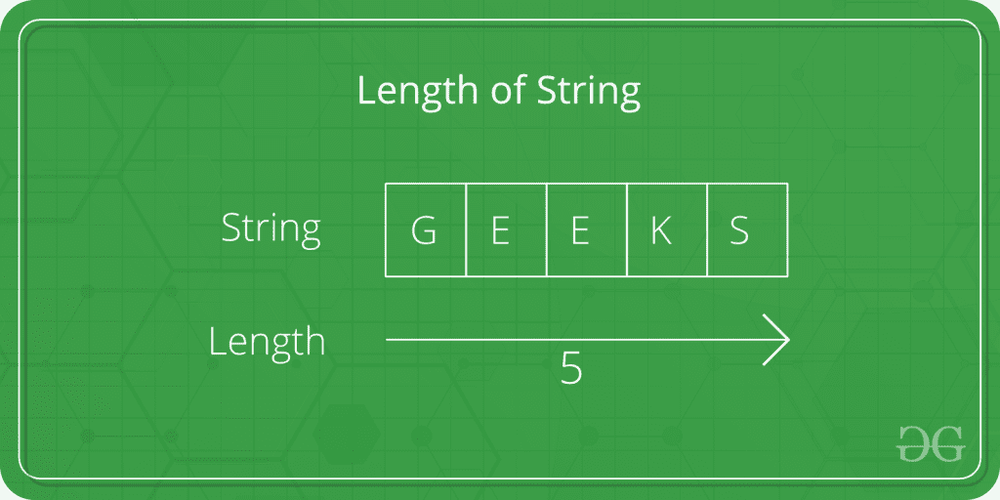
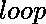
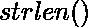

# C 程序求一个字符串的长度

> 原文:[https://www . geesforgeks . org/c-program-to-find-the-length-a-string/](https://www.geeksforgeeks.org/c-program-to-find-the-length-of-a-string/)

给定一根弦*弦*。任务是找到字符串的长度。



**示例**:

```
Input: str = "Geeks"
Output: Length of Str is : 4

Input: str = "GeeksforGeeks"
Output: Length of Str is : 13

```

在下面的程序中，要找到字符串 ***str*** 的长度，首先使用中的 scanf 将字符串作为用户的输入，然后使用和方法计算 str 的长度。

下面是寻找字符串长度的 C 程序。

**例 1:** 用循环计算字符串长度。

```
// C program to find the length of string
#include <stdio.h>
#include <string.h>

int main()
{
    char Str[1000];
    int i;

    printf("Enter the String: ");
    scanf("%s", Str);

    for (i = 0; Str[i] != '\0'; ++i);

    printf("Length of Str is %d", i);

    return 0;
}
```

**Output:**

```
Enter the String: Geeks
Length of Str is 5

```

**例 2:** 用 strlen()求字符串的长度。

```
// C program to find the length of 
// string using strlen function
#include <stdio.h>
#include <string.h>

int main()
{
    char Str[1000];
    int i;

    printf("Enter the String: ");
    scanf("%s", Str);

    printf("Length of Str is %ld", strlen(Str));

    return 0;
}
```

**Output:**

```
Enter the String: Geeks
Length of Str is 5

```