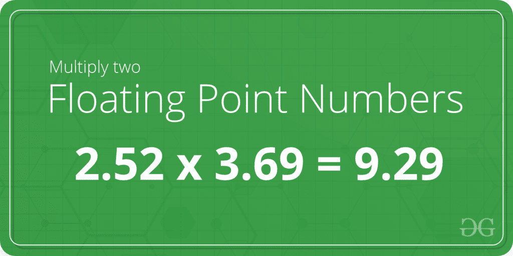

# 两个浮点数相乘的 C 程序

> 原文:[https://www . geeksforgeeks . org/c-程序乘二浮点数/](https://www.geeksforgeeks.org/c-program-to-multiply-two-floating-point-numbers/)

给定两个浮点数 A 和 b，任务是编写一个程序来寻找这两个数的乘积。


**示例**:

> **输入** : A = 2.12，B = 3.88
> 输出 : 8.225600
> 
> **输入** : A = 3.78，B = 6.32
> 输出 : 23.889601

在下面的两个浮点数相乘的程序中，首先要求用户输入两个浮点数，使用 [scanf()](https://www.geeksforgeeks.org/scanf-fscanf-sscanf-scanf_s-fscanf_s-sscanf_s/) 功能扫描输入，并存储在变量和中。然后，使用算术运算符将变量和相乘，并将乘积存储在变量**乘积**中。

下面是两个浮点数相乘的 C 程序:

```
// C program to multiply two floating point numbers
#include <stdio.h>

int main()
{
    float A, B, product = 0.0f;

    // Ask user to enter the two numbers
    printf("Enter two floating numbers A and B : \n");

    // Read two numbers from the user || A = 2.12, B = 3.88
    scanf("%f%f", &A, &B);

    // Calclulate the multiplication of A and B
    // using '*' operator
    product = A * B;

    // Print the product
    printf("Product of A and B is: %f", product);

    return 0;
}
```

**Output:**

```
Enter two floating numbers A and B : 2.12 3.88
Product of A and B is: 8.225600

```