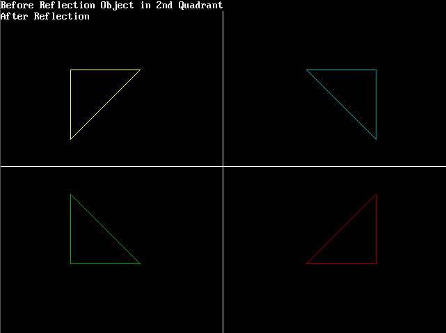

# 使用计算机图形执行给定 2D 图像的反射的 C 程序

> 原文:[https://www . geeksforgeeks . org/c-使用计算机图形学对给定的 2d 图像进行程序执行反射/](https://www.geeksforgeeks.org/c-program-to-perform-reflection-of-the-given-2d-image-using-computer-graphics/)

在本文中，我们将讨论如何使用逻辑在 [C](https://www.geeksforgeeks.org/c-programming-language/) 中使用[计算机图形](https://www.geeksforgeeks.org/basic-graphic-programming-in-c/)执行反射，而不是使用旋转和平移后的平移的[直接矩阵公式。](https://www.geeksforgeeks.org/translation-objects-computer-graphics-reference-added-please-review/)

这种技术目前已经应用于作为三角形的对象，代码可以应用于任何对象，只要将 **(X <sub>n</sub> 、Y <sub>n</sub> )** 坐标适配到其中。

这种技术的基本逻辑是，在任何给定的反射中，反射物体的横向反转与源物体的任何给定侧的距离相同。即，如果源物体距离左侧 10 像素，则反射物体距离右侧 10 像素，这同样适用于顶侧和底侧。

**<u>现实生活中的例子</u> :**

*   如果一个人站在镜子前，这个人的右手与镜子右边界的距离将与这个人的倒影左手与左边界的距离相同。
*   为了方便通过程序显示上述技术，让我们在 2 <sup>和</sup>图形象限绘制源对象，但只要对代码稍加修改，就可以从任何象限完成。

**<u>上述技术的步骤</u> :**

*   通过提供坐标，在 2 <sup>和</sup>图形象限中创建一个对象。
*   对于沿 X 轴的反射:
    *   y 轴坐标将保持不变。
    *   通过[计算源物体](https://www.geeksforgeeks.org/sum-manhattan-distances-pairs-points/)的 X 坐标与其沿 X 轴最近的表面之间的距离，获得横向反转的 X 轴坐标距离。
    *   使用从上述步骤获得的横向反转的 X 坐标绘制另一个对象，同时保持 Y 坐标不变。
    *   以上步骤将生成源对象的镜像或反射。
    *   在这种情况下，反射物体将在 **1 <sup>st</sup> 象限**形成。
*   对于沿 Y 轴的反射:
    *   x 轴坐标将保持不变。
    *   通过计算源对象的 Y 坐标与其沿 Y 轴最近的表面之间的距离，获得横向反转的 Y 轴坐标的距离。
    *   在保持 X 坐标不变的情况下，使用从上述步骤获得的横向反转 Y 坐标绘制另一个对象。
    *   以上步骤将生成源对象的镜像或反射。
    *   在这种情况下，反射物体将在**3<sup>3</sup>象限**形成。
*   2c。对于沿原点的反射:
    *   x 轴和 Y 轴坐标会改变。
    *   通过计算源对象的 Y 坐标与其沿 Y 轴最近的表面之间的距离，获得横向反转的 Y 轴坐标距离。
    *   通过计算源对象的 X 坐标与其沿 X 轴最近的表面之间的距离，获得横向反转的 X 轴坐标距离。
    *   使用从上述步骤获得的横向反转的 X 和 Y 坐标绘制另一个对象。
    *   以上步骤将生成源对象的镜像或反射。
    *   这一次，反射是关于原点的，因为 X 和 Y 坐标都发生了变化，将物体从里向外推出。
    *   在这种情况下，反射物体将在 **4 <sup>第</sup>象限**形成。

**进场:**

1.  通过将 4 个值作为 [line()函数的参数](https://www.geeksforgeeks.org/draw-line-c-graphics/)作为**线(getmaxx()/2，0，getmaxx()/2，getmaxy())** ，在图形中画一条线作为 Y 轴。
2.  在图形中画一条线作为 **X 轴**，将 4 个值作为线()的参数传递，作为**线(0，getmaxy()/2，getmaxx()，getmaxy()/2)** 。
3.  使用带有设定变量参数的**线()**函数绘制一个对象。
4.  使用该技术的**步骤 3** 执行反射并沿着**原点**绘制对象，并将其着色为**红色**，以将其与其他对象区分开来。
5.  使用该技术的**步骤 1** 执行反射并沿着 **X 轴**绘制对象，并将其着色为**青色**，以将其与其他对象区分开来。
6.  使用该技术的**步骤 2** 执行反射并沿着 **Y 轴**绘制对象，并将其着色为**绿色**，以将其与其他对象区分开来。

下面是上述方法的实现:

## C

```cpp
// C program for the above approach

#include <conio.h>
#include <graphics.h>
#include <stdio.h>

// Driver Code
void main()
{
    // Initialize the drivers
    int gm, gd = DETECT, ax, x1 = 100;
    int x2 = 100, x3 = 200, y1 = 100;
    int y2 = 200, y3 = 100;

    // Add in your BGI folder path
    // like below initgraph(&gd, &gm,
    // "C:\\TURBOC3\\BGI");
    initgraph(&gd, &gm, "");
    cleardevice();

    // Draw the graph
    line(getmaxx() / 2, 0, getmaxx() / 2,
         getmaxy());
    line(0, getmaxy() / 2, getmaxx(),
         getmaxy() / 2);

    // Object initially at 2nd quadrant
    printf("Before Reflection Object"
           " in 2nd Quadrant");

    // Set the color
    setcolor(14);
    line(x1, y1, x2, y2);
    line(x2, y2, x3, y3);
    line(x3, y3, x1, y1);
    getch();

    // After reflection
    printf("\nAfter Reflection");

    // Reflection along origin i.e.,
    // in 4th quadrant
    setcolor(4);
    line(getmaxx() - x1, getmaxy() - y1,
         getmaxx() - x2, getmaxy() - y2);

    line(getmaxx() - x2, getmaxy() - y2,
         getmaxx() - x3, getmaxy() - y3);

    line(getmaxx() - x3, getmaxy() - y3,
         getmaxx() - x1, getmaxy() - y1);

    // Reflection along x-axis i.e.,
    // in 1st quadrant
    setcolor(3);
    line(getmaxx() - x1, y1,
         getmaxx() - x2, y2);
    line(getmaxx() - x2, y2,
         getmaxx() - x3, y3);
    line(getmaxx() - x3, y3,
         getmaxx() - x1, y1);

    // Reflection along y-axis i.e.,
    // in 3rd quadrant
    setcolor(2);
    line(x1, getmaxy() - y1, x2,
         getmaxy() - y2);
    line(x2, getmaxy() - y2, x3,
         getmaxy() - y3);
    line(x3, getmaxy() - y3, x1,
         getmaxy() - y1);
    getch();

    // Close the graphics
    closegraph();
}
```

**输出:**

[](https://media.geeksforgeeks.org/wp-content/uploads/20210315185921/Screenshot239.png)