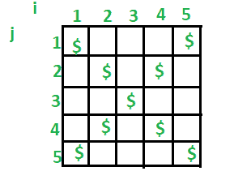
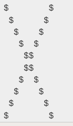

# C++程序打印十字或 X 图案

> 原文:[https://www . geesforgeks . org/c-程序到打印-交叉或-x-pattern/](https://www.geeksforgeeks.org/c-program-to-print-cross-or-x-pattern/)

给定一个数字 n，我们需要打印一个大小为 n 的 X 图案。

```cpp
Input : n = 3
Output : 
$ $
 $ 
$ $

Input : n = 5
Output : 
$   $
 $ $ 
  $  
 $ $ 
$   $

Input : n = 4
Output : 
$  $
 $ 
 $ 
$  $

```



我们需要打印 n 行 n 列。所以我们运行两个嵌套循环。外部循环逐个打印所有行(运行 i = 1 到 n)。内部循环(运行 j = 1 到 n)运行当前行的所有列。现在一行可以包含空格和“{content}”。我们如何决定将空间放在哪里，将“{content}”放在哪里？。

对于 i = 1:第一列和最后一列应包含“{ content }”；
对于 i = 2:第二个和第二个最后一列应包含“{ content }”；
一般来说，第 I 列和第(n+1–I)列应该包含“{ content }”；

```cpp
// Program to make an X shape $ pattern in c++
#include <iostream>
using namespace std;

int main()
{ 
    // n denotes the number of lines in which 
    // we want to make X pattern
    int n; 

    // i denotes the number of rows
    cout << "Enter the value of n \n";
    cin >> n;

    // Print all rows one by one 
    for (int i = 1; i <= n; i++) {

        // Print characters of current row
        for (int j = 1; j <= n; j++) 
        {
            // For i = 1, we print a '{content}apos; only in 
            // first and last columns
            // For i = 2, we print a '{content}apos; only in 
            // second and second last columns
            // In general, we print a '{content}apos; only in 
            // i-th and n+1-i th columns

            if (j == i || j == (n + 1 - i))
                cout << "{content}quot;; 
            else
                cout << " ";
        }

        // Print a newline before printing the
        // next row. 
        cout << endl;
    }
    return 0;
}
```

