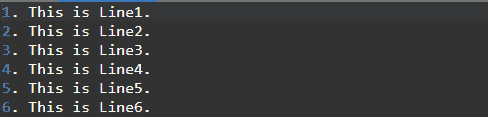
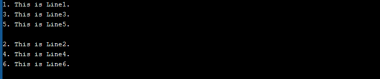

# C 程序打印文件的奇数行内容后接偶数行内容

> 原文:[https://www . geesforgeks . org/c-程序-打印-文件奇数行内容-后跟偶数行内容/](https://www.geeksforgeeks.org/c-program-to-print-odd-line-contents-of-a-file-followed-by-even-line-content/)

**先决条件:**[C](https://www.geeksforgeeks.org/basics-file-handling-c/)文件处理基础

给定一个目录中的**文本文件**，任务是先打印文件的所有奇数行内容，然后打印所有偶数行内容。

**示例:**

> **输入:** **file1.txt** :
> 欢迎
> 到
> 极客 forGeeks
> **输出:**
> **奇数行内容:**
> 欢迎
> 极客 forGeeks
> **偶数行内容:**
> 到
> 
> **输入:** **file1.txt** :
> 1。这是 1 号线。
> 2。这是 2 号线。
> 3。这是 3 号线。
> 4。这是 4 号线。
> 
> **输出:**
> **奇数行内容:**
> 1。这是 1 号线。
> 3。这是 3 号线。
> **偶数行内容:**
> 2。这是 2 号线。
> 4。这是 4 号线。

**进场:**

1.  [在 **a+模式**下打开文件](https://www.geeksforgeeks.org/basics-file-handling-c/)。
2.  在文件末尾插入新的一行，这样输出就不会受到影响。
3.  保留一个不打印文件偶数行的**复选框**，打印文件奇数行。
4.  倒回文件指针。
5.  重新初始化**检查**。
6.  通过保留一个**复选框**，打印文件的**偶数行**，不打印文件的奇数行。

下面是上述方法的实现:

```cpp
// C program for the above approach

#include <stdio.h>

// Function which prints the file content
// in Odd Even manner
void printOddEvenLines(char x[])
{
    // Opening the path entered by user
    FILE* fp = fopen(x, "a+");

    // If file is null, then return
    if (!fp) {
        printf("Unable to open/detect file");
        return;
    }

    // Insert a new line at the end so
    // that output doesn't get effected
    fprintf(fp, "\n");

    // fseek() function to move the
    // file pointer to 0th position
    fseek(fp, 0, 0);

    int check = 0;
    char buf[100];

    // Print Odd lines to stdout
    while (fgets(buf, sizeof(buf), fp)) {

        // If check is Odd, then it is
        // odd line
        if (!(check % 2)) {
            printf("%s", buf);
        }
        check++;
    }
    check = 1;

    // fseek() function to rewind the
    // file pointer to 0th position
    fseek(fp, 0, 0);

    // Print Even lines to stdout
    while (fgets(buf, sizeof(buf), fp)) {

        if (!(check % 2)) {
            printf("%s", buf);
        }
        check++;
    }

    // Close the file
    fclose(fp);

    return;
}

// Driver Code
int main()
{
    // Input filename
    char x[] = "file1.txt";

    // Function Call
    printOddEvenLines(x);

    return 0;
}
```

**输入文件:**
[](https://media.geeksforgeeks.org/wp-content/uploads/20200513080853/Screenshot-6381.png) 
**输出文件:**
[](https://media.geeksforgeeks.org/wp-content/uploads/20200513080907/Screenshot-6391.png)