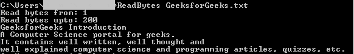

# C 程序从文件中读取一定范围的字节并打印到控制台

> 原文:[https://www . geesforgeks . org/c-从文件读取一系列字节并将其打印到控制台/](https://www.geeksforgeeks.org/c-program-to-read-a-range-of-bytes-from-file-and-print-it-to-console/)

给定一个文件 **F** ，任务是编写 [C 程序](https://www.geeksforgeeks.org/c/)从给定的文件打印任意范围的字节，并将其打印到控制台。

**使用的功能:**

1.  [**【fopen()**](https://www.geeksforgeeks.org/c-fopen-function-with-examples/)**:**创建新文件。文件打开，属性为**“a”**或**“a+”**或**“w”**或**“w++”**。
2.  [**fgetc**](https://www.geeksforgeeks.org/fgetc-fputc-c/)**():**从文件中读取字符。
3.  [**fclose():** 为 c](https://www.geeksforgeeks.org/c-fopen-function-with-examples/) 输一档。

**进场:**

*   初始化一个[文件指针](https://www.geeksforgeeks.org/basics-file-handling-c/)，比如**文件*fptr1** 。
*   初始化一个数组来存储将从文件中读取的字节。
*   使用函数 **fopen()** 打开文件，如 **fptr1 = fopen(argv[1]，“r”)**。
*   [迭代一个循环](https://www.geeksforgeeks.org/range-based-loop-c/)直到读取并存储给定文件，在变量中扫描字符，使用 **fgetc()** 函数说 **C** 。
*   将上述步骤中提取的每个字符 **C** 存储到新字符串 **S** 中，并使用 [**printf()** 功能](https://www.geeksforgeeks.org/return-values-of-printf-and-scanf-in-c-cpp/)打印该字符串。
*   完成上述步骤后，使用 **fclose()** 功能关闭文件。

下面是上述方法的实现:

## C

```cpp
// C program to read particular bytes
// from the existing file
#include <stdio.h>
#include <stdlib.h>

// Maximum range of bytes
#define MAX 1000

// Filename given as the command
// line argument
int main(int argc, char* argv[])
{
    // Pointer to the file to be
    // read from
    FILE* fptr1;
    char c;

    // Stores the bytes to read
    char str[MAX];
    int i = 0, j, from, to;

    // If the file exists and has
    // read permission
    fptr1 = fopen(argv[1], "r");

    if (fptr1 == NULL) {
        return 1;
    }

    // Input from the user range of
    // bytes inclusive of from and to
    printf("Read bytes from: ");
    scanf("%d", &from);
    printf("Read bytes upto: ");
    scanf("%d", &to);

    // Loop to read required byte
    // of file
    for (i = 0, j = 0; i <= to
                       && c != EOF;
         i++) {

        // Skip the bytes not required
        if (i >= from) {
            str[j] = c;
            j++;
        }

        // Get the characters
        c = fgetc(fptr1);
    }

    // Print the bytes as string
    printf("%s", str);

    // Close the file
    fclose(fptr1);

    return 0;
}
```

**输出:**

