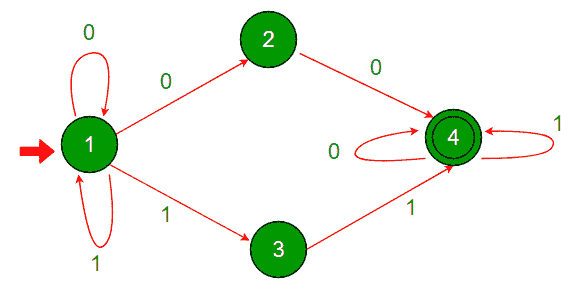

# 模拟非确定有限自动机(NFA)的 C 程序

> 原文:[https://www . geesforgeks . org/c-程序-模拟-不确定-有限自动机-nfa/](https://www.geeksforgeeks.org/c-program-to-simulate-nondeterministic-finite-automata-nfa/)

**背景**

NFA 通常用有向图来描述。每个边和顶点都标记为 0 或 1，表示可能的过渡。顶点代表 NFA 的州。标记为 0 的是不接受状态，标记为 1 的是接受状态。

*   它采用有限长度的输入字符串。通常，输入字符串是 0 和 1 的二进制序列。
*   我们从顶点 1 开始，顶点 1 总是起始状态，沿着输入字符串的位顺序给出的边，直到输入字符串没有进一步的位。
*   术语“非确定性”意味着在任何状态 V 下，我们都有不止一个跟随边缘的选择。NFA 消耗输入字符串，状态集合 Q 表示 NFA 可能的移动。
*   如果 Q 至少包含一个最后一个顶点接受的状态，那么我们说 NFA 接受了输入字符串，否则 NFA 拒绝了输入字符串。
*   每个 NFA 都不是 DFA，但是每个 NFA 都可以翻译成 DFA。

**NFA 示例:**



```cpp
Starting state - vertex 1
Accepting states - Vertices with double circles(label 1) // Vertex 4
Non ­accepting states - single circles (label 0). // Vertices 1, 2 and 3.
```

**如何检查一根弦的验收？**

**输入:1010**

*   在状态 1 中，我们有两种可能性，要么遵循自循环并保持在状态 1，要么遵循标记为 1 的边并进入状态 3。

```cpp
                            {1} 1010 --> {1, 3} 010
```

*   在状态 3 中，没有标记为 0 的边，因此计算将停止。
*   在状态 1 中，我们有两种可能性，要么遵循自循环并保持在状态 1，要么遵循标记为 0 的边缘到状态 2。

```cpp
                            {1, 3} 010 --> {1, 2} 10
```

*   现在状态 2 没有标记为 1 的边。计算将会停止。我们有两种可能:要么跟随自循环到状态 1，要么跟随标记为 1 的边到状态 3。

```cpp
                             {1, 2} 10 --> {1, 3} 0
```

*   在状态 3 中，没有标记为 0 的边。所以计算会消失。在状态 1 中，我们有两种可能性:要么跟随自循环到状态 1，要么沿着标记为 0 的边到状态 2。

```cpp
                                 {1, 3} 0 --> {1, 2}
```

*   现在 NFA 已经消耗了输入。它可以处于状态 1 或状态 2，这两种状态都是不可接受的。所以 **NFA 已经拒绝了输入 1010。**

**输入:1100**

```cpp
          {1} 1100 --> {1, 3} 100 {1, 3} 100 --> {1, 3, 4} 00 {1, 3, 4} 
                  00--> {1, 2, 4} 0 {1, 2, 4} 0--> {1, 2, 4}
```

*   现在 NFA 已经消耗了输入。它可以是状态 1、2 或 4。状态 4 是接受状态。所以，**NFA 接受字符串 1100。**
*   我们可以很容易地验证给定的 NFA 接受所有带有“00”和/或“11”的二进制字符串作为子字符串。

**模拟不确定有限自动机(NFA)的 C 程序**

**输入格式:**NFA 的邻接表表示形式如下。
给定的示例将表示为
边的总数:4
边连通性:
1 0 4 0 1 0 2 1 1 3
2 0 1 0 4
3 0 1 4
4 1 2 0 4 1 4

**输出格式:**NFA 按照字典顺序接受的前 10 个二进制字符串(e 表示空字符串):{e，0，1，00，01，10，11，000，…}

给定测试用例的样本输出如下:
00
11
000
001
011
100
110
111

## C

```cpp
#include <stdio.h>
#include <stdlib.h>
#include <string.h>
#include <stdbool.h>
#include <math.h>

int row = 0;

// A structure to represent an adjacency list node
struct node
{
    int data;
    struct node* next;
    char edgetype;

}typedef node;

// Adds an edge to an adjacency list
node* push(node* first , char edgetype , int data)
{
    node* new_node = (node*)malloc(sizeof(node));
    new_node->edgetype = edgetype;
    new_node->data = data;
    new_node->next = NULL;
    if (first==NULL)
    {
        first = new_node;
        return new_node;
    }
    first->next = push(first->next,edgetype,data);
    return first;
}

//Recursive function to check acceptance of input
int nfa(node** graph, int current, char* input,
        int* accept, int start)
{
    if (start==(int)strlen(input))
        return accept[current];

    node* temp = graph[current];
    while (temp != NULL)
    {
      if (input[start]==temp->edgetype)
        if (nfa(graph,temp->data,input,accept,start+1==1))
           return 1;
      temp=temp->next;
    }
    return 0;
}

//Function to generate binary strings of size n
void generate(char** arr, int size, char *a)
{
    if (size==0)
    {
        strcpy(arr[row], a);
        row++;
        return;
    }
    char b0[20] = {'\0'};
    char b1[20] = {'\0'};
    b0[0] = '0';
    b1[0] = '1';

    //Recursively generate the binary string
    generate((char**)arr, size-1, strcat(b0,a)); //Add 0 in front
    generate((char**)arr, size-1, strcat(b1,a)); //Add 1 in front
    return;

}

// Driver program to test above functions
int main()
{
    int n;
    int i, j;
    scanf("%d", &n); //Number of nodes
    node* graph[n+1]; //Create a graph

    for (i=0;i<n+1;i++)
        graph[i]=NULL;

    int accept[n+1]; //Array to store state of vertex

    for (i=0; i<n; i++)
    {
        //Index of vertex , Acceptance state , Number of edges
        int index,acc,number_nodes;
        scanf("%d%d%d",&index,&acc,&number_nodes);
        accept[index]=acc; //Store acceptance

        for (j=0;j<number_nodes;j++) //Add all edges
        {
            int node_add;
            int edge;
            scanf("%d%d",&edge,&node_add);
            graph[index] = push(graph[index],'0'+edge,node_add);
        }
    }

    int size = 1; //Size of input
    int count = 0; //Keep count of output strings

    if (accept[1]==1) //Check for empty string
    {
        printf("e\n");
        count++;
    }

    while (count < 11)
    {
        char** arr;
        int power = pow(2,size);
        arr = (char**)malloc(power*sizeof(char*));

        for (i=0;i<power;i++)
            arr[i] = (char*)malloc(size*sizeof(char));

        char a[20] = {'\0'};

        generate((char**)arr,size,a); //Generate inputs

        for (i=0; i<power; i++)
        {
            char input[20] = {'\0'};

            for (j=0; j<size; j++)
            {
                char foo[2];
                foo[0] = arr[i][size-1-j];
                foo[1] = '\0';
                strcat(input,foo);
                                //Copy generated string input
            }

            int result = nfa(graph,1,input,accept,0);
                        // Store result of nfa

            if (result==1)
            {
                printf("%s\n",input);
                                // Print if accepted
                count++;
            }

            if (count==10)
                return 0;
        }

        size++; //Increment size of binary string input
        row=0;
    }

    return 0;
}
```

**输入:**

```cpp
4
1 0 4 0 1 0 2 1 1 1 3
2 0 1 0 4
3 0 1 1 4
4 1 2 0 4 1 4
```

**输出:**

```cpp
00
11
000
001
011
100
110
111
0000
0001
```

本文由**阿琼·穆拉贾尼供稿。**如果发现有不正确的地方，请写评论，或者想分享更多关于上面讨论的话题的信息