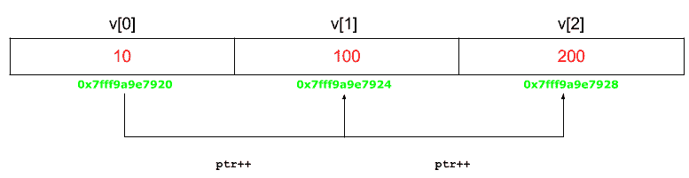

# 使用指针对数组进行排序的程序

> 原文:[https://www . geesforgeks . org/c-程序使用指针对数组进行排序/](https://www.geeksforgeeks.org/c-program-to-sort-an-array-using-pointers/)

给定一个大小为 n 的数组，任务是使用 c 语言中的指针对这个数组进行排序。

**示例:**

```cpp
Input: n = 5, arr[] = {0, 23, 14, 12, 9}
Output: {0, 9, 12, 14, 23}

Input: n = 3, arr[] = {7, 0, 2}
Output: {0, 2, 7}

```

**方法:**[数组](https://www.geeksforgeeks.org/introduction-to-arrays/)可以通过[指针](https://www.geeksforgeeks.org/pointers-in-c-and-c-set-1-introduction-arithmetic-and-array/)获取，指针变量指向数组的[基址。因此，为了使用指针对数组进行排序，我们需要使用**(指针+索引)**格式访问数组的元素。](https://www.geeksforgeeks.org/c-language-2-gq/arrays-pointers-gq/)

[](https://www.geeksforgeeks.org/pointers-in-c-and-c-set-1-introduction-arithmetic-and-array/)

下面是上述方法的实现:

**程序:**

```cpp
#include <stdio.h>

// Function to sort the numbers using pointers
void sort(int n, int* ptr)
{
    int i, j, t;

    // Sort the numbers using pointers
    for (i = 0; i < n; i++) {

        for (j = i + 1; j < n; j++) {

            if (*(ptr + j) < *(ptr + i)) {

                t = *(ptr + i);
                *(ptr + i) = *(ptr + j);
                *(ptr + j) = t;
            }
        }
    }

    // print the numbers
    for (i = 0; i < n; i++)
        printf("%d ", *(ptr + i));
}

// Driver code
int main()
{
    int n = 5;
    int arr[] = { 0, 23, 14, 12, 9 };

    sort(n, arr);

    return 0;
}
```

**Output:**

```cpp
0 9 12 14 23

```