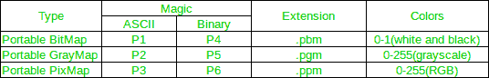

# 用 PGM 格式写图像的 C 程序

> 原文:[https://www . geesforgeks . org/c-program-to-write-a-image-in-PGM-format/](https://www.geeksforgeeks.org/c-program-to-write-an-image-in-pgm-format/)

**PGM** 代表**便携式灰色地图**。将 C 语言中的 2D 数组保存为 PNG、JPG 或其他格式的图像，在写入文件之前，需要花费大量精力将数据编码为指定的格式。
然而，Netpbm 格式提供了一个简单的解决方案，易于移植。

Netpbm 格式是 Netpbm 项目使用和定义的任何图形格式。可移植的位图格式(PPM)、可移植的灰度图格式(PGM)和可移植的位图格式(PBM)是设计用于在平台之间轻松交换的图像文件格式。

Netpbm 是一个开源的图形程序包和编程库。它主要用于 Unix 世界，在那里人们可以发现它包含在所有主要的开源操作系统发行版中，但也适用于 macOS 等。它也在微软视窗下工作。

每个文件都以一个两字节的幻数(以 ASCII 表示)开始，该幻数标识文件的类型(PBM、PGM 和 PPM)及其编码(ASCII 或二进制)。幻数是一个大写的 P 后跟一个一位数。

ASCII 格式考虑到人的可读性和容易转移到其他平台；二进制格式在文件大小方面更有效，但可能存在本机字节顺序问题。

在二进制格式中，PBM 每像素使用 1 位，PGM 每像素使用 8 位，PPM 每像素使用 24 位:红色 8 位，绿色 8 位，蓝色 8 位。



PGM 和 PPM 格式(ASCII 和二进制版本)在 X 和 Y 维度之后和实际像素数据之前有一个额外的最大值参数(黑色和白色之间的灰色数)。黑色为 0，最大值为白色。每行末尾都有一个换行符。

**如何编写 PGM 文件？**
文件格式如下:
1。幻数“**P2**”
2。空白(空白、TAb、CRs、LFs)。
3。A **宽度**，格式为十进制 ASCII 字符。
4。空白。
5。A **高度**，同样以 ASCII 十进制表示。
6。空白。
7。最大灰度值，同样以 ASCII 十进制表示。
8。空白。
9。**宽度** X **高度**灰度值，以 ASCII 十进制表示，介于 0 和指定的最大值之间，由空白分隔，以光栅格式表示，从上到下。

```
// C program to read a BMP Image and 
// write the same into a PGM Image file
#include <stdio.h>

void main()
{
    int i, j, temp = 0;
    int width = 13, height = 13;

    // Suppose the 2D Array to be converted to Image is as given below
    int image[13][13] = {
      { 15, 15, 15, 15, 15, 15, 15, 15, 15, 15, 15, 15, 15 },
      { 31, 31, 31, 31, 31, 31, 31, 31, 31, 31, 31, 31, 31},
      { 47, 47, 47, 47, 47, 47, 47, 47, 47, 47, 47, 47, 47},
      { 63, 63, 63, 63, 63, 63, 63, 63, 63, 63, 63, 63, 63},
      { 79, 79, 79, 79, 79, 79, 79, 79, 79, 79, 79, 79, 79},
      { 95, 95, 95, 95, 95, 95, 95, 95, 95, 95, 95, 95, 95 },
      { 111, 111, 111, 111, 111, 111, 111, 111, 111, 111, 111, 111, 111},
      { 127, 127, 127, 127, 127, 127, 127, 127, 127, 127, 127, 127, 127},
      { 143, 143, 143, 143, 143, 143, 143, 143, 143, 143, 143, 143, 143},
      { 159, 159, 159, 159, 159, 159, 159, 159, 159, 159, 159, 159, 159},
      { 175, 175, 175, 175, 175, 175, 175, 175, 175, 175, 175, 175, 175},
      { 191, 191, 191, 191, 191, 191, 191, 191, 191, 191, 191, 191, 191},
      { 207, 207, 207, 207, 207, 207, 207, 207, 207, 207, 207, 207, 207}
    };

    FILE* pgmimg;
    pgmimg = fopen("pgmimg.pgm", "wb");

    // Writing Magic Number to the File
    fprintf(pgmimg, "P2\n"); 

    // Writing Width and Height
    fprintf(pgmimg, "%d %d\n", width, height); 

    // Writing the maximum gray value
    fprintf(pgmimg, "255\n"); 
    int count = 0;
    for (i = 0; i < height; i++) {
        for (j = 0; j < width; j++) {
            temp = image[i][j];

            // Writing the gray values in the 2D array to the file
            fprintf(pgmimg, "%d ", temp);
        }
        fprintf(pgmimg, "\n");
    }
    fclose(pgmimg);
}
```

*   首先，将文件保存为“ **write_pgm_img.c** ”。*   要编译 C 文件，打开终端(Ctrl+Alt+T)，输入下面一行代码
    `**gcc -o write_pgm_img write_pgm_img.c**`*   要执行代码，请输入
    `**./write_pgm_img**`*   The **PGM** image will be saved as **pgmimg.pgm**.

    图像将如下所示:

    

    参考资料:https://en . Wikipedia . org/wiki/netpbm _ format