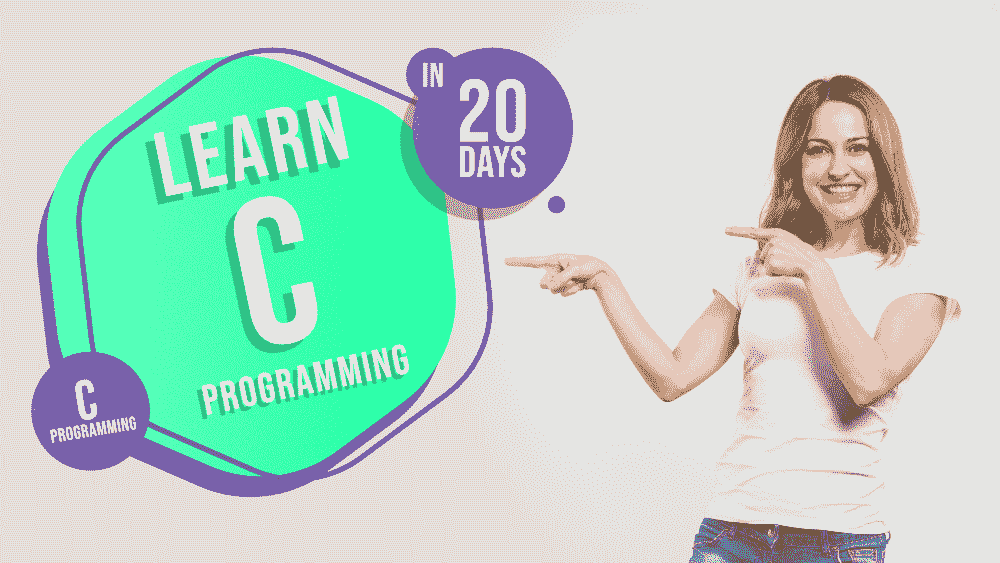

# 初学者 C 编程——20 天课程！

> 原文:[https://www . geesforgeks . org/c-初学者编程-为期 20 天的课程/](https://www.geeksforgeeks.org/c-programming-for-beginners-a-20-day-curriculum/)

在过去的 40-45 年里， **C** 是世界上最流行和最受认可的编程语言之一。事实上，它是大量个人*(包括我)的第一种编程语言！).*的确，强烈建议**用 C 语言**开始你的编程之旅，因为它有助于理解很多底层的过程，这增强了你的基础知识&增强了你的信心，这进一步使你更容易学习其他高级编程语言。还有，精通 **C 语言编程**给你提供了各种各样的职业机会，可以促使你考虑一下， ***开始学习 C 语言*** ！！

20 天学会 C

同时，C 是由**丹尼斯·里奇**开发的，是一种过程编程语言。该语言主要作为系统编程语言开发，用于编写操作系统，并用于各种主要平台的开发，如*微软视窗*、 *Linux* 等。此外，C 语言有一个丰富的库，提供各种内置功能，并提供动态内存分配。在本文中，我们将讨论一个人在短短 20 天内学习 C 语言必须遵循的 ***完整课程或路径*** ！

### 1.C 语言入门(第一天)

这是你首先需要做的事情——去*认识和理解 C 语言的本质！*你需要**去了解 C 语言的基础，**比如*语言的起源*、*它的特性&应用* s、*如何编译运行一个 C 程序*等等。此外，你还需要**创建你的第一个 C 程序**来更好地理解 C 编程。在这个初始阶段，你需要尽可能地熟悉这门语言的基础知识！

*   [C 语言介绍](https://www.geeksforgeeks.org/c-language-set-1-introduction/)
*   [C 语言的特点](https://www.geeksforgeeks.org/features-of-c-programming-language/)
*   [C 语言相对于其他语言的优势](https://www.geeksforgeeks.org/benefits-c-language-programming-languages/)
*   [C 程序的编译](https://www.geeksforgeeks.org/compiling-a-c-program-behind-the-scenes/)
*   [你好 C 语言世界节目](https://www.geeksforgeeks.org/c-hello-world-program/)

### 2.浏览变量、数据类型和运算符(第 2-3 天)

学习编程语言时，必须了解*变量*、*如何定义和存储它们(数据类型)*、*如何执行逻辑和数学运算(运算符)*等。先于任何其他编程概念。这些题目可以认为是**学习 C 编程**技能的基本必备。同时，您还需要在这里讨论其他几个相关的主题，比如变量在 C 语言中的作用域，如何在 C 语言中执行类型转换，运算符的类型等等。

*   [C 中的变量和关键词](https://www.geeksforgeeks.org/variables-and-keywords-in-c/)
*   [C](https://www.geeksforgeeks.org/scope-rules-in-c/)中的范围规则
*   [C 中的数据类型](https://www.geeksforgeeks.org/data-types-in-c/)
*   [操作员&其类型](https://www.geeksforgeeks.org/c-programming-language/#Operators)
*   [在 C 中打字](https://www.geeksforgeeks.org/type-conversion-c/)

### 3.理解控制流报表(第 4-5 天)

现在，是时候 ***了解控制程序执行流程的流程了*** 。要求你知道什么是控制语句&如何执行。有各种各样的主题，如*条件语句*、*循环*、*跳转语句*等等。在对这些概念有了理论上的理解之后，您也可以通过解决编程问题和创建基本程序来选择它们的实现。还建议您涵盖其他几个主题，如*切换语句*、*继续语句*、*中断语句*等，以获得更多说明。

*   [C 中的循环](https://www.geeksforgeeks.org/loops-in-c-and-cpp/)
*   [决策声明](https://www.geeksforgeeks.org/decision-making-c-c-else-nested-else/)
*   [C](https://www.geeksforgeeks.org/interesting-facts-about-switch-statement-in-c/)中的切换语句
*   [继续声明](https://www.geeksforgeeks.org/continue-statement-cpp/) | [中断声明](https://www.geeksforgeeks.org/break-statement-cc/)
*   [C 循环&控制结构练习题](https://www.geeksforgeeks.org/c-language-2-gq/loops-control-structure-gq/)

### 4.学习 C 语言中的数组和字符串处理(第 6-7 天)

完成控制流语句后，现在您需要了解 C 中的**数组&字符串处理。确切地说，数组是一个数据集合，其中包含固定数量的相同类型的值，而字符串实际上是以空字符 **'\0'** 结束的一维字符数组。你需要了解*如何声明数组&访问其元素*、*什么是多维数组*、*字符串库函数*等相关话题。**

*   [C 中的数组](https://www.geeksforgeeks.org/arrays-in-c-cpp/)
*   [C 中的字符串](https://www.geeksforgeeks.org/strings-in-c-2/)
*   [C 中的多维数组](https://www.geeksforgeeks.org/g-fact-44/)
*   [C](https://www.geeksforgeeks.org/commonly-used-string-functions-in-c-c-with-examples/)中的字符串函数
*   [单引号&双引号字符数组的声明](https://www.geeksforgeeks.org/g-fact/)

### 5.熟悉 C 语言中的函数(第 8-10 天)

完成上述主题后，现在您需要了解 C 编程语言的支柱–***C 中的函数*** 。函数是执行特定任务或计算的代码块。您需要了解*用户定义的标准库函数*、*C 中的函数原型*、*函数调用——按值调用和按引用调用*以及其他各种功能。同时，你还需要完成其他几个重要的主题，如**存储类**、**递归**等。有效理解 C 语言中的函数。

*   [功能在 C](https://www.geeksforgeeks.org/functions-in-c/)
*   [功能原型](https://www.geeksforgeeks.org/what-is-the-purpose-of-a-function-prototype/)
*   [C](https://www.geeksforgeeks.org/parameter-passing-techniques-in-c-cpp/)中的参数传递技术
*   [C 中的存储类](https://www.geeksforgeeks.org/storage-classes-in-c/)
*   [递归概念](https://www.geeksforgeeks.org/recursion/)

### 6.了解指针、结构和联合(第 11-13 天)

好了，让我们用一些更深入的概念，比如**指针**、**结构**、**联合**等等，来深入探究 C 编程的世界。简而言之，指针是存储另一个变量或内存位置地址的变量。此外，结构、联合、枚举等。是用户定义的数据类型的类型，它们有自己的功能和规范。你需要了解*如何声明和初始化指针*、*关于双指针*、*如何*定义*结构&并集*等相关概念。

*   [C 中的指针](https://www.geeksforgeeks.org/pointers-in-c-and-c-set-1-introduction-arithmetic-and-array/) | [双指针](https://www.geeksforgeeks.org/double-pointer-pointer-pointer-c/)
*   [结构](https://www.geeksforgeeks.org/structures-c/) | [联合](https://www.geeksforgeeks.org/union-c/) | [枚举(或枚举)在 C](https://www.geeksforgeeks.org/enumeration-enum-c/) 中
*   [声明指向函数的指针](https://www.geeksforgeeks.org/how-to-declare-a-pointer-to-a-function/)
*   [指针对 C 中数组](https://www.geeksforgeeks.org/pointer-vs-array-in-c/)
*   [对 C 中结构变量的操作](https://www.geeksforgeeks.org/g-fact-68/)

### 7.了解动态内存分配和链接列表(第 14-17 天)

此外，你需要理解像内存的动态*分配*、链表等概念。动态内存分配是在运行时手动分配内存的过程。您需要使用 **malloc()** 、 **calloc()** 、 **free()** 和 **realloc()** 学习 C 语言中的动态内存分配。此外，链表是一种线性数据结构，其中每个节点包含一个数据字段和对列表中下一个节点的引用。您还需要覆盖其他几个合适的数据结构，如*堆栈*、*队列*等。因为数据结构是每种编程语言的主干。

*   [C 中的动态内存分配](https://www.geeksforgeeks.org/dynamic-memory-allocation-in-c-using-malloc-calloc-free-and-realloc/)
*   [链表数据结构](https://www.geeksforgeeks.org/data-structures/linked-list/)
*   [内存泄漏](https://www.geeksforgeeks.org/what-is-memory-leak-how-can-we-avoid/)
*   [栈](https://www.geeksforgeeks.org/stack-data-structure/) | [队列](https://www.geeksforgeeks.org/queue-data-structure/)
*   [绿头鸭和胼胝的区别](https://www.geeksforgeeks.org/difference-between-malloc-and-calloc-with-examples/)

### 8.了解 C 语言中的文件管理和预处理程序(第 18-20 天)

最后，您需要全面了解 C 中的**文件管理&预处理程序。C 中的**文件处理涉及各种操作，如*创建*、*打开*、*读取*、*写入*、*移动到特定位置*、*关闭文件*。您需要了解用于执行这些操作的功能等。此外，您需要了解 **C 预处理器，**，它在实际编译之前会自动用于转换您的程序。它还将帮助您理解 C 编程的体系结构。

*   [C](https://www.geeksforgeeks.org/basics-file-handling-c/)中的文件处理
*   [C](https://www.geeksforgeeks.org/multiline-macros-in-c/)中的多行宏
*   [将两个文件的内容合并成第三个](https://www.geeksforgeeks.org/c-program-merge-contents-two-files-third-file/)
*   [预处理器在 C](https://www.geeksforgeeks.org/preprocessor-works-c/)
*   [预处理器指令](https://www.geeksforgeeks.org/cc-preprocessors/)

遵循上面给出的途径后，你将能够实现并展示你在 C 编程中的技能，以实现你的职业目标。此外，课程并不太复杂或耗时，因为你们每天都需要复习几个主题，并且在短短 20 天内就能覆盖整个教学大纲。所以，没有任何延迟，潜入 C 编程世界，提升你的编程技能，获得各种职业机会！