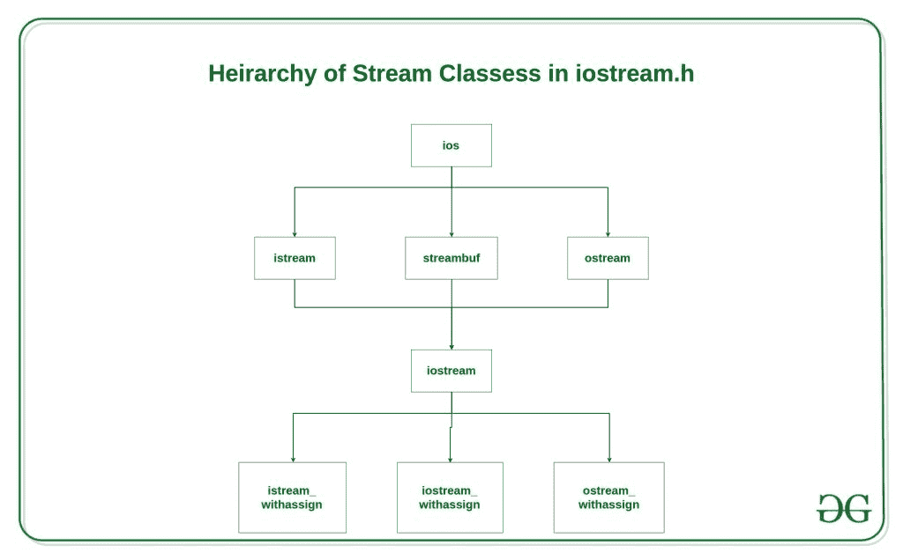

# C++ 流类结构

> 原文:[https://www.geeksforgeeks.org/c-stream-classes-structure/](https://www.geeksforgeeks.org/c-stream-classes-structure/)

在 [C++ ](https://www.geeksforgeeks.org/c-plus-plus/) 中，有许多流类，用于定义与文件相关的各种流和进行输入输出操作。所有这些类都在文件 **iostream.h** 中定义。下图显示了这些类的层次结构。



1.  **ios 类**是流类层次结构中最顶层的类。是**号船、【牡蛎】、**号船、**号船**号船的基本舱。

2.  **是流**和**牡蛎**为**流**类服务的基类。类别**为输入，类别**为输出。

3.  类 **ios** 使用 **istream** 和 **ostream** 间接继承到 **iostream** 类。为避免 **ios** 类数据和成员函数的重复，在**继承时声明为虚拟基类，在**继承时声明为**，在**继承时声明为****

```cpp
class istream: virtual public ios
{
};
class ostream: virtual public ios
{
};
```

**_withassign 类**为赋值操作提供了额外的功能，这就是为什么 **_withassign** 类。

**这些流类提供的设施。**

1.  **IOs 类:**IOs 类负责向所有其他流类提供所有输入和输出设施。

2.  **is tream 类:**这个类负责处理输入流。它提供了许多处理字符、字符串和对象的功能，如**获取、获取、读取、忽略、放回**等..
    **例:**

## CPP14

```cpp
#include <iostream>
using namespace std;

int main()
{
    char x;

    // used to scan a single char
    cin.get(x);

    cout << x;
}
```

**输入:**

```cpp
g
```

**输出:**

```cpp
g
```

**ostream 类:**这个类负责处理输出流。它提供了许多处理字符、字符串和对象的功能，如**写、放**等..
**例:**

## CPP14

```cpp
#include <iostream>
using namespace std;

int main()
{
    char x;

    // used to scan a single char
    cin.get(x);

    // used to put a single char onto the screen.
    cout.put(x);
}
```

1.  **输入:**

```cpp
g
```

**输出:**

```cpp
g
```

**iostream:**这个类负责处理输入和输出流，因为**是 stream 类**和 o **stream 类**都继承到其中。它提供了**流类**和 o **流类**的功能，用于处理字符、字符串和对象，如 **get、getline、read、ignore、putback、put、write** 等..
**例:**

## CPP14

```cpp
#include <iostream>
using namespace std;

int main()
{

    // this function display
    // ncount character from array
    cout.write("geeksforgeeks", 5);
}
```

**输出:**

```cpp
geeks
```

**istream_withassign 类:**这个类是 **istream** 的变种，允许对象赋值。预定义的对象 **cin** 是这个类的一个对象，因此可以在运行时被重新分配给不同的**或**对象。
**举例:**说明 **cin** 是**是**类的对象。

## CPP14

```cpp
#include <iostream>
using namespace std;

class demo {
public:
    int dx, dy;

    // operator overloading using friend function
    friend void operator>>(demo& d, istream& mycin)
    {
        // cin assigned to another object mycin
        mycin >> d.dx >> d.dy;
    }
};

int main()
{
    demo d;
    cout << "Enter two numbers dx and dy\n";

    // calls operator >> function and
    // pass d and cin as reference
    d >> cin; // can also be written as operator >> (d, cin) ;

    cout << "dx = " << d.dx << "\tdy = " << d.dy;
}
```

**输入:**

```cpp
4 5
```

**输出:**

```cpp
Enter two numbers dx and dy
4 5
dx = 4  dy = 5
```

**ostream_withassign 类:**这个类是 **ostream** 的变种，允许对象赋值。预定义的对象 **cout、cerr、clog** 是这个类的对象，因此可以在运行时重新分配给不同的 **ostream** 对象。
**例:**说明 **cout** 是 **ostream** 类的对象。

## CPP14

```cpp
#include <iostream>
using namespace std;

class demo {
public:
    int dx, dy;

    demo()
    {
        dx = 4;
        dy = 5;
    }

    // operator overloading using friend function
    friend void operator<<(demo& d, ostream& mycout)
    {
        // cout assigned to another object mycout
        mycout << "Value of dx and dy are \n";
        mycout << d.dx << " " << d.dy;
    }
};

int main()
{
    demo d; // default constructor is called

    // calls operator << function and
    // pass d and cout as reference
    d << cout; // can also be written as operator << (d, cout) ;
}
```

**输出:**

```cpp
Value of dx and dy are
4 5
```

**相关文章** :

*   [c++ 中的基本输入/输出](https://www.geeksforgeeks.org/basic-input-output-c/)