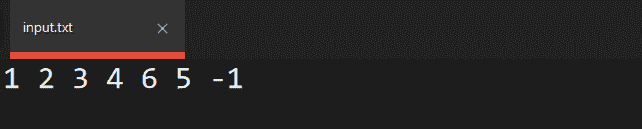
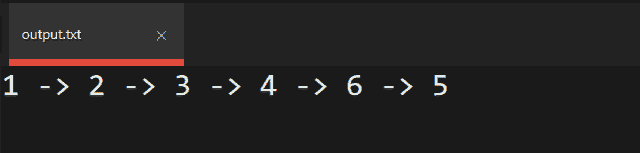

# c++中输入/输出运算符的级联

> 原文:[https://www . geeksforgeeks . org/输入输出操作符级联 in-c/](https://www.geeksforgeeks.org/cascading-of-input-output-operators-in-c/)

**先决条件:**[c++中的运算符重载](https://www.geeksforgeeks.org/operator-overloading-c/)[运算符重载的类型](https://www.geeksforgeeks.org/types-of-operator-overloading-in-c/)

当一个对象通过传递一个参数来调用一个运算符函数，而该运算符函数的返回值调用同一个表达式中的下一个运算符函数时，称为运算符的**级联。**以下是操作级联的示例说明:

**程序 1:**

## C++

```
// C++ program to illustrate the
// cascading operators
#include <iostream>
using namespace std;

// Height Class
class Height {
private:
    int feet, inches;

public:
    // Default Constructor
    Height()
    {
        feet = 0;
        inches = 0;
    }

    // Function to assign value to
    // the object of class Height
    void setData(int x, int y)
    {
        feet = x;
        inches = y;
    }

    // Function to print the object
    // of the class
    void showData()
    {
        cout << feet << "'" << inches;
    }

    // Function for overloading
    // of operator +
    Height operator+(Height H)
    {
        Height temp;

        // Add the feets
        temp.feet = feet + H.feet;

        // Add the inches
        temp.inches = inches + H.inches;
        return temp;
    }

    // Function to normalize the height
    // into proper terms of 1 feet
    // per 12 inches
    void normalize()
    {
        // Update the feets
        if (inches == 12 || inches > 12) {
            feet = feet + inches / 12;
        }

        // Update Inches
        inches = inches % 12;
    }
};

// Driver Code
int main()
{
    Height h1, h2, h3, h4;

    // Initialize the three heights
    h1.setData(5, 9);
    h2.setData(5, 2);
    h3.setData(6, 2);

    // Add all the heights using
    // cascading of operators
    h4 = h1 + h2 + h3;

    // Normalize the heights
    h4.normalize();

    // Print the height h4
    h4.showData();

    return 0;
}
```

**解释:**
在这个代码中，操作符的级联发生在这里:

> H4 = h1+H2+H3；

这里首先 h1 对象调用(+)运算符，并在运算符函数调用中传递 h2 作为参数，这个运算符函数的返回值再次调用(+)运算符，并在同一个表达式中传递 h3 作为参数，最后，这个第二个运算符函数的返回值在 h4 中赋值。

**程序二:**输入或输出运算符(**“>>”**或**“<<”**)在一个语句中的多次使用也是[输入/输出运算符](https://www.geeksforgeeks.org/basic-input-output-c/)级联的一个例子。

*   [**cout**](https://www.geeksforgeeks.org/basic-input-output-c/) 是预定义的 [**ostream**](https://www.geeksforgeeks.org/c-stream-classes-structure/) 类的对象。
*   对于不同的原始数据类型，在 **ostream** 类中定义了几个插入(“**<<**)运算符函数。对于非原始数据类型，您必须使用 [**朋友函数**](https://www.geeksforgeeks.org/friend-class-function-cpp/) 来定义它们。

下面是**'>>'****'<<'**运算符重载的程序，连续以一个数字 **N** 作为输入，在链表中插入数字 **N** ，直到 **N** = -1。

## C++

```
// C++ program to demonstrate the
// overloading of '<<' and '>>'
// operators
#include <iostream>
using namespace std;

// Class for each node object
// of the linked list
class node {
public:
    // Node of the linked list
    int data;
    node* next;

    // Constructor of node class
    node(int d)
    {
        data = d;
        next = NULL;
    }
};

// Insert a node at head of linked
// list
void insertAtHead(node*& head, int d)
{
    node* n = new node(d);
    n->next = head;
    head = n;
}

// Insert a node at tail of linked
// list
void insertAtTail(node* head, int data)
{
    // Make new node using
    // constructor
    node* n = new node(data);
    node* temp = head;

    // Traverse till we get to end of
    // the linked list
    while (temp->next != NULL)
        temp = temp->next;

    // Append the new node n at the end
    // of the linked list
    temp->next = n;
}

// Print the node at the linked list
void print(node* head)
{
    // Print the first Node
    if (head != NULL) {
        cout << head->data;
        head = head->next;
    }

    // Traverse till head traverse
    // till end
    while (head != NULL) {
        cout << "->" << head->data;
        head = head->next;
    }
}

// Function that takes continuous input
// until user enter -1 while initializing
// the linked list.
void takeInput(node*& head)
{
    int n;
    cin >> n;

    // If n is not equals to -1 insert
    // the node in the linked list
    while (n != -1) {

        // If head is NULL, insert at
        // the beginning of list
        if (head == NULL)
            insertAtHead(head, n);
        else
            insertAtTail(head, n);
        cin >> n;
    }
}

// Overloading the ostream operator '<<'
// to print the complete linked list from
// beginning
ostream& operator<<(ostream& os, node* head)
{
    print(head);
}

// Overloading the istream operator '>>'
// to take continuous input into the linked
// list until user inputs -1
istream& operator>>(istream& is, node*& head)
{
    takeInput(head);
}

// Driver Code
int main()
{
    // initialise head to NULL
    node* head = NULL;

    // Overloading of '>>' for inserting
    // element in the linked list
    cin >> head;

    // Overloading of '<<' for printing
    // element in the linked list
    cout << head;
    return 0;
}
```

**输入:**



**输出:**



**关于算子级联的一些要点:**

*   程序中操作符的级联没有限制。
*   被调用的运算符函数必须返回同一个类的对象，该对象的对象调用了该运算符函数，否则返回值将如何调用同一个类的运算符函数。