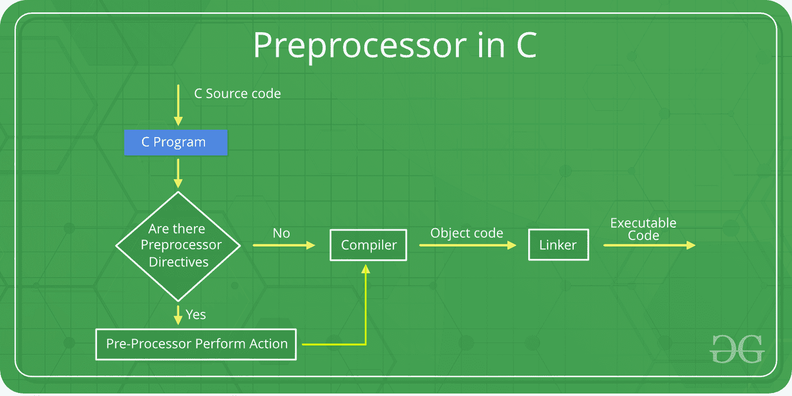

# C/C++预处理器

> 原文:[https://www.geeksforgeeks.org/cc-preprocessors/](https://www.geeksforgeeks.org/cc-preprocessors/)

顾名思义，预处理程序是在编译之前处理源代码的程序。在 C / C++中，编写程序和执行程序之间涉及许多步骤。在我们真正开始学习预处理器之前，让我们先看看这些步骤。



您可以在上图中看到中间步骤。程序员编写的源代码存储在文件程序中。然后，这个文件由预处理程序处理，并生成一个扩展的源代码文件，命名为程序。这个扩展文件由编译器编译，并生成一个名为 program .obj 的目标代码文件。最后，链接器将这个目标代码文件链接到库函数的目标代码，以生成可执行文件 program.exe。

预处理器程序提供预处理器指令，告诉编译器在编译前对源代码进行预处理。所有这些预处理器指令都以“#”(hash)符号开头。“#”符号表示，无论哪条语句以#开头，都将进入预处理器程序，预处理器程序将执行该语句。一些预处理器指令的例子有:*#包括*、*#定义*、 *#ifndef* 等。请记住# symbol 只提供了一个它将到达预处理器的路径，像 include 这样的命令由预处理器程序处理。例如，include 将在程序中包含额外的代码。我们可以将这些预处理器指令放在程序的任何地方。

**预处理器指令主要有 4 种类型:**

1.  宏指令
2.  文件包含
3.  条件编译
4.  其他指令

现在让我们详细了解一下这些指令。

*   **宏**:宏是程序中的一段代码，被赋予了某种名称。每当编译器遇到这个名称时，编译器就用实际的代码段替换这个名称。“#define”指令用于定义宏。现在让我们借助一个程序来理解宏定义:

## C++

```
#include <iostream>

// macro definition
#define LIMIT 5
int main()
{
    for (int i = 0; i < LIMIT; i++) {
        std::cout << i << "\n";
    }

    return 0;
}
```

## C

```
#include <stdio.h>

// macro definition
#define LIMIT 5
int main()
{
    for (int i = 0; i < LIMIT; i++) {
        printf("%d \n",i);
    }

    return 0;
}
```

**输出:**

```
0
1
2
3
4
```

在上面的程序中，当编译器执行单词 LIMIT 时，它用 5 代替它。宏定义中的“LIMIT”一词称为宏模板，“5”是宏扩展。

**注意**:没有分号('；')在宏定义的末尾。宏定义不需要分号来结束。

**带参数的宏**:我们也可以给宏传递参数。用参数定义的宏的工作方式与函数类似。让我们通过一个程序来理解这一点:

## C++

```
#include <iostream>

// macro with parameter
#define AREA(l, b) (l * b)
int main()
{
    int l1 = 10, l2 = 5, area;

    area = AREA(l1, l2);

    std::cout << "Area of rectangle is: " << area;

    return 0;
}
```

## C

```
#include <stdio.h>

// macro with parameter
#define AREA(l, b) (l * b)
int main()
{
    int l1 = 10, l2 = 5, area;

    area = AREA(l1, l2);

    printf("Area of rectangle is: %d", area);

    return 0;
}
```

**输出:**

```
Area of rectangle is: 50
```

从上面的程序中我们可以看到，每当编译器在程序中找到 AREA(l，b)时，它就会用语句(l*b)替换它。不仅如此，传递给宏模板 AREA(l，b)的值也将在语句(l*b)中被替换。因此，面积(10，5)将等于 10*5。

*   **文件包含**:这种类型的预处理器指令告诉编译器在源代码程序中包含一个文件。用户可以在程序中包含两种类型的文件:
    *   **头文件或标准文件**:这些文件包含预定义函数的定义，如 printf()、scanf()等。必须包含这些文件才能使用这些功能。不同的函数在不同的头文件中声明。例如，标准输入/输出函数在“iostream”文件中，而执行字符串操作的函数在“string”文件中。
        **句法**:

```
#include< *file_name* >
```

其中*文件名*是要包含的文件名。“<”和“>”括号告诉编译器在标准目录中查找文件。

*   **用户定义的文件**:当一个程序变得非常大的时候，最好把它分成更小的文件，并在需要的时候包含进去。这些类型的文件是用户定义的文件。这些文件可以包含为:

```
#include"*filename*"
```

*   **条件编译**:条件编译指令是一种有助于编译程序特定部分或基于某些条件跳过程序特定部分编译的指令。这可以在两个预处理命令“ **ifdef** 和“ **endif** 的帮助下完成。
    **语法**:

```
#ifdef macro_name
    statement1;
    statement2;
    statement3;
    .
    .
    .
    statementN;
#endif
```

如果定义了名为“*宏名*的宏，那么语句块将正常执行，但是如果没有定义，编译器将简单地跳过这个语句块。

*   **其他指令**:除了上面的指令，还有两个不常用的指令。这些是:
    *   **#undef 指令**:undef 指令用于取消现有宏的定义。该指令的作用如下:

```
#undef LIMIT
```

使用此语句将取消现有宏 LIMIT 的定义。在此语句之后，每个“#ifdef LIMIT”语句都将计算为 false。

*   **#pragma 指令**:该指令为特殊用途指令，用于开启或关闭部分功能。这种类型的指令是编译器特定的，即它们因编译器而异。下面讨论一些#pragma 指令:
    *   **#pragma 启动**和 **#pragma 退出**:这些指令帮助我们指定在程序启动之前(在控制传递给 main()之前)和程序退出之前(在控制从 main()返回之前)需要运行的功能。
        **注意:**以下程序不适用于 GCC 编译器。
        看下面的程序:

## C++

```
#include <bits/stdc++.h>
using namespace std;

void func1();
void func2();

#pragma startup func1
#pragma exit func2

void func1()
{
    cout << "Inside func1()\n";
}

void func2()
{
    cout << "Inside func2()\n";
}

int main()
{
    void func1();
    void func2();
    cout << "Inside main()\n";

    return 0;
}

// This code is contributed by shivanisinghss2110
```

## C

```
#include <stdio.h>

void func1();
void func2();

#pragma startup func1
#pragma exit func2

void func1()
{
    printf("Inside func1()\n");
}

void func2()
{
    printf("Inside func2()\n");
}

int main()
{
    void func1();
    void func2();
    printf("Inside main()\n");

    return 0;
}
```

**输出:**

```
Inside func1()
Inside main()
Inside func2()
```

当在 GCC 编译器上运行时，上述代码将产生如下所示的输出:

```
Inside main()
```

发生这种情况是因为 GCC 不支持#pragma 启动或退出。但是，您可以使用下面的代码在 GCC 编译器上获得类似的输出。

## C++

```
#include <iostream>
using namespace std;

void func1();
void func2();

void __attribute__((constructor)) func1();
void __attribute__((destructor)) func2();

void func1()
{
    printf("Inside func1()\n");
}

void func2()
{
    printf("Inside func2()\n");
}

// Driver code
int main()
{
    printf("Inside main()\n");

    return 0;
}

// This code is contributed by Shivani
```

## C

```
#include <stdio.h>

void func1();
void func2();

void __attribute__((constructor)) func1();
void __attribute__((destructor)) func2();

void func1()
{
    printf("Inside func1()\n");
}

void func2()
{
    printf("Inside func2()\n");
}

int main()
{
    printf("Inside main()\n");

    return 0;
}
```

*   **#pragma warn 指令:**该指令用于隐藏编译过程中显示的警告消息。
    我们可以隐藏如下所示的警告:
    *   **#pragma warn -rvl** :该指令隐藏了当一个应该返回值的函数没有返回值时发出的警告。
    *   **#pragma warn -par** :该指令隐藏了当函数不使用传递给它的参数时发出的警告。
    *   **#pragma warn -rch** :该指令隐藏了当代码不可访问时发出的警告。例如:函数中任何在*返回*语句后编写的代码都是不可达的。

本文由 [**哈什·阿加瓦尔**](https://www.facebook.com/harsh.agarwal.16752) 供稿。如果你喜欢 GeeksforGeeks 并想投稿，你也可以使用[write.geeksforgeeks.org](https://write.geeksforgeeks.org/)写一篇文章或者把你的文章邮寄到 contribute@geeksforgeeks.org。看到你的文章出现在极客博客主页上，帮助其他极客。

如果你发现任何不正确的地方，或者你想分享更多关于上面讨论的话题的信息，请写评论。