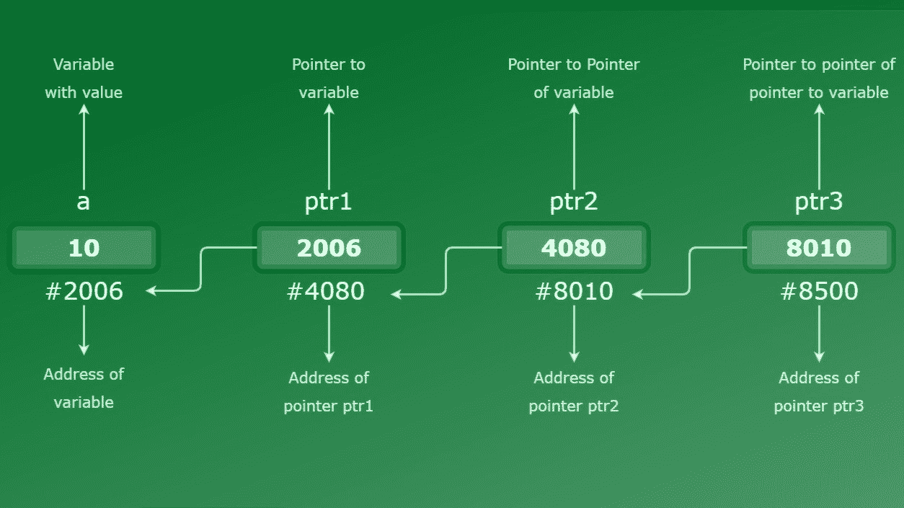

# C 中的指针链示例

> 原文:[https://www . geeksforgeeks . org/c-in-pointers-in-with-examples/](https://www.geeksforgeeks.org/chain-of-pointers-in-c-with-examples/)

**先决条件:**C 中的[指针，](https://www.geeksforgeeks.org/pointers-in-c-and-c-set-1-introduction-arithmetic-and-array/)[C](https://www.geeksforgeeks.org/double-pointer-pointer-pointer-c/)中的双指针(指针对指针)

[指针](https://www.geeksforgeeks.org/pointers-in-c-and-c-set-1-introduction-arithmetic-and-array/)用于指向变量的存储位置。指针存储变量的地址。

类似地，一个**指针链**是当有多个级别的指针时。简化，一个指针指向一个变量的地址，双指针指向一个变量等等。这叫做**多重间接**。

**语法:**

```
// level-1 pointer declaration
datatype *pointer; 

// level-2 pointer declaration
datatype **pointer; 

// level-3 pointer declaration
datatype ***pointer; 
.
.
and so on

```

指针的级别取决于声明时指针变量前面有多少星号。

**申报:**

```
int *pointer_1;
int **pointer_2;
int ***pointer_3;
.
.
and so on

```

根据内存大小，指针或链的级别可以达到 N 级。如果您想要创建一个级别为-5 的指针，您需要在声明时在指针变量名前面加 5 个星号(*)。

**初始化:**

```
// initializing level-1 pointer
// with address of variable 'var'
pointer_1 = &var;

// initializing level-2 pointer
// with address of level-1 pointer
pointer_2 = &pointer_1;

// initializing level-3 pointer
// with address of level-2 pointer
pointer_3 = &pointer_2;
.
.
and so on

```

**例 1:**
[](https://media.geeksforgeeks.org/wp-content/uploads/20200218181458/chain_pointer-1-1.jpg)

如图所示，变量“a”是存储整数值 10 的普通整数变量，位于位置 2006。“ptr1”是一个指针变量，它指向整数变量“a”，并将它的位置(即 2006)存储为它的值。类似地，ptr2 指向指针变量 ptr1，ptr3 指向指针变量 ptr2。由于每个指针都直接或间接指向变量“a”，因此它们都具有与变量“a”相同的整数值，即 10

让我们通过下面给出的代码来更好地理解:

```
#include <stdio.h>
// C program for chain of pointer

int main()
{
    int var = 10;

    // Pointer level-1
    // Declaring pointer to variable var
    int* ptr1;

    // Pointer level-2
    // Declaring pointer to pointer variable *ptr1
    int** ptr2;

    // Pointer level-3
    // Declaring pointer to double pointer **ptr2
    int*** ptr3;

    // Storing address of variable var
    // to pointer variable ptr1
    ptr1 = &var;

    // Storing address of pointer variable
    // ptr1 to level -2 pointer ptr2
    ptr2 = &ptr1;

    // Storing address of level-2 pointer
    // ptr2 to level-3 pointer ptr3
    ptr3 = &ptr2;

    // Displaying values
    printf("Value of variable "
           "var = %d\n",
           var);
    printf("Value of variable var using"
           " pointer ptr1 = %d\n",
           *ptr1);
    printf("Value of variable var using"
           " pointer ptr2 = %d\n",
           **ptr2);
    printf("Value of variable var using"
           " pointer ptr3 = %d\n",
           ***ptr3);

    return 0;
}
```

**Output:**

```
Value of variable var = 10
Value of variable var using pointer ptr1 = 10
Value of variable var using pointer ptr2 = 10
Value of variable var using pointer ptr3 = 10

```

**示例 2:** 考虑下面给出的代码，其中我们采用了变量的浮点数据类型，所以现在我们也必须对指针链采用相同的数据类型。作为指针和变量，它所指向的应该具有相同的数据类型。

```
#include <stdio.h>
int main()
{
    float var = 23.564327;

    // Declaring pointer variables upto level_4
    float *ptr1, **ptr2, ***ptr3, ****ptr4;

    // Iinitializing pointer variables
    ptr1 = &var;
    ptr2 = &ptr1;
    ptr3 = &ptr2;
    ptr4 = &ptr3;

    // Printing values
    printf("Value of var = %f\n", var);
    printf("Value of var using level-1"
           " pointer = %f\n",
           *ptr1);
    printf("Value of var using level-2"
           " pointer = %f\n",
           **ptr2);
    printf("Value of var using level-3"
           " pointer = %f\n",
           ***ptr3);
    printf("Value of var using level-4"
           " pointer = %f\n",
           ****ptr4);

    return 0;
}
```

**Output:**

```
Value of var = 23.564327
Value of var using level-1 pointer = 23.564327
Value of var using level-2 pointer = 23.564327
Value of var using level-3 pointer = 23.564327
Value of var using level-4 pointer = 23.564327

```

**示例 3:使用链式指针**
更新变量正如我们已经知道的，指针指向变量的地址位置，因此当我们访问指针的值时，它将指向变量的值。现在要更新变量值，我们可以使用任何级别的指针，因为最终每个指针都直接或间接指向该变量。它将直接改变变量地址位置的值。

```
#include <stdio.h>

int main()
{
    // Initializing integer variable
    int var = 10;

    // Declaring pointer variables upto level-3
    int *ptr1, **ptr2, ***ptr3;

    // Iinitializing pointer variables
    ptr1 = &var;
    ptr2 = &ptr1;
    ptr3 = &ptr2;

    // Printing values BEFORE updation
    printf("Before:\n");
    printf("Value of var = %d\n", var);
    printf("Value of var using level-1"
           " pointer = %d\n",
           *ptr1);
    printf("Value of var using level-2"
           " pointer = %d\n",
           **ptr2);
    printf("Value of var using level-3"
           " pointer = %d\n",
           ***ptr3);

    // Updating var's value using level-3 pointer
    ***ptr3 = 35;

    // Printing values AFTER updation
    printf("After:\n");
    printf("Value of var = %d\n", var);
    printf("Value of var using level-1"
           " pointer = %d\n",
           *ptr1);
    printf("Value of var using level-2"
           " pointer = %d\n",
           **ptr2);
    printf("Value of var using level-3"
           " pointer = %d\n",
           ***ptr3);

    return 0;
}
```

**Output:**

```
Before:
Value of var = 10
Value of var using level-1 pointer = 10
Value of var using level-2 pointer = 10
Value of var using level-3 pointer = 10
After:
Value of var = 35
Value of var using level-1 pointer = 35
Value of var using level-2 pointer = 35
Value of var using level-3 pointer = 35

```

**注意:** Level-N 指针只能用来指向 level-(N-1)指针。一级指针除外。一级指针总是指向变量。