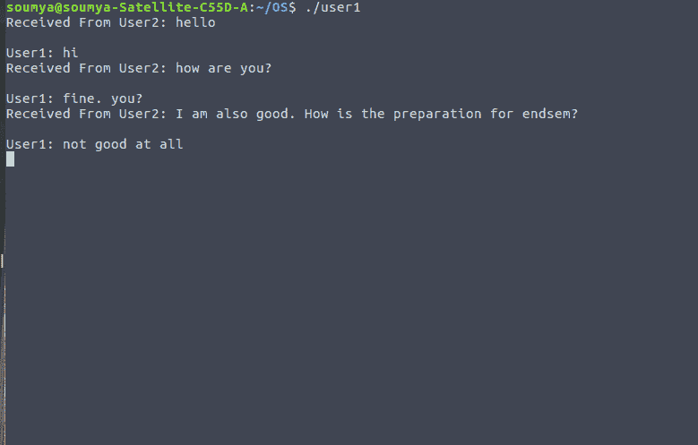
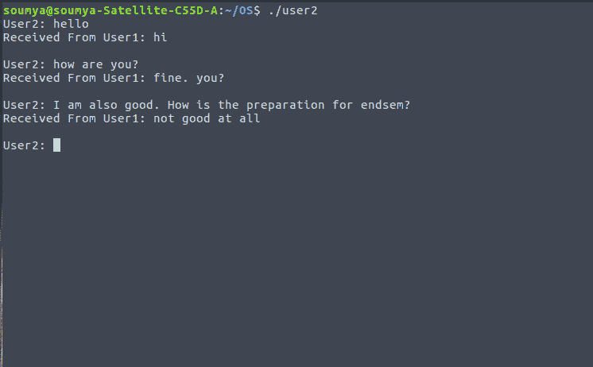

# 使用信号和共享内存在两个进程之间聊天应用

> 原文:[https://www . geeksforgeeks . org/chat-两个进程之间的应用程序-使用信号和共享内存/](https://www.geeksforgeeks.org/chat-application-between-two-processes-using-signals-and-shared-memory/)

**先决条件:** [**C 信号处理**](https://www.geeksforgeeks.org/signals-c-language/)[**IPC 通过共享内存**](https://www.geeksforgeeks.org/ipc-shared-memory/)

在 UNIX 系统中使用**信号**来通知进程某个特定事件已经发生。信号可以同步或异步接收，这取决于信号源和发出信号的事件原因。信号必须遵循以下模式–

1.信号是由特定事件的发生而产生的。

2.生成的信号被传送到特定的过程。

3.信号必须在过程接收后处理。

在这个问题中，使用 **kill** 功能将消息从一个用户发送到另一个用户。kill 函数接受两个输入——接收器进程的进程 id 和信号类型。为此，我们使用共享内存来存储两个进程的进程 id。我们使用 ***处理器功能*** ，它将打印从另一个进程接收的消息。用户 2 将开始向用户 1 发送消息，然后他们将继续聊天。

## 用户 1

```cpp
#include <signal.h>
#include <stdio.h>
#include <stdlib.h>
#include <string.h>
#include <sys/ipc.h>
#include <sys/shm.h>
#include <sys/types.h>
#include <unistd.h>

#define FILLED 0
#define Ready 1
#define NotReady -1

struct memory {
    char buff[100];
    int status, pid1, pid2;
};

struct memory* shmptr;

// handler function to print message received from user2

void handler(int signum)
{
    // if signum is SIGUSR1, then user 1 is receiving a message from user2

    if (signum == SIGUSR1) {
        printf("Received User2: ");
        puts(shmptr->buff);
    }
}

int main()
{
    // process id of user1

    int pid = getpid();

    int shmid;

    // key value of shared memory
    int key = 12345;

    // shared memory create
    shmid = shmget(key, sizeof(struct memory), IPC_CREAT | 0666);

    // attaching the shared memory

    shmptr = (struct memory*)shmat(shmid, NULL, 0);

    // store the process id of user1 in shared memory
    shmptr->pid1 = pid;
    shmptr->status = NotReady;

    // calling the signal function using signal type SIGUSER1
    signal(SIGUSR1, handler);

    while (1) {
        while (shmptr->status != Ready)
            continue;
        sleep(1);

        // taking input from user1

        printf("User1: ");
        fgets(shmptr->buff, 100, stdin);

        shmptr->status = FILLED;

        // sending the message to user2 using kill function

        kill(shmptr->pid2, SIGUSR2);
    }

    shmdt((void*)shmptr);
    shmctl(shmid, IPC_RMID, NULL);
    return 0;
}
```

## 用户 2

```cpp
#include <signal.h>
#include <stdio.h>
#include <stdlib.h>
#include <string.h>
#include <sys/ipc.h>
#include <sys/shm.h>
#include <sys/types.h>
#include <unistd.h>

#define FILLED 0
#define Ready 1
#define NotReady -1

struct memory {
    char buff[100];
    int status, pid1, pid2;
};

struct memory* shmptr;

// handler function to print message received from user1

void handler(int signum)
{
    // if signum is SIGUSR2, then user 2 is receiving a message from user1

    if (signum == SIGUSR2) {
        printf("Received From User1: ");
        puts(shmptr->buff);
    }
}

// main function

int main()
{
    // process id of user2
    int pid = getpid();

    int shmid;

    // key value of shared memory
    int key = 12345;

    // shared memory create

    shmid = shmget(key, sizeof(struct memory), IPC_CREAT | 0666);

    // attaching the shared memory

    shmptr = (struct memory*)shmat(shmid, NULL, 0);

    // store the process id of user2 in shared memory
    shmptr->pid2 = pid;

    shmptr->status = NotReady;

    // calling the signal function using signal type SIGUSR2
    signal(SIGUSR2, handler);

    while (1) {
        sleep(1);

        // taking input from user2

        printf("User2: ");
        fgets(shmptr->buff, 100, stdin);
        shmptr->status = Ready;

        // sending the message to user1 using kill function

        kill(shmptr->pid1, SIGUSR1);

        while (shmptr->status == Ready)
            continue;
    }

    shmdt((void*)shmptr);
    return 0;
}
```

**Output:**

*   
*   