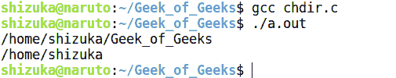
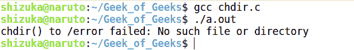

# C 语言中的 chdir()，示例

> 原文:[https://www . geesforgeks . org/chdir-in-c-language-with-examples/](https://www.geeksforgeeks.org/chdir-in-c-language-with-examples/)

**chdir** 命令是一个系统函数(系统调用)，用于改变当前工作目录。在某些系统上，该命令被用作 shell 命令 [cd](https://www.geeksforgeeks.org/cd-command-in-linux-with-examples/) 的别名。chdir 将调用进程的当前工作目录更改为路径中指定的目录。

**语法:**

```cpp
int chdir(const char *path);
```

**参数:**这里的*路径*是用户想要制作当前工作目录的目录路径。

**返回值:**该命令成功后返回零(0)。出现错误时返回-1，并适当设置 errno。

**注:**在 `unistd.h`申报。

**例 1:**

```cpp
#include<stdio.h>

// chdir function is declared
// inside this header
#include<unistd.h> 
int main()
{   
    char s[100];

    // printing current working directory
    printf("%s\n", getcwd(s, 100));

    // using the command
    chdir("..");

    // printing current working directory
    printf("%s\n", getcwd(s, 100));

    // after chdir is executed
    return 0;
}
```

**输出:**

[](https://media.geeksforgeeks.org/wp-content/uploads/chdir.png)

**注意:**上述程序改变了一个进程的工作目录。但是，它不会改变当前 shell 的工作目录。因为当程序在 shell 中执行时，shell 遵循 fork on exec 机制。所以，它不影响当前的外壳。

**例 2:**

```cpp
#include <unistd.h>
#include <stdio.h>

// Main Method
int main() {

  // changing the current 
  // working directory(cwd)
  // to /usr
  if (chdir("/usr") != 0) 
    perror("chdir() to /usr failed");

  // changing the cwd to /tmp
  if (chdir("/tmp") != 0) 
    perror("chdir() to /temp failed");

  // there is no /error 
  // directory in my pc
  if (chdir("/error") != 0) 

    // so chdir will return -1 
    perror("chdir() to /error failed");  

  return 0;
}
```

**输出:**

[](https://media.geeksforgeeks.org/wp-content/uploads/chdir2.png)

**错误:**可以有可以返回的错误。这些取决于文件系统。

*   **EACCES:** 如果路径的某个组件的搜索权限被拒绝。
*   **EFAULT:** 如果路径点位于可访问的地址空间之外。
*   **EIO:** 如果出现输入/输出错误。
*   **ELOOP:** 如果在解析路径中遇到太多符号链接。
*   **enametolong:**如果路径太长。
*   **ENOENT:** 如果文件不存在。
*   **ENOMEM:** 如果没有足够的内核内存可用。
*   **ENOTDIR:** 如果路径的成分不是目录。