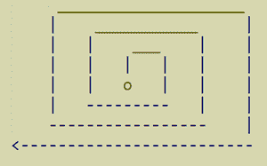
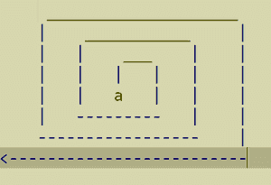
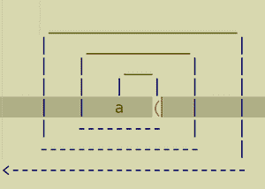
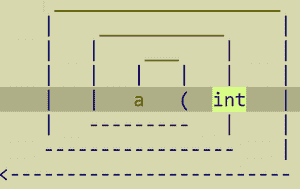
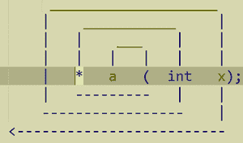
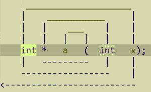

# C/c++中的顺时针/螺旋法则，示例

> 原文:[https://www . geeksforgeeks . org/顺时针-螺旋-c 中规-c-带-例/](https://www.geeksforgeeks.org/clockwise-spiral-rule-in-c-c-with-examples/)

螺旋/顺时针方法是 [C/C++](https://www.geeksforgeeks.org/c-plus-plus/) 程序员在几秒钟内定义头部语法声明含义的神奇工具。这个方法是由**大卫·安德森**创造的，这里有一个关于如何应用这个方法的简短说明。

编码时，当有人遇到新的不需要的语法声明时:

```cpp
string(const** f(int, void (*const p)(int)))(char[]);
```

这里出现的问题是[功能](https://www.geeksforgeeks.org/functions-in-c/)名称“f”是什么意思？有一种臭名昭著的方法可以帮助人们在几秒钟内推导出这个函数“f”的含义。

**进场:**

**第一步:**考虑这个顺时针螺旋。



**第二步:**将 *O* 替换为 *a* 。



**第三步:**现在，沿着顺时针的路径，用一些单词替换“|”，试着得到语法的意思，用“(”替换“|”。圆括号说明其功能，表示**“‘一’是功能”。**

****

****第四步:**考虑看看圆括号/函数里面是什么，这样就遇到了开括号(记住像从[优先的运算符](https://www.geeksforgeeks.org/operator-precedence-and-associativity-in-c/)一样，括号总是先打开的)从左到右一直走到圆括号的末尾)】。可以说“‘a’是以整数‘x’为自变量的函数”。**

****

****第五步:**现在回到第一轮括号，继续从”()开始的螺旋路径。将“|”替换为“*”。这意味着返回值和[指针](https://www.geeksforgeeks.org/pointers-in-c-and-c-set-1-introduction-arithmetic-and-array/)。这里“‘a’是一个以整数‘x’作为参数的函数，它返回一个指向的指针”。**

****

****第 6 步:**继续顺时针螺旋。你会遇到已经处理过的“int”，所以继续螺旋路径。**

****

****第 7 步:**将“|”替换为“int”。可以说“‘a’是一个以整数‘x’为自变量的函数，它返回一个指向整数的指针”。**

****

****第八步:**再继续这条路，一个人会得到“；”这意味着这是语句的结尾，看看这是如何轻松定义语法含义的。**

****

**最后，可以说“‘a’是以整数‘x’作为参数的函数，它返回一个指向该整数的指针”。**

****答案:** f 是一个以参数为 int 的函数，p 是一个以参数为 int 的函数，返回一个指向 nothing (void)的常量指针返回一个指向[常量函数](https://www.geeksforgeeks.org/difference-between-static-and-constant-function-in-cpp/)的指针，以[字符数组](https://www.geeksforgeeks.org/difference-between-string-and-character-array-in-java/)为参数返回一个[字符串](https://www.geeksforgeeks.org/string-data-structure/)。**

****要点:****

1.  **语法解释:

    *   **A[ ]:** [阵](https://www.geeksforgeeks.org/arrays-in-c-cpp/) A 大小不确定，A[ 5 ]表示阵的大小为 5。
    *   **(类型 1，类型 2):** 传递类型 1 和类型 2 的函数。
    *   ***:** 指针指向。** 
2.  **从变量名开始。**
3.  **保持这个读数，直到变量声明中的所有修饰符都被覆盖。**
4.  **总是先完成括号中的任何内容。**
5.  **继续以螺旋/顺时针方向进行此操作，直到所有令牌都被覆盖。**

****例子:**
通过想象大脑中的螺旋来考虑一个例子:**

```cpp
(char const *p) ( int , const (int  *)*);
```

**记住经验法则。总是以变量名开头。从一个变量 p 顺时针螺旋开始。**

****第一步:**“p”为变量。**

```cpp
p 
```

****步骤 2:**“p”是一个变量，它是指向的指针。**

```cpp
p -> * 
```

****步骤 3:**“p”是一个变量，它是一个函数的指针。**

```cpp
p -> *  -> ( 
```

**步骤 4: **'** p '是一个变量，它是指向以 int 为参数的函数的指针。**

```cpp
p -> *  -> (  -> int 
```

****第五步:**对于下一步，没有变量名，给一个。让它成为“a”。所以这个表达式可以写成:**

```cpp
(char const *p) ( int , const (int  *)* a );
```

****第六步:**这里的‘a’是一个变量。**

```cpp
a 
```

****第七步:**闭圆括号不说明什么，继续。**

```cpp
a-> ) 
```

****第 8 步:**在下一步中，a 是指向的变量指针。**

```cpp
a -> ) -> * 
```

****步骤 9:** 忽略分号，因为语法定义不完整，所以继续。**

```cpp
a -> ) -> *  -> ; 
```

****第 10 步:**封闭的圆形括号没有说明什么，继续。**

```cpp
a -> ) -> *  -> ; -> )
```

****第 11 步:**现在‘a’是指向指针的变量指针。**

```cpp
a -> ) -> *  -> ; -> ) -> * 
```

****步骤 12:**“a”是指向指针 int 的变量指针。**

```cpp
a -> ) -> *  -> ; -> ) -> * -> int 
```

****步骤 13:**“a”是指向指针 int 常量的变量指针。**

```cpp
a -> ) -> *  -> ; -> ) -> * -> int -> const 
```

**让我们回到定义“p”的地方。**

****第 14 步:**“p”是一个变量，它是指向以 int 为参数的函数的指针，也是指向指针 int 常量的变量指针，指针 int 常量返回常量。**

```cpp
p -> *  -> (  -> int , const... -> const
```

****注意:**
这里忽略了已经用于定义语法的重用术语。**

****第 15 步:** p 是一个变量，它是指向以 int 为参数的函数的指针，也是指向指针 int 常量的变量指针，指针 int 常量返回一个常量字符。**

```cpp
p -> *  -> (  -> int , const... -> const->char
```

**这就完成了语法的全部含义。**

****注意:**
当语法有数组(尤其是[多维数组](https://www.geeksforgeeks.org/multidimensional-arrays-c-cpp/)时，这个规则有一个例外，所以这个规则有一个更新。**

*   **当遇到一个数组时，移动到最右边的右方括号，将该数组视为一个“扫描”**
*   ****示例:**

    *   **int * a[10][]:**“a”是一个大小为 10 的多维数组，以及一个未定义大小的指向 int 的指针。**