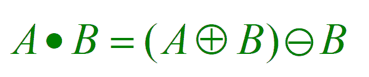
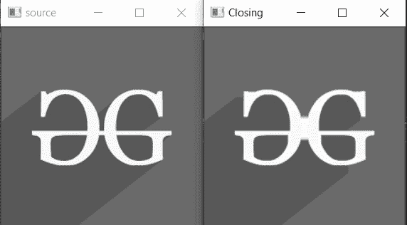

# 关闭| c++ 中 OpenCV 的形态转换

> 原文:[https://www . geesforgeks . org/closing-形态学-transformations-in-opencv-in-c/](https://www.geeksforgeeks.org/closing-morphological-transformations-in-opencv-in-c/)

本文讨论了一种叫做**闭合**的[形态运算](https://www.geeksforgeeks.org/python-morphological-operations-in-image-processing-opening-set-1/)。

*   它有助于减少图像内部的内部噪声。
*   在本文中，另一个操作符被详细描述为关闭，它正好与打开相反，并应用膨胀，然后是[侵蚀](https://www.geeksforgeeks.org/erosion-dilation-images-using-opencv-python/)。
*   就像 open 操作符一样，它也使用结构化元素，但它用于移除小孔而不是孔。

**语法:**

> morphologyEx (src、dst、op、内核、锚点、迭代、borderType、borderValue)

**参数:**

*   **src:** 是输入图像。
*   **dst:** 是输出图像。
*   **op:** 形态操作类型。
*   **内核:**用于关闭的结构元素。
*   **锚:**结构元素内部的锚位置。默认值为[-1，-1}表示位置为结构元素的中心。
*   **迭代:**应用关闭的次数。
*   **边框类型:**边框的类型(BORDER_CONSTANT、BORDER_REPLICATE 等。)
*   **边框值:**边框值
*   **返回:**输出图像(Mat 对象)

关闭操作由表达式给出:

[](https://media.geeksforgeeks.org/wp-content/uploads/20191224004635/gfg_closing.png)

*   该表达式表示 A 是 **A <sup>的子图像。</sup>乙**。
*   该操作符用于从图像中去除小孔。
*   它也有助于平滑轮廓和融合狭窄的休息和细长的海湾。

下面是演示闭合形态算子的程序:

## C++

```cpp
// C++ program for demonstrating the
// closing morphological operator

// For drawing shapes
#include <opencv2/highgui/highgui.hpp>
#include <opencv2/imgproc.hpp>
using namespace cv;
using namespace std;

// Function to demonstrate the
// closing morphological operator
void closingMorphological()
{
    // Reading the Image
    Mat image = imread(
        "C:/Users/harsh/Downloads/geeks.png",
        IMREAD_GRAYSCALE);

    // Check if the image is
    // created successfully
    if (!image.data) {
        cout << "Could not open or "
             << "find the image\n";
        return 0;
    }

    int morph_size = 2;

    // Create structuring element
    Mat element = getStructuringElement(
        MORPH_RECT,
        Size(2 * morph_size + 1,
             2 * morph_size + 1),
        Point(morph_size, morph_size));
    Mat output;

    // Closing
    morphologyEx(image, output,
                 MORPH_CLOSE, element,
                 Point(-1, -1), 2);

    // Displays the source and
    // the closing image formed
    imshow("source", image);
    imshow("Closing", output);
    waitKey();
}

// Driver Code
int main(int argc, char** argv)
{
    // Function Call
    closingMorphological();

    return 0;
}
```

**输出:**

[](https://media.geeksforgeeks.org/wp-content/uploads/20210128213428/gg.jpg)