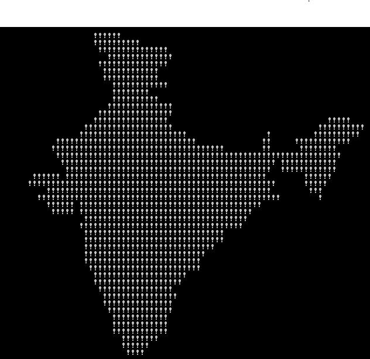

# 生成印度地图的代码(附说明)

> 原文:[https://www . geesforgeks . org/code-to-generate-the-the-map-of-India-with-explain/](https://www.geeksforgeeks.org/code-to-generate-the-map-of-india-with-explanation/)

给出一个生成印度地图的模糊代码，解释它的工作原理。
以下代码在执行时生成印度地图–

以上代码是**混淆代码**的典型例子，即人类难以理解的代码。
**它是如何工作的？**
基本上，字符串是印度地图的游程编码。字符串中的交替字符存储了画空格的次数，以及连续画感叹号的次数。
这里分析了这个程序的不同元素–
**编码字符串**

```cpp
"Hello!Welcome to GeeksForGeeks."
"TFy!QJu ROo TNn(ROo)SLq SLq ULo+UHs UJq TNn*RPn/QPbEWS_JSWQAIJO^NBELPeHBFHT}TnALVlBL"
"OFAkHFOuFETpHCStHAUFAgcEAelclcn^r^r\\tZvYxXyT|S~Pn SPm SOn TNn ULo0ULo#ULo-WHq!WFs XDt!";
```

请注意编码字符串末尾的[b+++ 21]。由于 b++ + 21 相当于(b+++ 21)，其计算结果为 31 (10 + 21)，因此该字符串的前 31 个字符将被忽略，不会有任何作用。剩余的编码字符串包含绘制地图的说明。单个字符决定了要连续绘制多少个空格或感叹号。
**【外部 for 循环】**
这个循环遍历字符串中的字符。每次迭代将 b 的值增加 1，并将字符串中的下一个字符分配给 a。
**内部 for 循环**
此循环绘制单个字符，并在到达行尾时绘制一条新行。考虑一下这个 putchar 语句

```cpp
putchar(++ c=='Z' ? c = c/9 : 33^b&1);
```

因为“Z”代表 ASCII 中的数字 90，所以 90/9 会给我们 10，这是一个换行符。十进制 33 是代表“！”的 ASCII。切换 33 的低位会得到 32，这是一个空格的 ASCII 码。这导致！如果 b 是奇数，则打印；如果 b 是偶数，则打印空白。
下面是上面代码的**一个不太模糊的版本**–

## C++

```cpp
// C++ program to print map of India
#include <iostream>
using namespace std;

int main()
{
    int a = 10, b = 0, c = 10;

    // The encoded string after removing first 31 characters
    // Its individual characters determine how many spaces
    // or exclamation marks to draw consecutively.
    char* str = "TFy!QJu ROo TNn(ROo)SLq SLq ULo+UHs UJq "
                "TNn*RPn/QPbEWS_JSWQAIJO^NBELPeHBFHT}TnALVlBL"
                "OFAkHFOuFETpHCStHAUFAgcEAelclcn^r^r\\tZvYxXyT|S~Pn SPm "
                "SOn TNn ULo0ULo#ULo-WHq!WFs XDt!";

    while (a != 0)
    {
        // read each character of encoded string
        a = str[b++ ];
        while (a-- > 64)
        {
            if (++ c == 90) // 'Z' is 90 in ascii
            {
                // reset c to 10 when the end of line is reached
                c = 10;        // '\n' is 10 in ascii

                // print newline
                putchar('\n'); // or putchar(c);
            }
            else
            {
                // draw the appropriate character
                // depending on whether b is even or odd
                if (b % 2 == 0)
                    putchar('!');
                else
                    putchar(' ');
            }
        }
    }

    return 0;
}

// This code is contributed by SHUBHAMSINGH10.
```

## C

```cpp
// C program to print map of India
#include <stdio.h>

int main()
{
    int a = 10, b = 0, c = 10;

    // The encoded string after removing first 31 characters
    // Its individual characters determine how many spaces
    // or exclamation marks to draw consecutively.
    char* str = "TFy!QJu ROo TNn(ROo)SLq SLq ULo+UHs UJq "
                "TNn*RPn/QPbEWS_JSWQAIJO^NBELPeHBFHT}TnALVlBL"
                "OFAkHFOuFETpHCStHAUFAgcEAelclcn^r^r\\tZvYxXyT|S~Pn SPm "
                "SOn TNn ULo0ULo#ULo-WHq!WFs XDt!";

    while (a != 0)
    {
        // read each character of encoded string
        a = str[b++ ];
        while (a-- > 64)
        {
            if (++ c == 90) // 'Z' is 90 in ascii
            {
                // reset c to 10 when the end of line is reached
                c = 10;        // '\n' is 10 in ascii

                // print newline
                putchar('\n'); // or putchar(c);
            }
            else
            {
                // draw the appropriate character
                // depending on whether b is even or odd
                if (b % 2 == 0)
                    putchar('!');
                else
                    putchar(' ');
            }
        }
    }

    return 0;
}
```

## Java 语言(一种计算机语言，尤用于创建网站)

```cpp
// Java program to print map of India
class GFG
{
    public static void main(String[] args)
    {
        int a =10, b = 0, c = 10;

        // The encoded string after removing first 31 characters
        // Its individual characters determine how many spaces
        // or exclamation marks to draw consecutively.
        String s1="TFy!QJu ROo TNn(ROo)SLq SLq ULo+UHs UJq TNn*RPn/QP,\n"
        + "bEWS_JSWQAIJO^NBELPeHBFHT}TnALVlBLOFAkHFOuFETpHCStHAUFAgcEAelc,\n"
        + "lcn^r^r\\tZvYxXyT|S~Pn SPm SOn TNn ULo0ULo#ULo-WHq!WFs XDt!";

        // read each character of encoded string
        a=s1.charAt(b);

        while (a != 0)
        {
            if (b < 170)
            {
                a = s1.charAt(b);
                b++ ;
                while (a-- > 64)
                {

                    if (++ c=='Z')
                    {

                        c/=9;

                        System.out.print((char)(c));
                    }
                    else
                        System.out.print((char)(33 ^ (b & 0x01)));
                }
            }
            else
                break;
        }
    }
}
```

## 蟒蛇 3

```cpp
# Python3 program to print map of India
a = 10
b = 0
c = 10

# The encoded string after removing first
# 31 characters. Its individual characters
# determine how many spaces or exclamation
# marks to draw consecutively.
s = ("TFy!QJu ROo TNn(ROo)SLq SLq ULo+UHs"
     " UJq TNn*RPn/QPbEWS_JSWQAIJO^NBELPe"
     "HBFHT}TnALVlBLOFAkHFOuFETpHCStHAUFA"
     "gcEAelclcn^r^r\\tZvYxXyT|S~Pn SPm S"
     "On TNn ULo0ULo#ULo-WHq!WFs XDt!")

# Read each character of encoded string
a = ord(s[b])

while a != 0:
    if b < 170:
        a = ord(s[b])
        b += 1

        while a > 64:
            a -= 1
            c += 1

            if c == 90:
                c = c // 9
                print(end = chr(c))
            else:
                print(chr(33 ^ (b & 0X01)), end = '')
    else:
        break

# The code is contributed by aayush_chouhan
```

## C#

```cpp
// C# program to print map of India
using System;

class GFG
{
    public static void Main()
    {
        int a = 10, b = 0, c = 10;

        // The encoded string after removing first 31 characters
        // Its individual characters determine how many spaces
        // or exclamation marks to draw consecutively.
        string s1 = "TFy!QJu ROo TNn(ROo)SLq SLq ULo+UHs UJq TNn*RPn/QP,\n"
        + "bEWS_JSWQAIJO^NBELPeHBFHT}TnALVlBLOFAkHFOuFETpHCStHAUFAgcEAelc,\n"
        + "lcn^r^r\\tZvYxXyT|S~Pn SPm SOn TNn ULo0ULo#ULo-WHq!WFs XDt!";

        // read each character of encoded string
        a = s1[b];

        while (a != 0)
        {
            if (b < 170)
            {
                a = s1[b];
                b++ ;
                while (a-- > 64)
                {

                    if (++ c == 'Z')
                    {

                        c/=9;

                    Console.Write((char)(c));
                    }
                    else
                    Console.Write((char)(33 ^ (b & 0x01)));
                }
            }
            else
                break;
        }
    }
}

//This code is contributed by vt_m.
```

## 服务器端编程语言（Professional Hypertext Preprocessor 的缩写）

```cpp
<?php
// PHP Implementation to
// print map of India

$a = 10;
$b = 0;
$c = 10;

// The encoded string after removing first 31 characters
// Its individual characters determine how many spaces
// or exclamation marks to draw consecutively.
$s1 = "TFy!QJu ROo TNn(ROo)SLq SLq ULo+UHs UJq ".
      "TNn*RPn/QPbEWS_JSWQAIJO^NBELPeHBFHT}TnALVlBL".
      "OFAkHFOuFETpHCStHAUFAgcEAelclcn^r^r\\tZvYxXyT|S~Pn SPm ".
      "SOn TNn ULo0ULo#ULo-WHq!WFs XDt!";
$a=ord($s1[$b]);

while ($a != 0)
    {
        if ($b < 170)
        {
            $a = ord($s1[$b]);
            $b++ ;
            while ($a-- > 64)
            {

                if (++$c==90)
                {

                    $c=floor($c/9);

                    echo chr($c);
                }
                else
                    printf(chr(33 ^ ($b & 0x01)));
            }
        }
        else
            break;
    }

// note: ord() function convert the
// characters into its Ascii value

//this code is contributed by mits
?>
```

**输出:**



**参考:**[http://stackoverflow . com/questions/3533348/这个代码是如何生成印度地图的](http://stackoverflow.com/questions/3533348/how-does-this-code-generate-the-map-of-india)
本文由 **Aditya Goel** 供稿。如果你喜欢 GeeksforGeeks 并想投稿，你也可以使用[write.geeksforgeeks.org](https://write.geeksforgeeks.org)写一篇文章或者把你的文章邮寄到 review-team@geeksforgeeks.org。看到你的文章出现在极客博客主页上，帮助其他极客。
如果发现有不正确的地方，或者想分享更多关于上述话题的信息，请写评论。