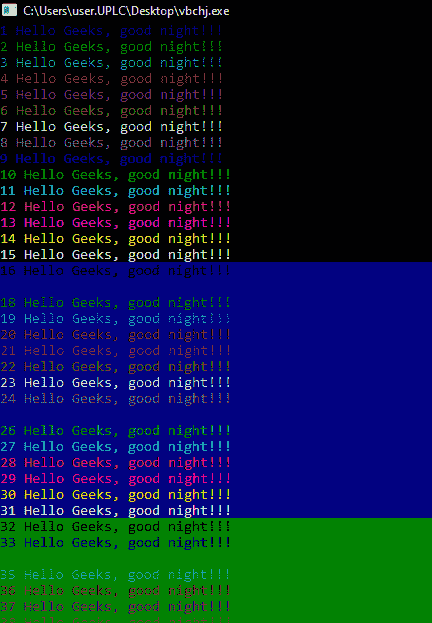

# 在 C++中为文本和控制台背景着色

> 原文:[https://www . geesforgeks . org/coloring-text-and-console-background-in-c/](https://www.geeksforgeeks.org/colorizing-text-and-console-background-in-c/)

在 [C++编程](https://www.geeksforgeeks.org/c-plus-plus/)中，输出屏幕的默认背景为黑色，文本颜色为白色，任务是给输出屏幕的背景和文本颜色都上色。

**<u>头文件</u> :**

为文本和背景着色所需的头文件可以是给定的头文件:

> #包括 <windows.h>或
> #包括< stdlib.h ></windows.h>

**<u>颜色控制台的语法</u> :**

> HANDLE console _ color
> 
> //控制台的颜色
> 控制台 _ Color = GetStdHandle(STD _ OUTPUT _ HANDLE)；
> 
> // P 是根据你的需要的色码。
> SetConsoleTextAttribute(console _ color，P)；

下面是同样的程序:

## C++

```cpp
// C++ program for the coloring the
// background and text with
// different color
#include <iostream>

// Header file to change color of
// text and background
#include <windows.h>
using namespace std;

// Driver Code
int main()
{
    // Color of the console
    HANDLE console_color;
    console_color = GetStdHandle(
        STD_OUTPUT_HANDLE);

    // Print different colors from 1
    // to 50 on the output screen
    for (int P = 1; P < 50; P++) {

        // P is color code of the
        // corresponding color
        SetConsoleTextAttribute(
            console_color, P);

        // Print Statement
        cout << P << " Hello Geeks, "
             << "good night!!!";
    }

    return 0;
}
```

**输出:**

[](https://media.geeksforgeeks.org/wp-content/uploads/20201213013042/gfgO.png)