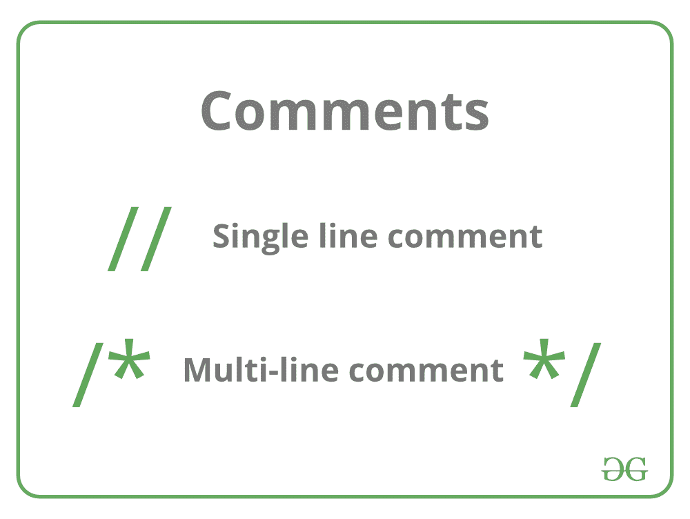

# C/c++

中的注释

> 原文:[https://www.geeksforgeeks.org/comments-in-c-c/](https://www.geeksforgeeks.org/comments-in-c-c/)

作为一名程序员，一个文档化的程序是一个很好的实践。它使程序更易读，错误查找变得更容易。好的文档的一个重要部分是注释。

*   在计算机编程中，注释是程序员可读的对计算机程序源代码的解释或注释
*   注释是不被编译器和解释器执行的语句。

**在 C/C++中有两种类型的注释:**

1.  单行注释
2.  多行注释



**单行评论**

表示为**/**双正斜杠
用于表示单行注释。它只对一行应用注释。它被称为 C++风格的注释，因为它最初是 C++编程的一部分。
例如:

```
// single line comment
```

**示例:**这个示例对于 C 和 C++来说是一样的，因为这两种语言的注释风格都是一样的。

## C

```
// C program to illustrate
// use of multi-line comment
#include <stdio.h>
int main(void)
{

    // Single line Welcome user comment
    printf("Welcome to GeeksforGeeks");
    return 0;
}
```

**Output:** 

```
Welcome to GeeksforGeeks
```

**多行评论**

表示为 **/* any_text */** 以正斜杠和星号(/*)开头，以星号和正斜杠(*/)结尾。
表示多行注释。它可以将注释应用于多行。它被称为 C 风格注释，因为它是在 C 编程中引入的。

```
/*Comment starts
continues
continues
.
.
.
Comment ends*/
```

**示例:**这个示例对于 C 和 C++来说是一样的，因为这两种语言的注释风格都是一样的。

## C

```
/* C program to illustrate
use of
multi-line comment */
#include <stdio.h>
int main(void)
{

    /* Multi-line Welcome user comment
    written to demonstrate comments
    in C/C++ */
    printf("Welcome to GeeksforGeeks");
    return 0;
}
```

**Output:** 

```
Welcome to GeeksforGeeks
```

**代码行末尾的注释**

您还可以创建一个显示在一行代码末尾的注释。但是一般来说，将注释放在代码行之前是更好的做法。
**示例:**这个示例对于 C 和 C++来说是一样的，因为这两种语言的注释风格都是一样的。

```
 int age; // age of the person
```

**编程中何时以及为什么要使用注释？**

1.  如果没有提供关于程序细节的注释，阅读大量代码的人会感到困惑。
2.  注释是一种通过提供更多描述使代码更易读的方法。
3.  注释可以包括对算法的描述，以使代码易于理解。
4.  如果代码要在很长一段时间后被重用，注释对自己也是有帮助的。