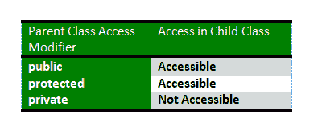

# 常见 C++面试问题|第二集

> 原文:[https://www . geesforgeks . org/common-question-c-interview-questions-set-2/](https://www.geeksforgeeks.org/commonly-asked-c-interview-questions-set-2/)

### 问:Java 和 C++的主要区别

差异有很多，一些主要的差异是:

*   Java 有自动垃圾收集，而 C++有析构函数，当对象被销毁时，析构函数会自动调用。
*   Java 不支持指针、模板、联合、运算符重载、结构等。
*   C++没有对线程的内置支持，而在 Java 中有一个线程类，您可以继承它来创建一个新的线程
*   Java 中没有 goto
*   C++支持方法重载和运算符重载，但 Java 只有方法重载。
*   C++只支持使用类的多重继承，但是 Java 不支持使用类的多重继承。我们需要接口来实现 Java 中的多个继承。
*   Java 是*解释的*，因此与平台无关，而 C++不是。编译时，Java 源代码转换成 JVM *字节码*。解释器在运行时执行这个字节码并给出输出。C++使用编译器运行和编译，该编译器将源代码转换为机器级语言。

### 什么是 C++访问说明符？

访问说明符用于定义如何在类外部访问成员(函数和变量)。

*   **Private:** 声明为 Private 的成员只能在同一个类内访问，不能在声明的类外访问。子类也不允许访问父类的私有成员。
*   **公共:**声明为公共的成员可以从任何地方访问。
*   **受保护:**只有类及其子类可以访问受保护的成员。

你知道[在 C++中给派生类方法更多的限制访问会发生什么吗？](https://www.geeksforgeeks.org/what-happens-when-more-restrictive-access-is-given-in-a-derived-class-method-in-c/)

### 问:主要的 C++特性

**类:**类是数据和函数或方法的蓝图。类不占用任何空间。

*   **对象:**对象是面向对象系统中的基本运行时实体，对象是类的实例，这些是用户定义的数据类型。
*   **封装和数据抽象:**将数据和功能包装(组合)成一个单元称为封装。外部世界无法访问数据，只有包装在类中的函数才能访问数据。数据与程序直接访问的隔离称为数据隐藏或信息隐藏。
*   **数据抽象**–只向外界提供需要的信息，隐藏实现细节。例如，考虑一个公共函数为 getReal()和 getImag()的 Complex 类。我们可以将类实现为大小为 2 的数组或两个变量。抽象的优点是，我们可以在任何时候改变实现，复杂类的用户不会受到影响，因为我们的方法接口保持不变。如果我们的实施是公开的，我们将无法改变它。
*   **继承:**继承是一个类的对象获取另一个类的对象的属性的过程。它支持分级分类的概念。继承提供了可重用性。这意味着我们可以在不修改现有类的情况下向其添加额外的特性。
*   **多态性:**多态性是指能够采取多种形式的能力。一个操作在不同的情况下可能表现出不同的行为。该行为取决于操作中使用的数据类型。
*   **动态绑定:**在动态绑定中，响应函数调用要执行的代码是在运行时决定的。C++有虚拟函数来支持这一点。
*   **消息传递:**对象之间通过相互发送和接收信息进行通信。对象的消息是执行过程的请求，因此将调用接收对象中的函数来生成所需的结果。消息传递包括指定对象的名称、函数的名称和要发送的信息。

### 问:[c++中的结构与类](https://www.geeksforgeeks.org/g-fact-76/)

*   在 C++中，结构与类相同，除了以下区别:
    *   默认情况下，类的成员是私有的，结构的成员是公共的。
    *   从类/结构派生结构时，基类/结构的默认访问说明符是公共的。当派生一个类时，默认访问说明符是私有的。

### 问:[Malloc()vs new](https://www.geeksforgeeks.org/malloc-vs-new/)/[Delete vs Free](https://www.geeksforgeeks.org/g-fact-30/)

下面是 malloc()和运算符 new 之间的区别。

*   new 是运算符，而 malloc()是函数。
*   new 返回精确的数据类型，而 malloc()返回 void *。
*   new 调用构造函数(类实例会自动初始化和取消初始化)，而 malloc()不会(类不会自动初始化或取消初始化
*   语法:
    1.  int * n = new int(10)；//用 new()初始化
    2.  str =(char *)malloc(15)；//malloc()

**free( )** 用于 C 中 malloc()，或 calloc()分配的资源

**删除**用于 C++中 new 分配的资源

### 问:[内联功能](https://www.geeksforgeeks.org/inline-functions-cpp/)

C++提供了内联函数来减少函数调用开销。内联函数是一个函数，当它被调用时，它是按行展开的。当内联函数被调用时，内联函数的整个代码在内联函数调用点被插入或替换。这种替换由 C++编译器在编译时执行。如果内联函数很小，它可能会提高效率。

内联定义函数的语法是:

内联返回类型函数名(参数)

{

//功能代码

}

*记住，内联只是对编译器的请求，不是命令。编译器可以忽略内联请求。*

### q .[c++中的友元类和函数](https://www.geeksforgeeks.org/friend-class-function-cpp/)

朋友类可以访问其他类的私有和受保护成员，在这些类中，它被声明为朋友。有时允许特定类访问其他类的私有成员是有用的。例如，链接列表类可能被允许访问节点的私有成员。

朋友函数和朋友类一样，朋友函数可以被授予访问私有和受保护成员的特殊权限。朋友功能可以是:

A)另一类的方法

全球性职能

**好友函数和类的要点:**

1)朋友只能用于有限的目的。太多的函数或外部类被声明为具有受保护或私有数据的类的朋友，这降低了面向对象编程中封装单独类的价值。

2)友谊不是相互的。如果 A 班是 B 的朋友，那么 B 不会自动成为 A 的朋友。

3)友谊不是遗传的(详情见此)

Java 中没有朋友的概念。

### 问:[功能过载](https://www.geeksforgeeks.org/function-overloading-in-c/) VS [操作员过载](https://www.geeksforgeeks.org/operator-overloading-c/)

函数重载是 C++中的一个特性，其中两个或多个函数可以具有相同的名称，但是参数类型和参数数量不同。

*注意:不允许重载不同返回类型的函数。*

操作重载允许我们让操作符为用户定义的类工作。例如，我们可以在一个像 String 这样的类中重载一个运算符“+”，这样我们就可以通过使用+来连接两个字符串。

算术运算符可能重载的其他示例类有复数、小数、大整数等。

### 问: [**复制构造器**](https://www.geeksforgeeks.org/copy-constructor-in-cpp/)

复制构造函数是使用同一类的另一个对象初始化对象的成员函数。复制构造函数具有以下一般函数原型:类名(const CLaSS name & old _ obj)；

点(int x1，int y1){ x = x1；y = y1}

//复制构造函数

点(常量点& p2){ x = p2 . x；y = p2.y}

什么时候调用复制构造函数？

在 C++中，在下列情况下可以调用复制构造函数:

1.  当类的对象由值返回时。
2.  当类的对象通过值作为参数传递(给函数)时。
3.  当一个对象基于同一类的另一个对象构造时。
4.  当编译器生成临时对象时。

***我们可以让复制构造函数私有吗？**T3】*

*可以，复制构造函数可以私有*

### 问:**什么是遗传？**

不同种类的物体往往有一定的共性。然而每一个都定义了使它们不同的附加特征。面向对象编程允许类从其他类继承常用的状态和行为

### 问:**什么是静态成员？**

Static 是 C++中的一个关键字，用来给元素赋予特殊的特性。静态元素在程序生命周期中只在静态存储区被分配一次存储。他们有一个直到程序生命周期的范围。静态关键字可用于以下情况:

[**c++中静态成员函数的有趣事实**](https://www.geeksforgeeks.org/some-interesting-facts-about-static-member-functions-in-c/)

*   **静态成员函数没有这个指针。**
*   **静态成员函数不能是虚拟的**
*   **如果同名成员函数声明和名称参数类型列表中的任何一个是静态成员函数声明，则不能重载它们。**
*   **静态成员函数不能声明为 const、volatile 或 const volatile。**

**点击** [**此处**](https://www.geeksforgeeks.org/c-plus-plus/) **阅读更多有趣的 C++事实**

**点击** [**此处**](https://www.geeksforgeeks.org/c-plus-plus/#OutputQuestions) **练习基于“输出是什么”的提问？**

如果发现有不正确的地方，请写评论，或者想分享更多关于以上讨论话题的信息