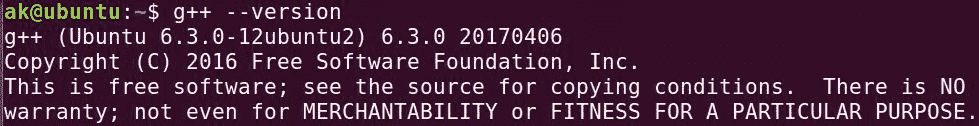

# 用 g++

编译

> 原文:[https://www.geeksforgeeks.org/compiling-with-g-plus-plus/](https://www.geeksforgeeks.org/compiling-with-g-plus-plus/)

**g++** 命令是 GNU c++ 编译器调用命令，用于对源代码进行预处理、编译、汇编和链接，生成可执行文件。g++ 命令的不同“选项”允许我们在中间阶段停止这个过程。

*   **查看 g++ 编译器版本信息:**

```cpp
g++ --version
```



*   **编译一个 CPP 文件生成可执行目标文件:** *g++ file_name* 命令用于编译创建一个可执行文件 *a.out* (默认目标名称)。
    **示例:**给定一个简单的程序，用文件名 *hello.cpp*
    在标准输出上打印“Hello Geek”

## 卡片打印处理机（Card Print Processor 的缩写）

```cpp
// hello.cpp file
#include <iostream>
int main()
{
    std::cout << "Hello Geek\n";
    return 0;
}
```