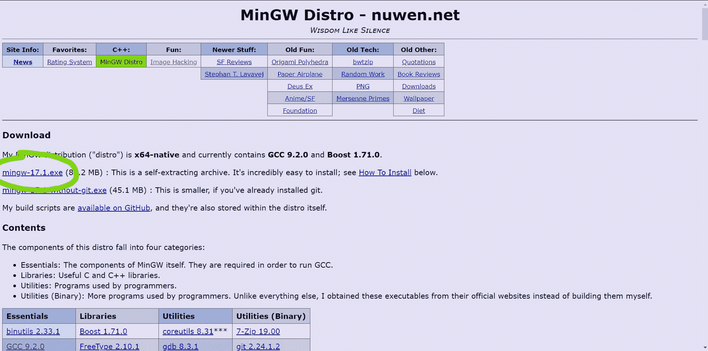
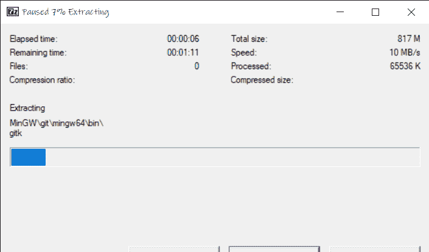
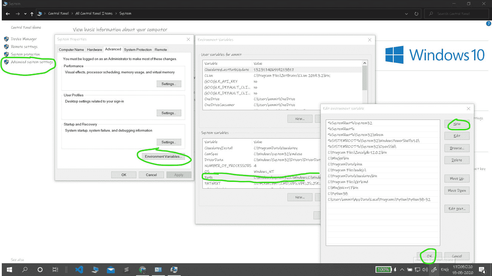
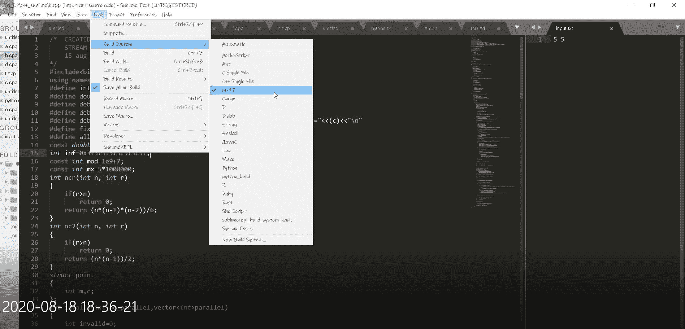
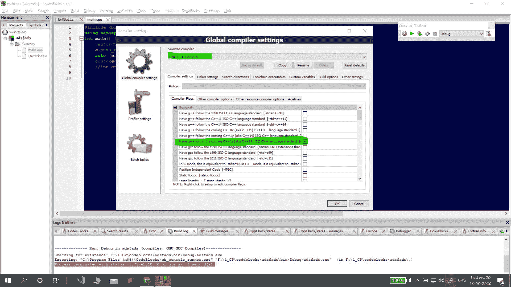
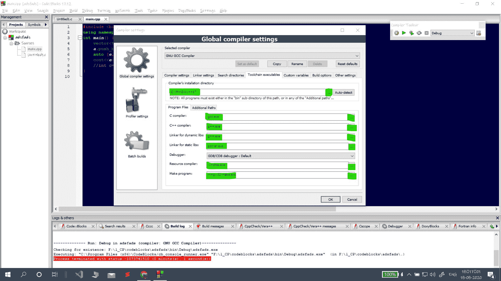
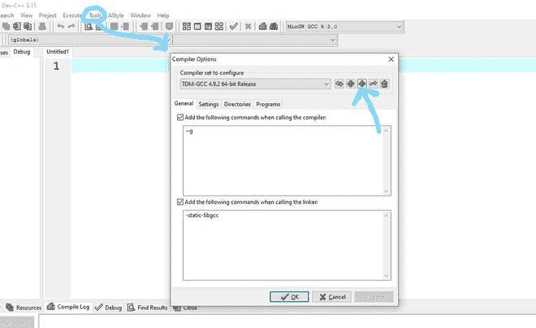
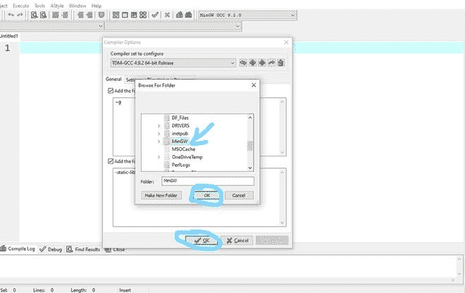
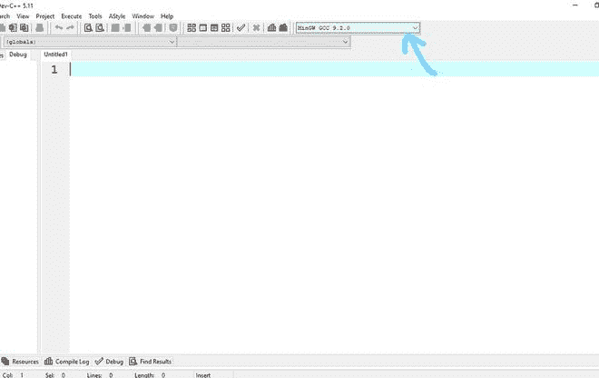

# 完成在 Windows 上安装 C++17 的指南

> 原文:[https://www . geesforgeks . org/complete-install-guide-c17-in-window/](https://www.geeksforgeeks.org/complete-guide-to-install-c17-in-windows/)

在[竞技编程](https://www.geeksforgeeks.org/category/competitive-programming/)领域 [C++](https://www.geeksforgeeks.org/c-plus-plus/) 是使用最多的语言之一，因为它庞大的 [STL(标准模板库)](https://www.geeksforgeeks.org/the-c-standard-template-library-stl/)函数，并且一天比一天更新。这是安装最新版本的 C++(C++ 17)的完整指南，也是崇高文本和代码块的设置指南。

### **<u>安装 C++17 编译器(GCC 9.2)</u>**

要安装 C++17 编译器，按照[这个](https://nuwen.net/mingw.html)链接下载 GCC 9.2 编译器。下载完成后，提取文件并将提取的 **MinGw** 文件夹保存在 c 盘，如下图所示:

 

### **<u>设置路径</u>**

如果您是第一次在计算机上安装 GCC 编译器，请按照以下步骤操作:

1.  从保存在 c 盘的**文件复制 bin 文件夹路径**
2.  转到**控制面板** - > **系统** - > **高级系统设置** - > **环境变量** - > **从系统变量** - > **编辑路径新建** - > **粘贴路径**保存好每一件东西。



如果以前安装了任何 GCC 编译器，那么按照相同的过程来设置新的 GCC 编译器路径，或者用 C 驱动器中的这个新的 MinGw 文件夹替换以前存在的 MinGw 文件夹。现在，通过在 CMD 中运行以下命令，检查计算机上安装的 GCC 版本，以验证它是否已成功安装:

```cpp
gcc --version
```

如果安装成功，必须是 9.2。

### **<u>崇高文本设置指南</u>**

在崇高文本编辑器中，当运行 C++代码时，它会对一些新添加的 C++17 STL 函数发出警告，并且由于 C++程序的默认构建设置，如果有任何警告，它将不会运行。为了克服这个问题，我们将为 C++程序添加自定义构建代码，如下所示:

```cpp
{
    "cmd" : [ "g++.exe", "-std=c++17", "${file_name}", "-o",
              "${file_base_name}.exe", "&&", "start", "cmd",
              "/k", "${file_base_name}.exe" ],
    "file_regex" : "^(..[^:]*):([0-9]+):?([0-9]+)?:? (.*){content}quot;,
    "shell" : true,
    "working_dir" : "$file_path",
    "selector" : "source.cpp",
}
```

复制上面的代码并创建新的构建系统(工具->构建系统->新的构建系统)。想叫什么就叫什么，用**崇高建造**扩展保存。现在转到**工具** - > **构建系统**，选择您之前保存的**构建文件**，我们就完成了。



现在，要运行您的代码，请按 **Ctrl + B** 。

### **<u>代码块设置指南</u>**

1.转到全局编译器设置->选择编译器作为 GNU GCC 编译器

2.在编译器设置中将 c++17 标记为:



3.切换到工具链可执行文件选项卡->在编译器的安装目录中从 C 驱动器选择 MinGw 文件夹，并从 C-> MinGw -> bin 文件夹更新所有程序文件。

下面是同样的说明:



### <u>开发人员设置指南–c++</u>

*   转到工具->编译器选项-> '+'按钮(添加按文件夹设置的编译器)



*   从 c 盘选择 MinGW 文件夹->点击确定保存设置。



*   使用此下拉菜单随时将编译器的版本/类型更改回以前的版本或新版本:

