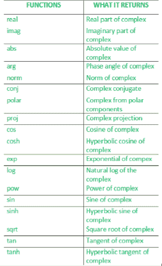
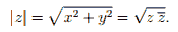

# c++中的复数|集合 1

> 原文:[https://www.geeksforgeeks.org/complex-numbers-c-set-1/](https://www.geeksforgeeks.org/complex-numbers-c-set-1/)

复杂库实现了复杂类来包含笛卡尔形式的复数，以及几个函数和重载来操作它们。
[](https://media.geeksforgeeks.org/wp-content/uploads/complex21.png)

*   **real()**–返回复数的实部。
*   **imag()** – It returns the imaginary part of the complex number.

    ```cpp
    // Program illustrating the use of real() and 
    // imag() function
    #include <iostream>     

    // for std::complex, std::real, std::imag
    #include <complex>      
    using namespace std;

    // driver function
    int main()
    {    
      // defines the complex number: (10 + 2i)
      std::complex<double> mycomplex(10.0, 2.0);

      // prints the real part using the real function
      cout << "Real part: " << real(mycomplex) << endl;
      cout << "Imaginary part: " << imag(mycomplex) << endl;
      return 0;
    }
    ```

    输出:

    ```cpp
    Real part: 10
    Imaginary part: 2

    ```

*   **ABS()**–返回复数的绝对值。
*   **arg()** – It returns the argument of the complex number.

    ```cpp
    // Program illustrating the use of arg() and abs()
    #include <iostream>     

    // for std::complex, std::abs, std::atg
    #include <complex> 
    using namespace std;

    // driver function
    int main ()
    {    
      // defines the complex number: (3.0+4.0i)
      std::complex<double> mycomplex (3.0, 4.0);

      // prints the absolute value of the complex number
      cout << "The absolute value of " << mycomplex << " is: ";
      cout << abs(mycomplex) << endl;

      // prints the argument of the complex number
      cout << "The argument of " << mycomplex << " is: ";
      cout << arg(mycomplex) << endl;

      return 0;
    }
    ```

    输出:

    ```cpp
    The absolute value of (3,4) is: 5
    The argument of (3,4) is: 0.927295

    ```

*   **polar()** – It constructs a complex number from magnitude and phase angle.

    实数=幅度*余弦(相角)
    虚数=幅度*正弦(相角)

    ```cpp
    // Program illustrating the use of polar()
    #include <iostream>     

    // std::complex, std::polar
    #include <complex>
    using namespace std;

    // driver function
    int main ()
    {
      cout << "The complex whose magnitude is " << 2.0;
      cout << " and phase angle is " << 0.5;

      // use of polar()
      cout << " is " << polar (2.0, 0.5) << endl;

      return 0;
    }
    ```

    输出:

    ```cpp
    The complex whose magnitude is 2 and phase angle is 0.5 is (1.75517,0.958851)

    ```

*   **norm()** – It is used to find the norm(absolute value) of the complex number. If z = x + iy is a complex number with real part x and imaginary part y, the complex conjugate of z is defined as z'(z bar) = x – iy, and the absolute value, also called the norm, of z is defined as :
    [](https://media.geeksforgeeks.org/wp-content/uploads/complex-2.png)

    ```cpp
    // example to illustrate the use of norm()
    #include <iostream>     

    // for std::complex, std::norm
    #include <complex> 
    using namespace std;

    // driver function
    int main ()
    {    
      // initializing the complex: (3.0+4.0i)
      std::complex<double> mycomplex (3.0, 4.0);

      // use of norm()
      cout << "The norm of " << mycomplex << " is " 
           << norm(mycomplex) <<endl;

      return 0;
    }
    ```

    输出:

    ```cpp
    The norm of (3,4) is 25.

    ```

*   **conj()** – It returns the conjugate of the complex number x. The conjugate of a complex number (real,imag) is (real,-imag).

    ```cpp
    // Illustrating the use of conj()
    #include <iostream> 
    using namespace std;

    // std::complex, std::conj
    #include <complex>      

    // driver program
    int main ()
    {
      std::complex<double> mycomplex (10.0,2.0);

      cout << "The conjugate of " << mycomplex << " is: ";

      // use of conj()
      cout << conj(mycomplex) << endl;
      return 0;
    }
    ```

    输出:

    ```cpp
     The conjugate of (10,2) is (10,-2)

    ```

*   **proj()** – It returns the projection of z(complex number) onto the Riemann sphere. The projection of z is z, except for complex infinities, which are mapped to the complex value with a real component of INFINITY and an imaginary component of 0.0 or -0.0 (where supported), depending on the sign of the imaginary component of z.

    ```cpp
    // Illustrating the use of proj()

    #include <iostream>
    using namespace std;

    // For std::complex, std::proj
    #include <complex>

    // driver program
    int main()
    {
        std::complex<double> c1(1, 2);
        cout << "proj" << c1 << " = " << proj(c1) << endl;

        std::complex<double> c2(INFINITY, -1);
        cout << "proj" << c2 << " = " << proj(c2) << endl;

        std::complex<double> c3(0, -INFINITY);
        cout << "proj" << c3 << " = " << proj(c3) << endl;
    }
    ```

    输出:

    ```cpp
    proj(1,2) = (1,2)
    proj(inf,-1) = (inf,-0)
    proj(0,-inf) = (inf,-0)

    ```

*   **sqrt()** – Returns the square root of x using the principal branch, whose cuts are along the negative real axis.

    ```cpp
    // Illustrating the use of sqrt()
    #include <iostream>
    using namespace std;

    // For std::ccomplex, stdc::sqrt
    #include <complex>

    // driver program
    int main()
    {    
        // use of sqrt()
        cout << "Square root of -4 is "
             << sqrt(std::complex<double>(-4, 0)) << endl
             << "Square root of (-4,-0), the other side of the cut, is "
             << sqrt(std::complex<double>(-4, -0.0)) << endl;
    }
    ```

    输出:

    ```cpp
    Square root of -4 is (0,2)
    Square root of (-4,-0), the other side of the cut, is (0,-2)

    ```

下一篇:[c++中的复数|集合 2](https://www.geeksforgeeks.org/complex-numbers-c-set-2/)

本文由**香巴拉维·辛格**供稿。如果你喜欢 GeeksforGeeks 并想投稿，你也可以使用[contribute.geeksforgeeks.org](http://www.contribute.geeksforgeeks.org)写一篇文章或者把你的文章邮寄到 contribute@geeksforgeeks.org。看到你的文章出现在极客博客主页上，帮助其他极客。

如果你发现任何不正确的地方，或者你想分享更多关于上面讨论的话题的信息，请写评论。