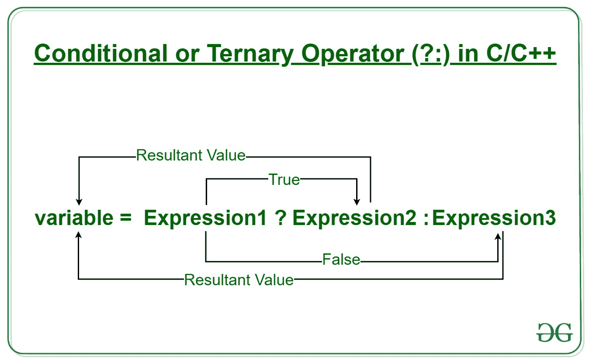
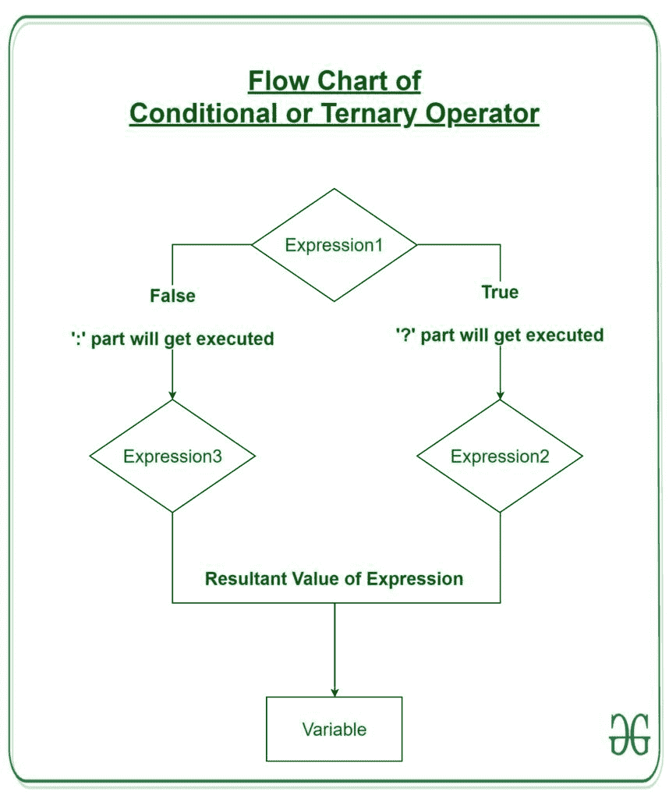

# 条件或三元运算符(？:)在 C/C++中

> 原文:[https://www . geesforgeks . org/conditional-or-三元运算符 in-c-c/](https://www.geeksforgeeks.org/conditional-or-ternary-operator-in-c-c/)

条件运算符有点类似于 [if-else 语句](https://www.geeksforgeeks.org/decision-making-c-c-else-nested-else/)，因为它遵循与 [if-else 语句](https://www.geeksforgeeks.org/decision-making-c-c-else-nested-else/)相同的算法，但是条件运算符占用的空间更少，有助于以尽可能短的方式编写 if-else 语句。

[](https://media.geeksforgeeks.org/wp-content/uploads/20190920110229/Conditional-or-Ternary-Operator-__-in-C_C.jpg)

**语法:**
条件运算符的形式为

```
variable = Expression1 ? Expression2 : Expression3

```

它可以被可视化为 if-else 语句，如下所示:

```
if(Expression1)
{
    variable = Expression2;
}
else
{
    variable = Expression3;
}

```

自条件运算符'？:'需要三个操作数才能工作，因此它们也被称为**三元运算符**。
**工作:**
这里**表现 1** 是需要评估的条件。如果条件(**表达式 1** )为真，则执行**表达式 2** ，并返回结果。否则，如果条件(**表达式 1** )为假，则执行**表达式 3** ，并返回结果。

[](https://media.geeksforgeeks.org/wp-content/uploads/20190920114837/Flow-Chart-of-Conditional-or-Ternary-Operator-__-in-C_C.jpg)

**示例:**存储两个数字中最大值的程序。

## C

```
// C program to find largest among two
// numbers using ternary operator

#include <stdio.h>

int main()
{
    int m = 5, n = 4;

    (m > n) ? printf("m is greater than n that is %d > %d",
                     m, n)
            : printf("n is greater than m that is %d > %d",
                     n, m);

    return 0;
}
```

## C++

```
// C++ program to find largest among two
// numbers using ternary operator

#include <iostream>
using namespace std;

int main()
{
    // variable declaration
    int n1 = 5, n2 = 10, max;

    // Largest among n1 and n2
    max = (n1 > n2) ? n1 : n2;

    // Print the largest number
    cout << "Largest number between " << n1
                           << " and " << n2
                           << " is " << max;

    return 0;
}
```

**Output**

```
m is greater than n that is 5 > 4

```