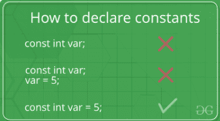
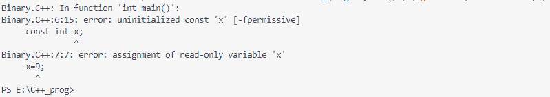

# c++中的 Const 关键字

> 原文:[https://www.geeksforgeeks.org/const-keyword-in-cpp/](https://www.geeksforgeeks.org/const-keyword-in-cpp/)

本文讨论了 **C++中 [const 关键字](https://www.geeksforgeeks.org/const-qualifier-in-c/)的各种功能。每当 **const 关键字**被附加任何方法()，变量，[指针变量](https://www.geeksforgeeks.org/pointers-in-c-and-c-set-1-introduction-arithmetic-and-array/)，并且带有一个类的对象时，它阻止特定的**对象/方法()/变量**修改它的数据项值。**

#### <u>常量变量</u>:

常量变量的声明和初始化有一套特定的规则:

*   [常量变量](https://www.geeksforgeeks.org/how-to-modify-a-const-variable-in-c/)不能在赋值时保持未初始化状态。
*   它不能在程序中的任何地方赋值。
*   在声明常量变量时，需要向常量变量提供显式值。



下面是演示上述概念的 C++程序:

## C++

```cpp
// C++ program to demonstrate the
// the above concept
#include <iostream>
using namespace std;

// Driver Code
int main()
{

    // const int x;  CTE error
    // x = 9;   CTE error
    const int y = 10;
    cout << y;

    return 0;
}
```

**Output:** 

```cpp
10
```

**<u>错误声明所面临的错误</u> :** 如果您试图初始化常量变量而没有分配显式值，则会生成编译时错误(CTE)。



### <u>带指针变量的常量关键字</u>:

指针可以用 const 关键字声明。因此，有三种可能的方法将 const 关键字与指针一起使用，如下所示:

**<u>当</u>** **<u>指针变量指向常数值</u> :**

**语法:**

```cpp
const data_type* var_name;
```

下面是实现上述概念的 C++程序:

## C++

```cpp
// C++ program to demonstrate the
// above concept
#include <iostream>
using namespace std;

// Driver Code
int main()
{
    int x{ 10 };
    char y{ 'M' };

    const int* i = &x;
    const char* j = &y;

    // Value of x and y can be altered,
    // they are not constant variables
    x = 9;
    y = 'A';

    // Change of constant values because,
    // i and j are pointing to const-int
    // & const-char type value
    // *i = 6;
    // *j = 7;

    cout << *i << " " << *j;
}
```

**Output:** 

```cpp
9 A
```