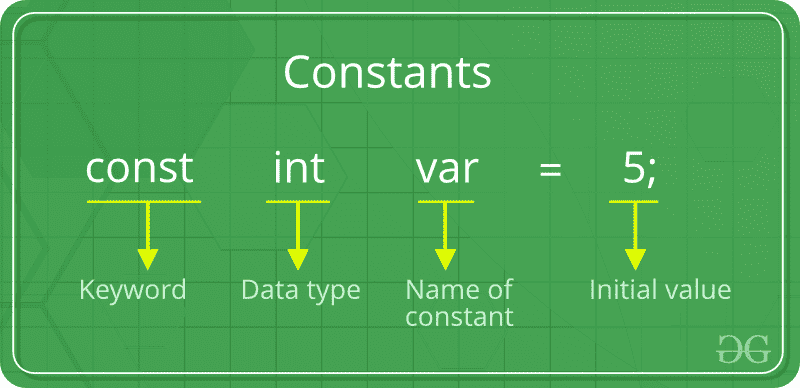
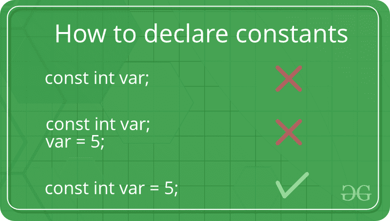

# C/c++

中的常数

> 原文:[https://www.geeksforgeeks.org/constants-in-c-cpp/](https://www.geeksforgeeks.org/constants-in-c-cpp/)

顾名思义，常量是指在 C/C++ 编程语言中，一旦定义就不能修改的变量或值。它们是程序中的固定值。可以有任何类型的常量，如整数、浮点、八进制、十六进制、字符常量等。每个常数都有一定的范围。太大而无法放入 int 的整数将被视为长整数。现在有各种不同的范围，从无符号位到有符号位。在有符号位下，int 的范围从-128 到+127 不等，在无符号位下，int 的范围从 0 到 255 不等。



**定义常数:**
在 C/C++ 程序中，我们可以通过如下两种方式定义常数:

1.  使用*#定义*预处理器指令
2.  使用*常量*关键字

**文字:**分配给每个常量变量的值被称为*文字*。通常，术语、常数和文字可以互换使用。例如，“*const int = 5；*”，是一个常量表达式，值 5 被称为常量整数文字。
c++ 中文字的各种[类型参见此处](https://www.geeksforgeeks.org/types-of-literals-in-c-c-with-examples/)。
现在让我们详细了解以上两种方式:

1.  **使用*****#定义*** **预处理器指令:**该指令用于声明现有变量或任何值的别名。我们可以用它来声明一个常数，如下所示:

    ```cpp
    #define identifierName value
    ```

    *   **identifierName:** 是给常量取的名字。
    *   **值:**指分配给 identifierName 的任何值。
2.  **使用** ***const*** **关键字**:使用 *const* 关键字定义常量就像定义变量一样简单，不同的是您必须在定义之前使用 *const* 关键字。

下面的程序展示了如何使用 const 来声明不同数据类型的常量:

## C

```cpp
#include <stdio.h>

int main()
{
    // int constant
    const int intVal = 10; 

    // Real constant
    const float floatVal = 4.14;

    // char constant 
    const char charVal = 'A'; 

    // string constant
    const char stringVal[10] = "ABC"; 

    printf("Integer constant:%d \n", intVal );
    printf("Floating point constant: %.2f\n", floatVal );
    printf("Character constant: %c\n", charVal );
    printf("String constant: %s\n", stringVal);

    return 0;
}
```

## C++

```cpp
#include <iostream>
using namespace std;

int main() {
    // int constant
    const int intVal = 10; 

    // Real constant
    const float floatVal = 4.14;

    // char constant 
    const char charVal = 'A'; 

    // string constant
    const string stringVal = "ABC"; 

    cout << "Integer Constant: " << intVal << "\n"; 
    cout << "Floating point Constant: " << floatVal << "\n"; 
    cout << "Character Constant: "<< charVal << "\n"; 
    cout << "String Constant: "<< stringVal << "\n";

    return 0; 
}
```

**Output:**

```cpp
Integer constant: 10 
Floating point constant: 4.14
Character constant: A 
String constant: ABC 
```

详情参见 C 中[常量限定符](https://www.geeksforgeeks.org/const-qualifier-in-c/)。

本文由**钦莫伊·蕾恩卡**供稿。如果你喜欢 GeeksforGeeks 并想投稿，你也可以使用[write.geeksforgeeks.org](https://write.geeksforgeeks.org)写一篇文章或者把你的文章邮寄到 review-team@geeksforgeeks.org。看到你的文章出现在极客博客主页上，帮助其他极客。
如果你发现任何不正确的地方，或者你想分享更多关于上面讨论的话题的信息，请写评论。