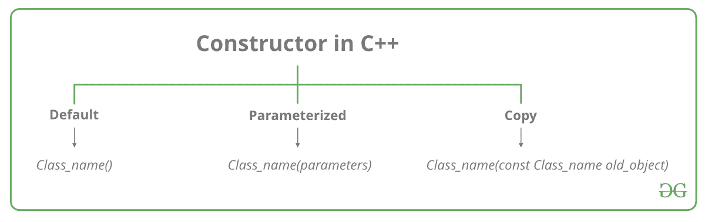

# c++中的构造函数

> 原文:[https://www.geeksforgeeks.org/constructors-c/](https://www.geeksforgeeks.org/constructors-c/)

**什么是建造师？**
构造函数是一种特殊类型的类成员函数，用于初始化类的对象。在 C++中，当创建对象(类的实例)时，会自动调用构造函数。它是类的特殊成员函数，因为它没有任何返回类型。
**构造函数和普通的成员函数有什么不同？**

构造函数在以下方面不同于普通函数:

*   构造函数与类本身同名
*   构造函数没有返回类型
*   创建对象时会自动调用构造函数。
*   它必须放在班级的公共区域。
*   如果我们不指定构造函数，C++编译器会为对象生成一个默认的构造函数(不需要参数，主体为空)。



让我们通过一个真实的例子来理解 C++中构造函数的类型。假设你去商店买了一个马克笔。想买记号笔的时候，有哪些选择？你第一次去商店说给我一支马克笔。所以只是说给我一个记号笔意味着你没有设置哪个品牌和哪个颜色，你没有提到任何东西只是说你想要一个记号笔。所以当我们说我想要一个马克笔时，无论市场上或他的店里有什么经常出售的马克笔，他都会简单地交出。这就是默认构造函数！第二种方法你去一家商店，说我想要一个红色的 XYZ 品牌的马克笔。所以你提到这个，他会给你那个标记。在这种情况下，你已经给出了参数。这就是参数化构造函数！然后第三个你去商店说我想要一个这样的记号笔(你手上的物理记号笔)。所以店主会看到那个标记。好的，他会给你一个新的标记。所以复制那个标记。这就是复制构造函数！
**施工人员类型**

[**1。**](https://www.geeksforgeeks.org/c-internals-default-constructors-set-1/) 默认构造函数是不接受任何参数的构造函数。它没有参数。

## 卡片打印处理机（Card Print Processor 的缩写）

```cpp
// Cpp program to illustrate the
// concept of Constructors
#include <iostream>
using namespace std;

class construct
{
public:
    int a, b;

    // Default Constructor
    construct()
    {
        a = 10;
        b = 20;
    }
};

int main()
{
    // Default constructor called automatically
    // when the object is created
    construct c;
    cout << "a: " << c.a << endl
         << "b: " << c.b;
    return 1;
}
```

**输出:**

```cpp
a: 10
b: 20
```

**注意:**即使我们没有显式定义任何构造函数，编译器也会自动隐式提供一个默认的构造函数。

**2。参数化构造函数:**可以将参数传递给构造函数。通常，这些参数有助于在创建对象时对其进行初始化。要创建参数化的构造函数，只需像添加其他函数一样添加参数。定义构造函数的主体时，使用参数初始化对象。

## 卡片打印处理机（Card Print Processor 的缩写）

```cpp
// CPP program to illustrate
// parameterized constructors
#include <iostream>
using namespace std;

class Point
{
private:
    int x, y;

public:
    // Parameterized Constructor
    Point(int x1, int y1)
    {
        x = x1;
        y = y1;
    }

    int getX()
    {
        return x;
    }
    int getY()
    {
        return y;
    }
};

int main()
{
    // Constructor called
    Point p1(10, 15);

    // Access values assigned by constructor
    cout << "p1.x = " << p1.getX() << ", p1.y = " << p1.getY();

    return 0;
}
```

**输出:**

```cpp
p1.x = 10, p1.y = 15
```

当在参数化构造函数中声明对象时，初始值必须作为参数传递给构造函数。正常的对象声明方式可能行不通。可以显式或隐式调用构造函数。

```cpp
 Example e = Example(0, 50); // Explicit call

 Example e(0, 50);           // Implicit call
```

*   **参数化构造函数的使用:**
    1.  它用于在创建不同对象时，用不同的值初始化不同对象的各种数据元素。
    2.  它被用来控制构造函数。
*   **一个类中可以有多个构造函数吗？**
    对，叫[建造师重载](https://www.geeksforgeeks.org/constructor-overloading-c/)。

**3。复制构造函数:**复制构造函数是使用同一类的另一个对象初始化一个对象的成员函数。[复制建造师](https://www.geeksforgeeks.org/copy-constructor-in-cpp/)详解。

每当我们为一个类定义一个或多个非默认构造函数(带参数)时，默认构造函数(不带参数)也应该被显式定义，因为在这种情况下编译器不会提供默认构造函数。然而，这并不是必须的，但它被认为是始终定义默认构造函数的最佳实践。

## 卡片打印处理机（Card Print Processor 的缩写）

```cpp
// Illustration
#include <iostream>
using namespace std;

class point
{
private:
  double x, y;

public:

  // Non-default Constructor &
  // default Constructor
  point (double px, double py)
  {
    x = px, y = py;
  }
};

int main(void)
{

  // Define an array of size
  // 10 & of type point
  // This line will cause error
  point a[10];

  // Remove above line and program
  // will compile without error
  point b = point(5, 6);
}
```

**输出:**

```cpp
Error: point (double px, double py): expects 2 arguments, 0 provided
```

**相关文章:**

*   [c++中的析构函数](https://www.geeksforgeeks.org/destructors-c/)
*   [c++中构造函数的测试](https://www.geeksforgeeks.org/c-plus-plus-gq/constructors-gq/)
*   [c++程序输出|集合 26(构造函数)](https://www.geeksforgeeks.org/output-c-programs-set-26-constructors/)
*   [c++程序输出|集合 27(构造函数和析构函数)](https://www.geeksforgeeks.org/output-c-programs-set-27-constructors-destructors/)

如果您发现任何不正确的地方，或者您想分享更多关于上面讨论的主题的信息，请写评论