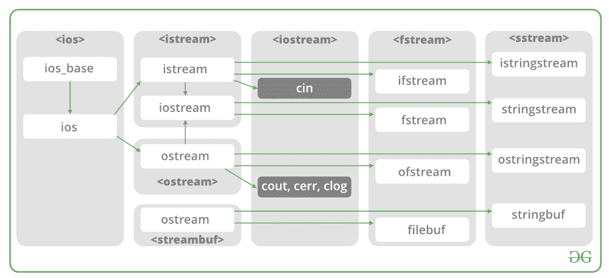

# 使用文件处理的 C++联系人簿

> 原文:[https://www . geesforgeks . org/contact-book-in-c-use-file-handling/](https://www.geeksforgeeks.org/contact-book-in-c-using-file-handling/)

需要立即复习语言和文件处理知识。所以让我们来讨论一下[文件处理](https://www.geeksforgeeks.org/file-handling-c-classes/)和[循环中的 C++语言概念。](https://www.geeksforgeeks.org/loops-in-c-and-cpp/)直我们知道，为了编译代码，需要一个用于编译 C++语言的 IDE，比如 Code Block，Visual Studio Code，Dev C++，等等来运行我们的程序。

这个软件的目标是用 C++编写一个使用文件处理的通讯录。在 C++中，文件主要通过使用三个类来处理[fsstream](https://www.geeksforgeeks.org/file-handling-c-classes/)、 [ifstream](https://www.geeksforgeeks.org/file-handling-c-classes/) 、 [ofstream](https://www.geeksforgeeks.org/file-handling-c-classes/) 在 fsstream 头文件中可用。

*   **ofstream:** 要写入文件的 stream 类
*   **ifstream:** 从文件中读取的流类
*   **fstream:** Stream 类，用于文件的读写。



**实施:**

联系人将被保存到一个文件中。通讯录将为用户提供以下功能:

```
1\. Add contact.
2\. Search Contact.
3\. Help.
4\. Exit.
```

将被保存的联系人的详细信息如下:

```
1\. First name.
2\. Last name.
3\. Phone Number.
```

**例**

## C++

```
// Importing input output operations file
#include <iostream>
// Importing file class
#include <fstream>
// Importing standard library file
#include <stdlib.h>

using namespace std;

// Variables declared outside any function
// hence scope is global, hence global variables
string fname, lname, phone_num;

// Methods

// Helper Methods followed by
// Main driver method

void addContact();
void searchContact();
void help();
void self_exit();
bool check_digits(string);
bool check_numbers(string);

// Method 1
// Helper method
void self_exit()
{
    system("cls");
    cout << "\n\n\n\t\tThank You for using Contact-Saver!";
    exit(1);
}

// Method 2
// Helper method
void help()
{
    cout << "Help Center";
    cout << endl << endl;
    system("pause");
    system("cls");
}

// Method 3
// Helper method
void addContact()
{
    ofstream phone("number.txt", ios::app);
    system("cls");
    cout << "\n\n\tEnter First Name : ";
    cin >> fname;
    cout << "\n\tEnter Last Name : ";
    cin >> lname;
    cout << "\n\tEnter Phone Number : ";
    cin >> phone_num;

    if (check_digits(phone_num) == true) {
        if (check_numbers(phone_num) == true) {
            if (phone.is_open()) {
                phone << fname << " " << lname << " "
                      << phone_num << endl;
                cout << "\n\tContact saved successfully !";
            }
            else {
                cout << "\n\tError in opening record!";
            }
        }
        else {
            cout << "\n\tOnly numbers are allowed!";
        }
    }
    else {
        cout << "\n\tPhone number should be of 10 digits "
                "only.";
    }
    cout << endl << endl;
    system("pause");
    system("cls");
    phone.close();
}

// Method 4
// Helper method
void searchContact()
{
    bool found = false;
    ifstream myfile("number.txt");
    string keyword;
    cout << "\n\tEnter Name to search : ";
    cin >> keyword;
    while (myfile >> fname >> lname >> phone_num) {
        if (keyword == fname || keyword == lname) {
            system("cls");
            cout << "\n\n\n\t\tCONTACT DETAILS";
            cout << "\n\nFirst Name : " << fname;
            cout << "\nLast Name : " << lname;
            cout << "\nPhone Number : " << phone_num;
            found = true;
            break;
        }
    }
    if (found == false)
        cout << "\nNo such contact is found!";

    cout << endl << endl;
    system("pause");
    system("cls");
}

// Method 5
// Helper method
bool check_digits(string x)
{
    if (x.length() == 10)
        return true;
    else
        return false;
}

// Method 6
// Helper method
bool check_numbers(string x)
{
    bool check = true;

    for (int i = 0; i < x.length(); i++) {
        if (!(int(x[i]) >= 48 && int(x[i]) <= 57)) {
            check = false;
            break;
        }
    }

    if (check == true)
        return true;

    if (check == false)
        return false;

    cout << endl << endl;
    system("pause");
    system("cls");
}

// Method 7
// Main driver method
int main()
{
    int choice;
    system("cls");
    system("color 0A");
    while (1) {
        cout << "\n\n\n\t\t\tCONTACT SAVER";
        cout << "\n\n\t1\. Add Contact\n\t2\. Search "
                "Contact\n\t3\. Help\n\t4\. Exit\n\t> ";
        cin >> choice;

        // Switch case
        switch (choice) {
        case 1:
            addContact();
            break;

        case 2:
            searchContact();
            break;

        case 3:
            help();
            break;

        case 4:
            self_exit();
            break;

        default:
            cout << "\n\n\tInvalid Input!";
        }
    }
    return 0;
}
```

**输出**

   