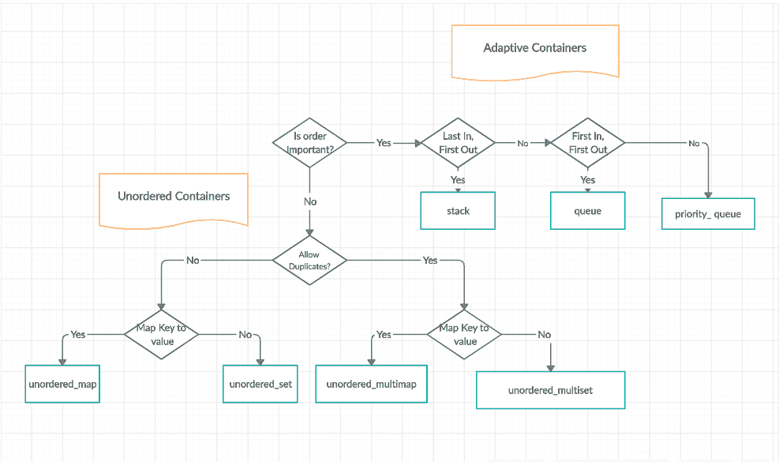
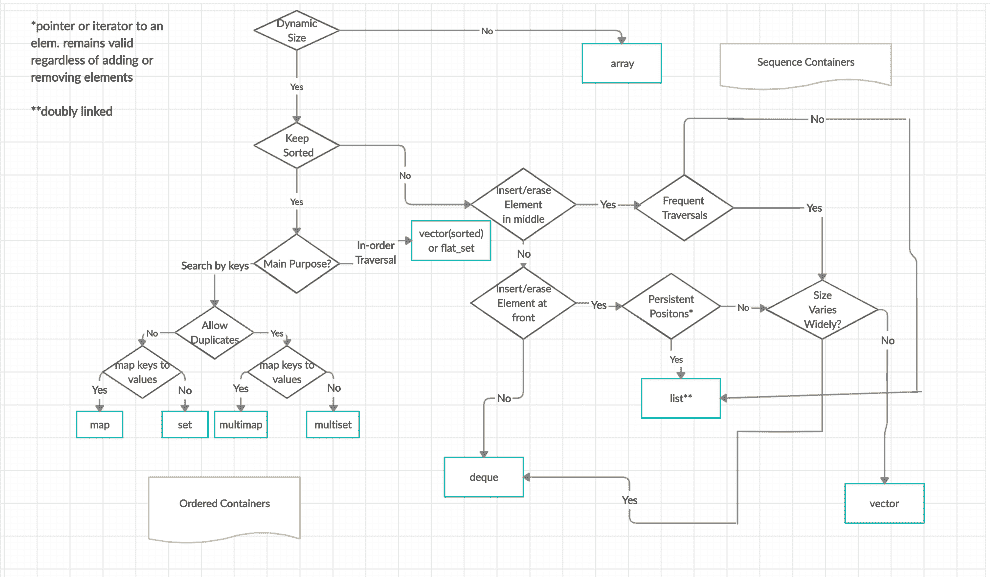

# c++ STL(标准模板库)中的容器

> 原文:[https://www.geeksforgeeks.org/containers-cpp-stl/](https://www.geeksforgeeks.org/containers-cpp-stl/)

容器是存储其他对象(其元素)集合的容器对象。它们被实现为类模板，这使得作为元素支持的类型具有很大的灵活性。

容器管理其元素的存储空间，并提供成员函数来直接或通过迭代器(引用属性与指针相似的对象)访问它们。

**序列容器**

序列容器实现了可以顺序访问的数据结构。

*   [**阵:**](https://www.geeksforgeeks.org/array-class-c/) 静态连片阵(类模板)
*   [**向量:**](https://www.geeksforgeeks.org/vector-in-cpp-stl/) 动态连片数组(类模板)
*   [**德格:**](https://www.geeksforgeeks.org/deque-cpp-stl/) 双端队列(类模板)
*   [**正向 _ 列表:**](https://www.geeksforgeeks.org/forward-list-c-set-1-introduction-important-functions/) 单链表(类模板)
*   [**列表:**](https://www.geeksforgeeks.org/list-cpp-stl/) 双链表(类模板)

**关联容器**

关联容器实现了可快速搜索的有序数据结构(O(log n)复杂度)。

*   [**集合:**](https://www.geeksforgeeks.org/set-in-cpp-stl/) 唯一键集合，按键排序
    (类模板)
*   [**映射:**](https://www.geeksforgeeks.org/map-associative-containers-the-c-standard-template-library-stl/) 键值对的集合，按键排序，键是唯一的(类模板)。
*   [**【多集:**](https://www.geeksforgeeks.org/multiset-in-cpp-stl/) 键集合，按键排序(类模板)
*   [**多映射:**](https://www.geeksforgeeks.org/multimap-associative-containers-the-c-standard-template-library-stl/) 键值对集合，按键排序
    (类模板)

**无序关联容器**

无序关联容器实现了可以快速搜索的无序(散列)数据结构(O(1)摊销，O(n)最坏情况复杂度)。

*   [**无序 _ 集合:**](https://www.geeksforgeeks.org/unorderd_set-stl-uses/) 唯一键的集合，按键散列。(类模板)
*   [**无序 _ 映射:**](https://www.geeksforgeeks.org/unordered_map-in-stl-and-its-applications/) 键值对的集合，按键散列，键是唯一的。(类模板)
*   [**【无序 _ 多集:**](https://www.geeksforgeeks.org/unordered_multiset-and-its-uses/) 键集合，按键散列(类模板)
*   [**【无序 _ 多映射:**](https://www.geeksforgeeks.org/unordered_multimap-and-its-application/) 键-值对的集合，按键进行散列(类模板)

**容器适配器**

容器适配器为顺序容器提供了不同的接口。

*   [**堆栈:**](https://www.geeksforgeeks.org/stack-in-cpp-stl/) 调整容器以提供堆栈(后进先出数据结构)(类模板)。
*   [**队列:**](https://www.geeksforgeeks.org/queue-cpp-stl/) 适配容器提供队列(先进先出数据结构)(类模板)。
*   [**优先级队列:**](https://www.geeksforgeeks.org/priority-queue-in-cpp-stl/) 适配容器提供优先级队列(类模板)。

**自适应容器和无序容器流程图**

**序列控制器和订购容器的流程图**

**更多有用链接**

*   [最近关于 C++ STL 的文章](https://www.geeksforgeeks.org/tag/stl/)
*   [最近关于 C++ STL 的文章](https://www.geeksforgeeks.org/category/cpp/)
*   [编码实践平台](https://practice.geeksforgeeks.org/)
*   [选择题](https://www.geeksforgeeks.org/quiz-corner-gq/#C++%20Programming%20Mock%20Tests)
*   [c++类所有文章](https://www.geeksforgeeks.org/c-plus-plus/)

要以最高效最有效的方式掌握 **C++标准模板库(STL)** ，请务必通过 GeeksforGeeks 查看本 [**C++ STL 在线课程**](https://practice.geeksforgeeks.org/courses/cpp-stl) 。本课程涵盖了 C++的基础知识和对所有 C++ STL 容器、迭代器等的深入解释，以及一些问题的视频解释。此外，您将学习使用 STL 内置的类和函数来实现一些复杂的数据结构，并方便地对它们执行操作。