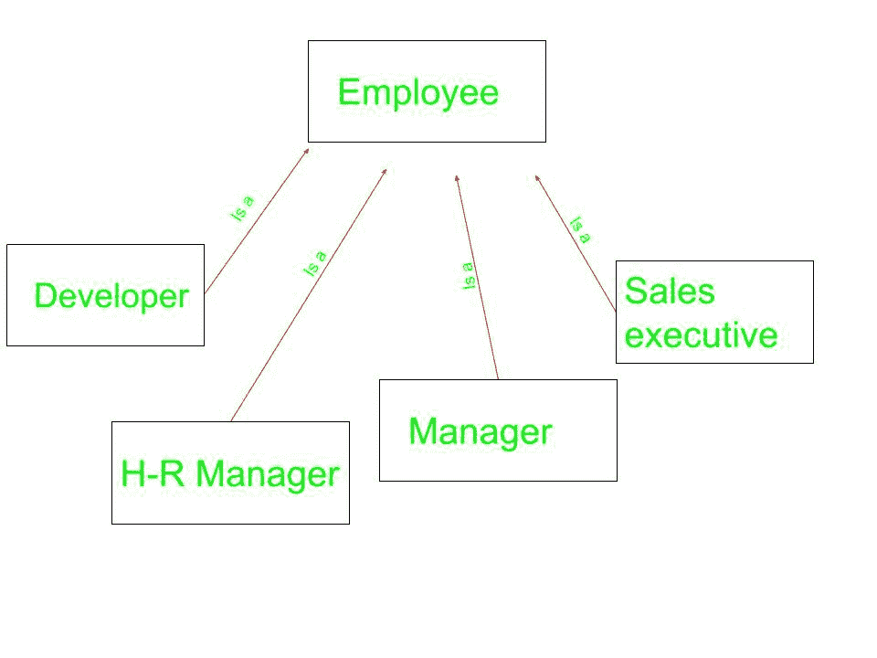

# c++中的集装箱船

> 原文:[https://www.geeksforgeeks.org/containership-in-c/](https://www.geeksforgeeks.org/containership-in-c/)

我们可以将一个类的对象创建到另一个类中，该对象将是该类的成员。这种类型的类间关系被称为**集装箱船**或**具有 _a** 关系，因为一个类包含另一个类的对象。而在这种关系中包含另一个类的对象和成员的类叫做**容器类**。
**属于另一个对象的对象称为包含对象，而包含另一个对象作为其部分或属性的对象称为容器对象。**

**集装箱船与继承的区别**

**集装箱船**
- >当你的新班级需要现有班级的功能，但是，不是它的界面
为 eg- >
1)计算机系统有一个硬盘
2)汽车有一个发动机，底盘，方向盘。

**继承**
- >当你想强制新类型和基类是同一类型时。
代表 eg- >
1)计算机系统是电子设备
2)汽车是交通工具



如上所述，员工可以是不同的类型。可以是开发人员、人力资源经理、销售主管等等。他们每个人都属于不同的问题领域，但员工的基本特征是所有人共有的。

**集装箱船语法:**

```cpp
// Class that is to be contained
class first {
    .
    .
};

// Container class
class second {

    // creating object of first
    first f;
    .
    .
};

```

下面的例子用 C++更好地解释了集装箱船。

**例 1:**

```cpp
// CPP program to illustrate
// concept of Containership

#include <iostream>
using namespace std;

class first {
public:
    void showf()
    {
        cout << "Hello from first class\n";
    }
};

// Container class
class second {
    // creating object of first
    first f;

public:
    // constructor
    second()
    {
        // calling function of first class
        f.showf();
    }
};

int main()
{
    // creating object of second
    second s;
}
```

**Output:**

```cpp
Hello from first class

```

**说明:**在类**第二个**我们有一个类的对象**第一个**。这是我们正在见证的另一种类型的遗传。这种类型的继承被称为**具有 _a** 关系，因为我们说类**第二个**有一个第一类**第一个**的对象作为它的成员。从对象 f 我们先调用类**的函数**。

**例 2:**

```cpp
#include <iostream>
using namespace std;

class first {
public:
    first()
    {
        cout << "Hello from first class\n";
    }
};

// Container class
class second {
    // creating object of first
    first f;

public:
    // constructor
    second()
    {
        cout << "Hello from second class\n";
    }
};

int main()
{
    // creating object of second
    second s;
}
```

**Output:**

```cpp
Hello from first class
Hello from second class

```

**解释:**在这个程序中我们没有继承类**第一**变成类**第二**但是因为我们有一个类的对象**第一**作为类**第二**的成员。所以调用类**第二个**的默认构造函数时，由于**第二个**中存在**第一个**类的对象 **f** ，首先调用类**的默认构造函数，然后调用类**第二个**的默认构造函数。**

**例 3:**

```cpp
#include <iostream>
using namespace std;

class first {
private:
    int num;

public:
    void showf()
    {
        cout << "Hello from first class\n";
        cout << "num = " << num << endl;
    }

    int& getnum()
    {
        return num;
    }
};

// Container class
class second {
    // creating object of first
    first f;

public:
    // constructor
    second()
    {
        f.getnum() = 20;
        f.showf();
    }
};

int main()
{
    // creating object of second
    second s;
}
```

**Output:**

```cpp
Hello from first class
num = 20

```

**说明:**在集装箱船的帮助下，我们只能使用**公共**成员/功能类，而不能使用**受保护**或**私人**。在**第一节**课中，我们借助 **getnum** 返回了参考。然后我们通过调用**显示**来显示它。

**例 4**

```cpp
#include<iostream>
using namespace std;

class cDate
{
    int mDay,mMonth,mYear;
public:
    cDate()
    {
        mDay = 10;
        mMonth = 11;
        mYear = 1999;
    }
    cDate(int d,int m ,int y)
    {
        mDay = d;
        mMonth = m;
        mYear = y;
    }
    void display()
    {
        cout << "day" << mDay << endl;
        cout <<"Month" << mMonth << endl;
        cout << "Year" << mYear << endl;
    }
};
// Container class
class cEmployee         
{
protected:
    int mId;
    int mBasicSal;
    // Contained Object
    cDate mBdate;       
public:
    cEmployee()
    {
        mId = 1;
        mBasicSal = 10000;
        mBdate = cDate();
    }
    cEmployee(int, int, int, int, int);
    void display();
};

cEmployee :: cEmployee(int i, int sal, int d, int m, int y)
{
    mId = i;
    mBasicSal = sal;
    mBdate = cDate(d,m,y);
}
void cEmployee::display()
{
    cout << "Id : " << mId << endl;
    cout << "Salary :" <<mBasicSal << endl;
    mBdate.display();
}

int main()
{
    // Default constructor call
    cEmployee e1;           
    e1.display();
    // Parameterized constructor called
    cEmployee e2(2,20000,11,11,1999);
    e2.display();
    return 0;
}
```

```cpp
output
Id : 1
Salary :10000
day 10
Month 11
Year 1999
Id : 2
Salary :20000
day 11
Month 11
Year 1999

```