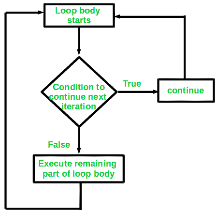

# 用 C/C++

继续语句

> 原文:[https://www.geeksforgeeks.org/continue-statement-cpp/](https://www.geeksforgeeks.org/continue-statement-cpp/)

Continue 也是一个循环控制语句，就像 [break 语句](https://www.geeksforgeeks.org/break-statement-cc/)一样。 *continue* 语句与 break *语句*相反，它不是终止循环，而是强制执行循环的下一次迭代。
顾名思义，continue 语句强制循环继续或执行下一次迭代。当 continue 语句在循环中执行时，continue 语句后面的循环中的代码将被跳过，循环的下一次迭代将开始。
**语法**:

```
continue;

```


**例** :
考虑一下需要写一个打印 1 到 10 的数字但不是 6 的程序的情况。指定您必须使用循环来执行此操作，并且只允许使用一个循环。
继续语句的用法来了。我们在这里可以做的是，我们可以运行一个从 1 到 10 的循环，每次我们都必须将迭代器的值与 6 进行比较。如果它等于 6，我们将使用 *continue* 语句继续下一次迭代，不打印任何内容，否则我们将打印该值。
以下是上述思路的实现:

## C

```
// C program to explain the use 
// of continue statement 
#include <stdio.h>

int main() {
    // loop from 1 to 10 
    for (int i = 1; i <= 10; i++) { 

        // If i is equals to 6, 
        // continue to next iteration 
        // without printing 
        if (i == 6) 
            continue; 

        else
            // otherwise print the value of i 
            printf("%d ", i); 
    } 

    return 0; 
}
```

## C++

```
// C++ program to explain the use
// of continue statement

#include <iostream>
using namespace std;

int main()
{
    // loop from 1 to 10
    for (int i = 1; i <= 10; i++) {

        // If i is equals to 6,
        // continue to next iteration
        // without printing
        if (i == 6)
            continue;

        else
            // otherwise print the value of i
            cout << i << " ";
    }

    return 0;
}
```

**Output:**

```
1 2 3 4 5 7 8 9 10 

```

*continue* 语句也可以用于任何其他循环，如 while 或 do while，方式与上面的 for 循环类似。

**练习题:**
给定一个数字 n，打印三角图案。我们只能使用一个循环。

```
Input: 7
Output:
*
* * 
* * *
* * * *
* * * * *
* * * * * *
* * * * * * *
```

解决方案:[使用一个循环打印图案|设置 2(使用继续语句)](https://www.geeksforgeeks.org/print-pattern-using-one-loop-continue-statement/)

本文由 [**哈什·阿加瓦尔**](https://www.facebook.com/harsh.agarwal.16752) 供稿。如果你喜欢 GeeksforGeeks 并想投稿，你也可以使用[contribute.geeksforgeeks.org](http://contribute.geeksforgeeks.org)写一篇文章或者把你的文章邮寄到 contribute@geeksforgeeks.org。看到你的文章出现在极客博客主页上，帮助其他极客。

如果你发现任何不正确的地方，或者你想分享更多关于上面讨论的话题的信息，请写评论。