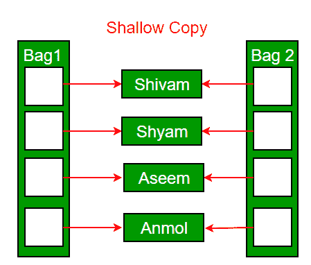
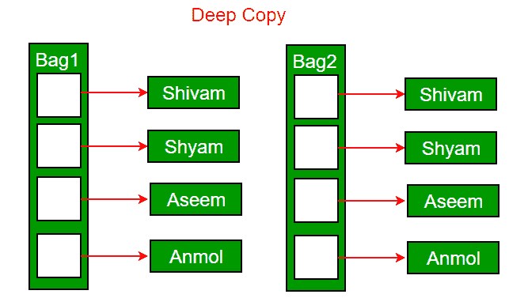

# c++ 中的复制构造函数

> 原文:[https://www.geeksforgeeks.org/copy-constructor-in-cpp/](https://www.geeksforgeeks.org/copy-constructor-in-cpp/)

我们已经讨论了 C++ 中构造函数的介绍。在这篇文章中，将讨论复制构造函数。
**什么是复制构造函数？**
复制构造函数是使用同一类的另一个对象初始化一个对象的成员函数。复制构造函数具有以下一般函数原型:

```cpp
    ClassName (const ClassName &old_obj); 
```

下面是复制构造函数的一个简单例子。

## 卡片打印处理机（Card Print Processor 的缩写）

```cpp
#include<iostream>
using namespace std;

class Point
{
private:
    int x, y;
public:
    Point(int x1, int y1) { x = x1; y = y1; }

    // Copy constructor
    Point(const Point &p1) {x = p1.x; y = p1.y; }

    int getX()            {  return x; }
    int getY()            {  return y; }
};

int main()
{
    Point p1(10, 15); // Normal constructor is called here
    Point p2 = p1; // Copy constructor is called here

    // Let us access values assigned by constructors
    cout << "p1.x = " << p1.getX() << ", p1.y = " << p1.getY();
    cout << "\np2.x = " << p2.getX() << ", p2.y = " << p2.getY();

    return 0;
}
```

**输出:**

```cpp
p1.x = 10, p1.y = 15
p2.x = 10, p2.y = 15 
```

**什么时候调用** **复制构造函数？**
在 C++ 中，在以下情况下可以调用复制构造函数:
1。当类的对象由值返回时。
2。当类的对象通过值作为参数传递(给函数)时。
3。当一个对象基于同一类的另一个对象构造时。
4。当编译器生成临时对象时。
然而，并不能保证在所有这些情况下都会调用复制构造函数，因为 C++ 标准允许编译器在某些情况下对副本进行优化，例如[返回值优化(有时称为 RVO)](http://en.wikipedia.org/wiki/Return_value_optimization) 。
来源:[https://www.geeksforgeeks.org/g-fact-13/](https://www.geeksforgeeks.org/g-fact-13/)

**什么时候需要**一个**自定义复制构造函数？**
如果我们不定义自己的复制构造函数，C++ 编译器会为每个类创建一个默认的复制构造函数，在对象之间进行成员复制。编译器创建的复制构造函数通常运行良好。只有当一个对象有指针或任何运行时资源分配(如文件句柄、网络连接)时，我们才需要定义自己的复制构造函数..等等。
默认 ***构造函数只做浅复制。***



***只有使用用户定义的复制构造函数才能进行深度复制。*** 在用户定义的复制构造函数中，我们确保被复制对象的指针(或引用)指向新的内存位置。



**复制构造函数 vs 赋值运算符**
下面两个语句中哪一个调用复制构造函数，哪一个调用赋值运算符？

## 卡片打印处理机（Card Print Processor 的缩写）

```cpp
MyClass t1, t2;
MyClass t3 = t1;  // ----> (1)
t2 = t1;          // -----> (2)
```

当从现有对象创建新对象时，将调用复制构造函数，作为现有对象的副本。当一个已经初始化的对象从另一个已存在的对象被赋予一个新值时，调用赋值运算符。在上面的示例中，(1)调用复制构造函数，(2)调用赋值运算符。详见[本](https://www.geeksforgeeks.org/copy-constructor-vs-assignment-operator-in-c/)。
**写一个需要复制构造函数的示例类？**
下面是一个完整的 C++ 程序来演示 Copy 构造函数的使用。在下面的 String 类中，我们必须编写复制构造函数。

## 卡片打印处理机（Card Print Processor 的缩写）

```cpp
#include<iostream>
#include<cstring>
using namespace std;

class String
{
private:
    char *s;
    int size;
public:
    String(const char *str = NULL); // constructor
    ~String() { delete [] s;  }// destructor
    String(const String&); // copy constructor
    void print() { cout << s << endl; } // Function to print string
    void change(const char *);  // Function to change
};

String::String(const char *str)
{
    size = strlen(str);
    s = new char[size+1];
    strcpy(s, str);
}

void String::change(const char *str)
{
    delete [] s;
    size = strlen(str);
    s = new char[size+1];
    strcpy(s, str);
}

String::String(const String& old_str)
{
    size = old_str.size;
    s = new char[size+1];
    strcpy(s, old_str.s);
}

int main()
{
    String str1("GeeksQuiz");
    String str2 = str1;

    str1.print(); // what is printed ?
    str2.print();

    str2.change("GeeksforGeeks");

    str1.print(); // what is printed now ?
    str2.print();
    return 0;
}
```

输出:

```cpp
GeeksQuiz
GeeksQuiz
GeeksQuiz
GeeksforGeeks
```

**如果从上面的代码中去掉复制构造函数会有什么问题？**
如果我们从上面的程序中移除复制构造函数，我们就不会得到预期的输出。对 str2 所做的更改也反映在 str1 中，这是从未预料到的。

## 卡片打印处理机（Card Print Processor 的缩写）

```cpp
#include<iostream>
#include<cstring>
using namespace std;

class String
{
private:
    char *s;
    int size;
public:
    String(const char *str = NULL); // constructor
    ~String() { delete [] s;  }// destructor
    void print() { cout << s << endl; }
    void change(const char *);  // Function to change
};

String::String(const char *str)
{
    size = strlen(str);
    s = new char[size+1];
    strcpy(s, str);
}

void String::change(const char *str)
{
    delete [] s;
    size = strlen(str);
    s = new char[size+1];
    strcpy(s, str);
}

int main()
{
    String str1("GeeksQuiz");
    String str2 = str1;

    str1.print(); // what is printed ?
    str2.print();

    str2.change("GeeksforGeeks");

    str1.print(); // what is printed now ?
    str2.print();
    return 0;
}
```

输出:

```cpp
GeeksQuiz
GeeksQuiz
GeeksforGeeks
GeeksforGeeks
```

**我们可以让复制构造函数私有吗？**
是的，复制构造函数可以私有。当我们在一个类中使复制构造函数私有时，该类的对象变得不可复制。当我们的类有指针或动态分配的资源时，这特别有用。在这种情况下，我们可以像上面的 String 示例一样编写自己的复制构造函数，或者创建一个私有的复制构造函数，这样用户在运行时就不会遇到意外，而是会遇到编译器错误。
**为什么复制构造函数的参数必须作为引用传递？**
通过值传递对象时，调用复制构造函数。复制构造函数本身就是一个函数。因此，如果我们在复制构造函数中按值传递一个参数，对复制构造函数的调用将会调用复制构造函数，这将成为一个非终止的调用链。因此，编译器不允许通过值传递参数。
**为什么复制构造函数的参数应该是常量？**
见[https://www . geesforgeks . org/copy-constructor-const/](https://www.geeksforgeeks.org/copy-constructor-argument-const/)
本文由 **Shubham Agrawal** 供稿。如果你喜欢极客博客并想投稿，你也可以把你的文章邮寄到 review-team@geeksforgeeks.org。看到你的文章出现在极客博客主页上，帮助其他极客。
如果发现有不正确的地方，或者想分享更多关于上述话题的信息，请写评论。