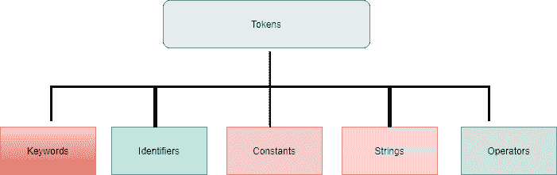

# C++关键词

> 原文:[https://www.geeksforgeeks.org/cpp-keywords/](https://www.geeksforgeeks.org/cpp-keywords/)

[C++](https://www.geeksforgeeks.org/c-plus-plus/) 是一门功能强大的语言。在 C++中，我们可以编写结构化程序，也可以编写[面向对象程序](https://www.geeksforgeeks.org/oops-object-oriented-design/)。C++是 [C](https://www.geeksforgeeks.org/c-programming-language/) 的超集，因此大多数 C 的构造在 C++中都是合法的，它们的意义没有改变。然而，也有一些例外和补充。

[**Token**](https://www.geeksforgeeks.org/cc-tokens/) **:** 当编译器在处理一个 C++程序的源代码时，每一组用空格分隔的字符称为一个 Token。代币是程序中最小的独立单元。C++程序是使用标记编写的。它有以下标记:

*   [关键词](https://www.geeksforgeeks.org/variables-and-keywords-in-c/)
*   [标识符](https://www.geeksforgeeks.org/difference-between-keyword-and-identifier/)
*   [常数](https://www.geeksforgeeks.org/constants-in-c-cpp/)
*   [琴弦](https://www.geeksforgeeks.org/string-data-structure/)
*   [操作员](https://www.geeksforgeeks.org/bitwise-operators-in-c-cpp/)

[](https://media.geeksforgeeks.org/wp-content/uploads/20210507151607/token2.png)

[**关键词**](https://www.geeksforgeeks.org/variables-and-keywords-in-c/) (也称为**保留词**)对 [C++编译器](https://www.geeksforgeeks.org/compiling-with-g-plus-plus/)有特殊意义，并且总是以短(小写)的形式书写或键入。关键词是语言为特定目的使用的词语，如 **void** 、 **int** 、 **public** 等。它不能用于变量名或函数名。下表是 C++关键字的完整集合。

<figure class="table">

| 

**C++关键字**

 |
| --- |
| ASM | 两倍 | **新增** | [开关](https://www.geeksforgeeks.org/switch-statement-cc/) |
| 汽车 | 其他 | **操作员** | **模板** |
| 破裂 | 列举型别 | **私人** | **这个** |
| 情况 | 走读生 | **受保护** | **投** |
| **抓** | 漂浮物 | **公共** | **试试** |
| 茶 | 为 | 注册 | typedef(类型定义) |
| **级** | **朋友** | 返回 | 联盟 |
| 常数 | 转到 | 短的 | 无符号的 |
| 继续 | [如果](https://www.geeksforgeeks.org/check-if-given-number-is-perfect-square-in-cpp/) | 签名 | **虚拟** |
| 系统默认值 | **直列** | 大小 | 空的 |
| **删除** | （同 Internationalorganizations）国际组织 | 静电 | 不稳定的 |
| 做 | 长的 | 结构体 | 在…期间 |

</figure>

> **注:**ANSI C 中未找到的关键词在此以黑体显示。

*   **asm** :声明一段代码将被传递给汇编程序。
*   **auto** :用于定义块中对象的存储类说明符。
*   **中断**:终止开关语句或循环。
*   **case** :在 switch 语句中专门用于指定语句表达式的匹配项。
*   **catch** :指定异常发生时采取的动作。
*   **字符**:定义字符对象的基本数据类型。
*   **类**:声明封装数据成员和操作或成员函数的用户定义类型。
*   **常量**:定义其值在程序执行的整个生命周期内不会改变的对象。
*   **继续** :-将控制转移到循环的开始。
*   **默认值** :-处理 switch 语句中不按大小写处理的表达式值。
*   **删除**:内存解除分配运算符。
*   **do** :表示 do-while 语句的开始，其中子语句被重复执行，直到表达式的值为逻辑假。
*   **double:** 用于定义浮点数的基本数据类型。
*   **else:** 在 if-else 语句中专门使用。
*   **枚举:**声明用户定义的枚举数据类型。
*   **外部**:指定为外部的标识符与块有外部链接。
*   **浮点** :-用于定义浮点数的基本数据类型。
*   的**:表示语句的开始，实现重复控制。**
*   **friend:** 一个类或操作，其实现可以访问一个类的私有数据成员。
*   **转到**:将控制权转移到指定标签。
*   **if** :指示 if 语句的开始，实现选择性控制。
*   **内联:**一种函数说明符，向编译器指示函数体的内联替换优于通常的函数调用实现。
*   **int:** 用于定义整数对象的基本数据类型。
*   **long:** 定义 32 位 int 或扩展 double 的数据类型修饰符。
*   **新增**:内存分配运算符。
*   **运算符:**用新声明重载 c++运算符。
*   **private** :声明类外不可见的类成员。
*   **受保护:**声明除派生类之外的私有类成员
*   **public:** 声明在类外可见的类成员。
*   **寄存器:**一种存储类说明符，它是自动说明符，但也向编译器指示某个对象将被频繁使用，因此应保存在寄存器中。
*   **返回**:向函数的调用方返回一个对象。
*   **短:**定义 16 位整数的数据类型修饰符。
*   **有符号:**数据类型修饰符，表示对象的符号存储在高位。
*   **sizeof:** 以字节为单位返回对象的大小。
*   **static:** 对象定义的静态的生存期存在于程序执行的整个生存期中。
*   **struct:** 声明封装数据和成员函数的新类型。
*   **switch** :这个关键字用在“switch 语句”中。
*   **模板**:参数化或泛型类型。
*   **这个**:一个类指针指向该类的一个对象或者实例。
*   **抛出:**生成异常。
*   **尝试**:表示异常处理程序块的开始。
*   **typedef** :另一个整型或用户自定义类型的同义词。
*   **union:** 类似于结构，struct，因为它可以保存不同类型的数据，但是一个 union 在给定时间只能保存它的一个成员。
*   **无符号:**一种数据类型修饰符，指示高位用于对象。
*   **虚函数**:声明将由派生类重新定义的类的成员函数的函数说明符。
*   **无效:**缺少类型或功能参数表。
*   **易变的**:定义一个对象，该对象的值可能会以编译器无法检测到的方式发生变化。
*   **while**:while 语句的开始和 do-while 语句的结束。

### **<u>什么是标识符，和关键词</u>有何不同:**

标识符是指变量、函数、数组、类等的名称。由程序员创建。它们是任何语言的基本要求。

标识符命名规则:

*   标识符名称不能以数字或任何特殊字符开头。
*   关键字不能用作标识符名称。
*   仅允许字母字符、数字和下划线。
*   大写字母和小写字母是不同的。即 A 和 A 在 C++中是不同的。
*   有效的标识符是 GFG，gfg，极客的极客。

**程序 1:**

## C++

```
// C++ program to illustrate the use
// of identifiers

#include <iostream>
using namespace std;

// Driver Code
int main()
{
    // Use of Underscore (_) symbol
    // in variable declaration
    int geeks_for_geeks = 1;

    cout << "Identifier result is: "
         << geeks_for_geeks;

    return 0;
}
```

**Output:** 

```
Identifier result is: 1
```

**现在，问题来了，关键词和标识符有什么不同？**

因此，关键字有一些主要属性来区分关键字和标识符:

*   关键字是预定义/保留的单词，标识符是用于定义不同编程项目的值，如变量、整数、结构、联合。
*   关键字总是以小写字母开头，而标识符可以以大写字母和小写字母开头。
*   关键字只包含字母字符，但标识符可以由字母字符、数字和下划线组成。
*   没有特殊符号，在关键字和标识符中使用标点符号。标识符中只能使用下划线。
*   关键字和标识符示例:
    *   **关键词:** int，char，while，do。
    *   **标识符:**极客的极客，GFG，Gfg1。

**程序 2:**

下面是如何在程序中使用不同关键字的程序:

## C++

```
// C++ Program to demonstrate keywords
#include <iostream>
using namespace std;

// Driver Code
int main()
{
    // Variable declaration and
    // initialization
    int n = 2;

    // Switch Case Statement
    switch (n) {
    case 1:
        cout << "Computer Network"
             << endl;
        break;
    case 2:
        cout << "C++" << endl;
        break;
    case 3:
        cout << "DBMS" << endl;
        break;
    case 4:
        cout << "Data Structure"
             << endl;
        break;
    case 5:
        cout << "Operating System"
             << endl;
        break;
    default:
        cout << "Enter Valid number"
             << endl;
    }

    // Return keyword returns an object
    // to a function's caller
    return 0;
}
```

**Output:** 

```
C++
```