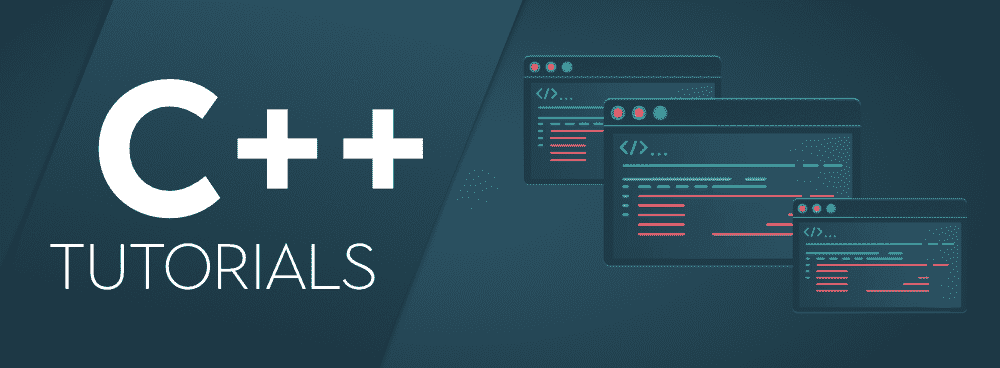
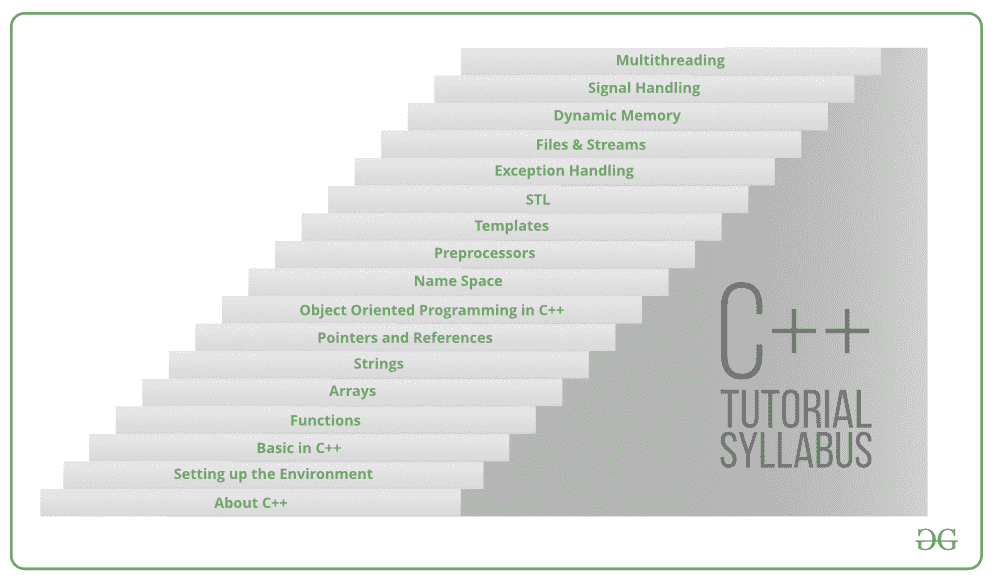

# C++教程

> 原文:[https://www.geeksforgeeks.org/cpp-tutorial/](https://www.geeksforgeeks.org/cpp-tutorial/)

**[C++](https://www.geeksforgeeks.org/c-plus-plus/)** 是一种通用编程语言，如今广泛用于竞技编程。它具有命令式、面向对象和泛型编程特性。C++运行在很多平台上，如视窗、Linux、Unix、Mac 等。

C++是一种高效而强大的语言，广泛应用于各种图形用户界面平台、三维图形和实时仿真。因为包含了丰富的函数库，用 C++工作变得比用 C 更简单方便，作为像 Java 一样的面向对象编程，C++提供了继承、多态、封装等支持。与 C 不同，C++允许异常处理和函数重载。将重要的主题放在一个屋檐下，这个 C++教程是从头开始学习 C++的一个非常有效和方便的方法。

**C++教程–标准分层方法**

下面是完整的逐步教程，展示了如何开始使用 C++并使自己精通它。

1.  **[关于 C++:](https://www.geeksforgeeks.org/introduction-to-c-programming-language/)** 首先，让我们通过了解 C++作为一种编程语言是如何以及为什么如此重要，以及它在计算机科学和编程领域的用途来奠定基础。
2.  [**设置环境:**](https://www.geeksforgeeks.org/setting-c-development-environment/) 在简单了解了 C++之后，下一步就是要知道如何通过在其中实现各种程序来最大限度地利用这种语言。C++运行在很多平台上，比如 Windows、Linux、Unix、Mac 等。在我们开始用 C++编程之前。我们需要在本地计算机上建立一个环境来成功编译和运行我们的 C++程序。如果不想设置本地环境，也可以使用在线 IDEs 编译程序。
3.  **[c++中的基础知识:](https://www.geeksforgeeks.org/c-programming-basics/)** 所以在建立了语言之后，让我们开始驾驭基础知识，并建立一个概念框架，说明如何编写程序以及语言必须向极客提供的各种规定。在本文中，我们将从编写第一个 C++程序开始学习输入/输出、运算符、变量、循环等。
4.  [**c++中的函数:**](https://www.geeksforgeeks.org/functions-in-c/) 函数是一组接受输入、进行某些特定计算并产生输出的语句。其思想是将一些通常或重复完成的任务放在一起，并制作一个函数，这样我们就可以调用该函数，而不是针对不同的输入反复编写相同的代码。
5.  [**c++中的数组:**](https://www.geeksforgeeks.org/arrays-in-c-cpp/) 数组是存储在连续内存位置的项目的集合。我们可以使用正常变量(v1，v2，v3，..)当我们有少量对象时，但是如果我们想要存储大量实例，那么用普通变量来管理它们就变得很困难。数组的思想是在一个变量中表示多个实例。
6.  **[c++中的字符串:](https://www.geeksforgeeks.org/strings-in-c-and-how-to-create-them/)** 字符串被定义为一个字符数组。字符数组和字符串的区别在于字符串以特殊字符“\0”结尾。这些用于处理多个字符和各种特殊字符。与 C 不同，C++为用户提供了丰富的库，使对字符串的操作更容易和有效地实现。
7.  [**指针&c++中的引用:**](https://www.geeksforgeeks.org/pointers-c-examples/) 指针是地址的符号表示。它们使程序能够模拟按引用调用，以及创建和操作动态数据结构。我们将数据类型与指针相关联的原因是它知道数据存储在多少字节中。当我们增加一个指针时，我们增加指针所指向的数据类型的大小。
8.  [**C++中的类和对象:**](https://www.geeksforgeeks.org/c-classes-and-objects/) 导致面向对象编程的 c++的构造块是类。它是用户定义的数据类型，保存自己的数据成员和成员函数，可以通过创建该类的实例来访问和使用。类就像一个对象的蓝图。对象是类的一个实例。当一个类被定义时，没有分配内存，但是当它被实例化时(即一个对象被创建)，内存被分配。
9.  [**c++中的面向对象编程:**](https://www.geeksforgeeks.org/object-oriented-programming-in-cpp/) 顾名思义在编程中使用对象。面向对象编程的目标是在编程中实现像继承、隐藏、多态等真实世界的实体。OOP 的主要目的是将数据和对数据进行操作的函数绑定在一起，这样除了函数之外，代码的任何其他部分都不能访问这些数据。
10.  [**c++中的命名空间:**](https://www.geeksforgeeks.org/namespace-in-c/) 命名空间允许我们将本来具有全局范围的命名实体分组到更窄的范围中，从而赋予它们命名空间范围。这允许将程序的元素组织到不同的逻辑范围中，这些逻辑范围由名称来表示。命名空间是在 C++中添加的特性，在 C 中不存在。命名空间是一个声明性区域，它为其中的标识符(类型、函数、变量等的名称)提供了一个范围。允许多个名称相同的命名空间块。这些块中的所有声明都在命名范围中声明。
11.  [**c++中的预处理器:**](https://www.geeksforgeeks.org/cc-preprocessors/) 顾名思义，预处理器就是在编译前处理我们源代码的程序。在 C / C++中，编写程序和执行程序之间涉及许多步骤。在我们真正开始学习预处理器之前，让我们先看看这些步骤。
12.  [**C++中的模板:**](https://www.geeksforgeeks.org/templates-cpp/) 模板是 c++中一个简单却非常强大的工具。简单的想法是将数据类型作为参数传递，这样我们就不需要为不同的数据类型编写相同的代码。例如，软件公司可能需要对不同的数据类型进行 sort()。我们可以编写一个 sort()并将数据类型作为参数传递，而不是编写和维护多个代码。C++添加了两个新的关键字来支持模板:“template”和“typename”。第二个关键字总是可以被关键字“class”替换。
13.  [**C++中的 STL:**](https://www.geeksforgeeks.org/the-c-standard-template-library-stl/)标准模板库(STL)是一组 c++模板类，提供列表、栈、数组等常见的编程数据结构和函数。它是容器类、算法和迭代器的库。它是一个通用库，因此，它的组件是参数化的。模板类的工作知识是使用 STL 的先决条件。
14.  [**c++中的异常处理:**](https://www.geeksforgeeks.org/exception-handling-c/)c++相对于 C 的优势之一就是异常处理。异常是程序在执行过程中遇到的运行时异常或异常情况。有两种类型的异常，即同步异常和异步异常。C++为此提供了 try、catch 和 throw。
15.  [**C++中的文件和流:**](https://www.geeksforgeeks.org/file-handling-c-classes/) 在 c++中，文件主要通过使用 fstream headerfile 中可用的三个类 fsstream、ifstream、ofstream 来处理。ofstream 类在写入文件时使用，ifstream 类用于读取文件，fstream 类用于读取/写入文件。
16.  [**c++中的动态内存:**](https://www.geeksforgeeks.org/new-and-delete-operators-in-cpp-for-dynamic-memory/)C/c++中的动态内存分配是指程序员手动进行内存分配。动态分配的内存在堆上分配，非静态变量和局部变量在堆栈上分配内存(详情请参考内存布局 C 程序)。
17.  [**c++中的信号处理:**](https://www.geeksforgeeks.org/c-signal-handling/) 信号是迫使操作系统停止正在进行的任务并参与已发送中断的任务的中断。这些中断可以暂停操作系统中任何程序的服务。类似地，C++也提供了它可以在程序中捕捉和处理的各种信号。
18.  [**c++中的多线程:**](https://www.geeksforgeeks.org/multithreading-in-cpp/)C+11 中引入了多线程支持。在 C++11 之前，我们不得不在 C 语言中使用 POSIX 线程或 p 线程库。虽然这个库可以完成这项工作，但是缺少任何标准语言提供的特性集导致了严重的可移植性问题。C++ 11 取消了所有这些，给了我们 std::thread。线程类和相关函数在线程头文件中定义。