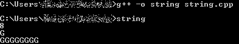
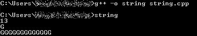
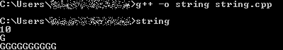

# 在 C++中创建特定长度的字符串

> 原文:[https://www . geesforgeks . org/create-一串特定长度的 in-cpp/](https://www.geeksforgeeks.org/create-a-string-of-specific-length-in-cpp/)

[C++](https://www.geeksforgeeks.org/c-plus-plus/) 在其定义中有一种方式将一系列字符表示为一个类的[对象。这个班叫](https://www.geeksforgeeks.org/c-classes-and-objects/)[T5【STD::string](https://www.geeksforgeeks.org/stdstring-class-in-c/)。String 类将字符存储为字节序列，具有允许访问单字节字符的功能。本文主要讨论如何在 C++中创建特定长度的特定字符串。让我们看一下获得特定长度字符串的各种方法，其中字符和字符串的长度作为用户输入。

**方法 1:** 在该方法中，使用[进行循环](https://www.geeksforgeeks.org/range-based-loop-c/)。其思路是，先取字符串的长度 **L** 作为输入，然后输入具体的**字符 C** ，初始化空字符串 **str** 。现在，重复循环 **L** 次。在每次迭代中，特定字符与字符串**连接，直到 for 循环结束。**

下面是上述方法的实现:

## C++

```
// C++ program for the above approach
#include <iostream>
using namespace std;

// Driver Code
int main()
{
    // Initialize the specific length
    // and character of string
    int L;
    char C;

    // Initialize the empty string
    // for concatenation
    string str = "";

    // Input the specific length and
    // character of string
    cin >> L;
    cin >> C;

    // Run the for loop L times
    for (int i = 0; i < L; i++)
        str = str + C;

    // Output the result string
    cout << str;

    return 0;
}
```

**输出:**



**方法 2:** 该方法使用预定义函数 [append()](https://www.geeksforgeeks.org/stdstringappend-in-c/) 。这个函数在 C++ 中的[字符串库中。所以思路是先初始化长度 L，特定字符 **C** ，字符串 **str** ，然后输入用户想要的字符串长度和特定字符。之后调用带有必要参数的](https://www.geeksforgeeks.org/strings-library-in-cpp-stl/) [**追加()函数**](https://www.geeksforgeeks.org/stdstringappend-in-c/) ，然后打印字符串**字符串**。

下面是上述方法的实现:

## C++

```
// C++ program for the above approach
#include <iostream>
using namespace std;

// Driver Code
int main()
{
    // Initialize the specific length
    // and character of string
    int L;
    char C;

    // Initialize the string
    string str;

    // Input the specific length and
    // character of string
    cin >> L;
    cin >> C;

    // Call the append function with
    // specific parameters
    str.append(L, C);

    // Output the result string
    cout << str;

    return 0;
}
```

**输出:**



**方法 3:** 这个方法非常简单、快速、高效。在此方法中，使用了 std::string 的构造函数。只需输入长度 L，字符 C，用默认值初始化字符串对象。

下面是上述方法的实现:

## C++

```
// C++ program for the above approach
#include <bits/stdc++.h>
using namespace std;

// Driver Code
int main()
{
    // Initialize the specific length
    // and character of string
    int L;
    char C;

    // Input the specific length
    // and character of string
    cin >> L;
    cin >> C;

    // Initialize the string object
    // with default values
    string str(L, C);

    // Output the result string
    cout << str;

    return 0;
}
```

**输出:**

