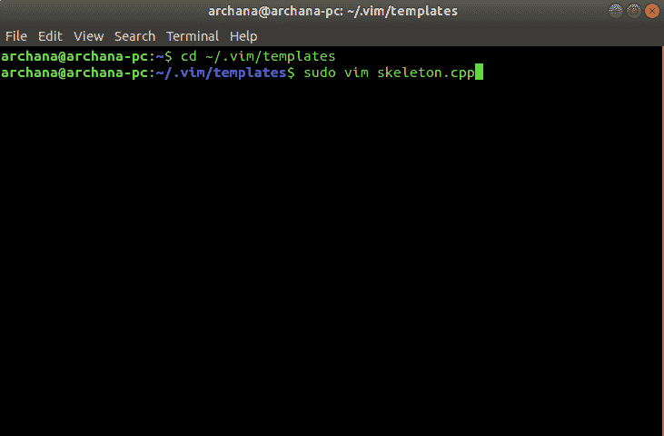
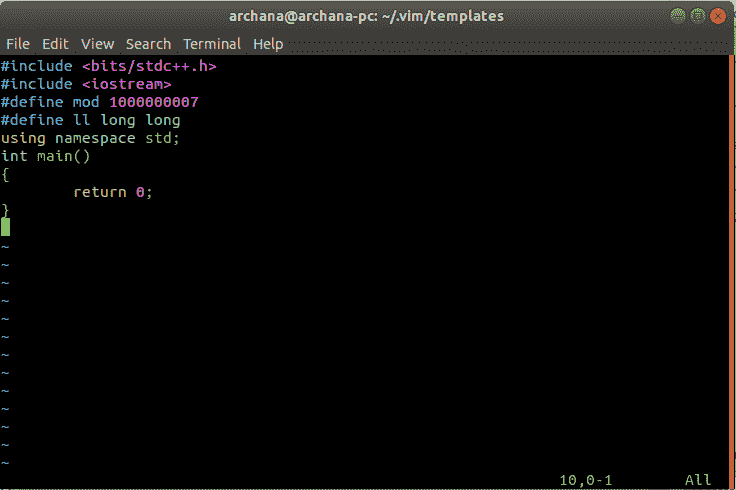
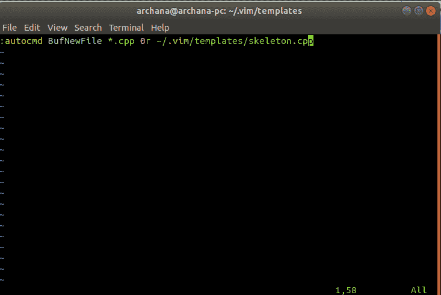
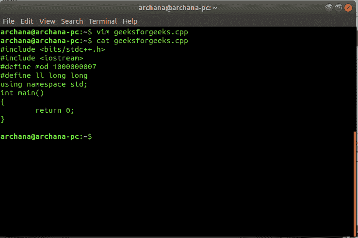

# 在 Linux 的 vim 中创建 C++模板

> 原文:[https://www . geesforgeks . org/creating-a-c-template-in-vim-in-Linux/](https://www.geeksforgeeks.org/creating-a-c-template-in-vim-in-linux/)

Vim 允许用户为以特定扩展名结尾的文件创建特定的模板。

### 创建模板的一般步骤:

第一步:在~/中创建模板。vim/模板/目录。模板是一个框架内容，可以放入以特定扩展名结尾的所有文件中。
第二步:向~/添加命令。指导 vim 用指定模板的内容填充新文件的 vimrc 文件。

**例如:**

```
  :autocmd BufNewFile  *.c 0r ~/vim/skeleton.c 

```

**说明:**
–autocmd 代表 Auto 命令。
–BufNewFile 是表示在缓冲区中打开新文件的事件。
–*。c 表示所有扩展名为` . c ` .
–0r 表示读取一个文件，并将其内容插入到扩展名为` . c `的新文件的顶部。这后面是一个指向框架文件的路径。

### 创建 c++模板的步骤:

第一步:打开终端。
第二步:将目录改为~/。vim/templates/。

```
$ cd ~/.vim/templates/

```

注意:如果模板子目录不可用，则在中创建一个。vim 文件夹。

```
$ mkdir templates && cd templates

```

第三步:打开模板文件。

```
$ sudo vim skeleton.cpp

```

**示例:**

第四步:添加骨架/模板。保存并关闭。
**示例:**

第五步:开启~/。vimrc 文件。

```
$ sudo vim  ~/.vimrc

```

第六步:添加下面一行。

```
:autocmd BufNewFile *.cpp 0r ~/.vim/templates/skeleton.cpp

```

**示例:**

第七步:保存并关闭。

### 打开新的 cpp 文件

**例:**
