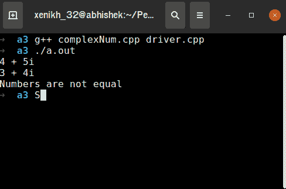

# 创建 C++可重用头文件及其实现文件

> 原文:[https://www . geesforgeks . org/creating-a-CPP-可重用-头文件-及其实现-文件/](https://www.geeksforgeeks.org/creating-a-cpp-reusable-header-file-and-its-implementation-files/)

可重用性是[软件工程](https://www.geeksforgeeks.org/software-engineering/)最重要的概念之一。可重用性意味着开发可以在同一程序或不同程序中重用的代码。 [C++](https://www.geeksforgeeks.org/c-plus-plus/) 通过[继承](https://www.geeksforgeeks.org/inheritance-in-c/)、[集装箱船](https://www.geeksforgeeks.org/containership-in-c/)、[多态](https://www.geeksforgeeks.org/polymorphism-in-c/)和[泛型](https://www.geeksforgeeks.org/generics-in-c/)允许重用。但是，还有另一种方法来定义独立的构件。这可以通过创建头文件和实现文件来实现。

> [**头文件**](https://www.geeksforgeeks.org/header-files-in-c-cpp-and-its-uses/) 是包含[类声明](https://www.geeksforgeeks.org/c-classes-and-objects/)的文件。类的名称通常与头文件的名称相同。(例如，LinkedList 类将存储在 LinkedList.h 头文件中)
> 
> 另一方面，实现文件由头文件中定义的类的函数定义组成。通常，文件名是类的名称，扩展名为. cpp。(例如，LinkedList 类的函数定义将存储在 LinkedList.cpp 头文件中)

现在，要创建在上面头文件中定义的类的[对象](https://www.geeksforgeeks.org/c-classes-and-objects/)，必须有一个 [main()函数](https://www.geeksforgeeks.org/executing-main-in-c-behind-the-scene/)。但是等等，在哪里定义 main()函数，特别是哪个文件？
主要功能在另一个文件中定义，称为驱动程序文件，或者在某些情况下，称为客户端文件。

**示例:**这里实现了 **complexNum** 类。它被分成两个文件。头文件扩展名为**，包含类定义。**

**头文件:**

## C++

```cpp
// Header file complexNum.h
#ifndef COMPLEXNUM_H
#define COMPLEXNUM_H

class complexNum {
private:
    int real;
    int imaginary;

public:
    // With default value,
    // default constructor
    complexNum(const int a = 0,
               const int b = 0);

    // setter function
    void setNum(const int a,
                const int b);

    // Prints the complex number
    // in the form real + i(imaginary),
    // i->iota
    void print() const;

    // An overloaded operator to compare
    // two complex number objects
    bool operator==(const complexNum&);
};
#endif
```

**实施文件:**

## C++

```cpp
// Implementation file
// complexNum.cpp
#include "complexNum.h"
#include <iostream>
using namespace std;

// A default constructor
complexNum::complexNum(int a,
                       int b)
{
    real = a;
    imaginary = b;
}

// A function to set values
void complexNum::setNum(const int a,
                        const int b)
{
    real = a;
    imaginary = b;
}

// A function to print the complex
// number in the form real +
// (imaginary)i, i->iota
void complexNum::print() const
{
    cout << real << " + " << imaginary << "i" << endl;
}

// An overloaded operator to
// compare two complex Number
// objects
bool complexNum::operator==(const complexNum& obj)
{
    if (this->real == obj.real && this->imaginary == obj.imaginary) {
        return true;
    }
    return false;
}
```

现在为了检查正确性并实现上面的 **complexNum** [类](https://www.geeksforgeeks.org/c-classes-and-objects/)，需要一个驱动文件。下面是驱动程序文件:

## C++

```cpp
// Driver file to illustrate
// the implementation of
// complexNum.cpp file
#include "complexNum.h"
#include <iostream>
using namespace std;

// Driver code
int main()
{
    // Defines a complex number
    // object (obj1 = 4 + 5i)
    complexNum obj1(4, 5);
    complexNum obj2;

    // Defines a complex number
    // object (obj2 = 3 + 4i)
    obj2.setNum(3, 4);

    // Prints the complex number
    obj1.print();
    obj2.print();

    // Checks, if two complex
    // number objects are equal or
    // not
    if (obj1 == obj2) {
        cout << "Both the numbers are equal" << endl;
    }
    else {
        cout << "Numbers are not equal" << endl;
    }
    return 0;
}
```

**输出:**



**注意:**
头文件、实现文件以及驱动文件应该在同一个文件夹中。否则，在 include 语句中提供当前工作目录的链接。

头文件已经被程序员使用，非常有用，在实现各种数据结构和算法时变得很方便。例如[动态数组](https://www.geeksforgeeks.org/how-do-dynamic-arrays-work/)可以使用<向量>头文件实现。

**在不同文件中存储类定义的优势:**

1.  继承可以用来实现代码的可重用性，但是它的缺点是一个类必须从同一个文件中的一个类继承。不能从不同的文件继承类。
2.  但是，这个问题可以通过使用头文件和实现文件来解决，从而使类可重用。
3.  如果类实现没有改变，那么就没有必要重新编译它。