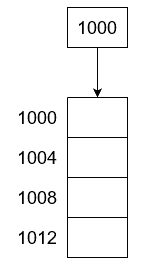
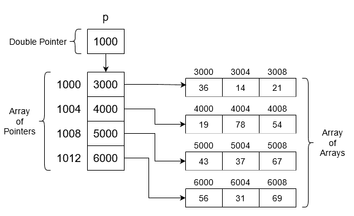

# 在 C++中创建指针数组

> 原文:[https://www . geesforgeks . org/creating-指针数组 in-cpp/](https://www.geeksforgeeks.org/creating-array-of-pointers-in-cpp/)

一个[指针数组](https://www.geeksforgeeks.org/pointer-array-array-pointer/)是一个[指针变量数组](https://www.geeksforgeeks.org/pointers-c-examples/)。它也被称为指针数组。我们将讨论如何动态创建[指针](https://www.geeksforgeeks.org/pointers-in-c-and-c-set-1-introduction-arithmetic-and-array/)的 1D 和 2D [数组](https://www.geeksforgeeks.org/array-data-structure/)。**动态**一词表示[内存在运行时分配](https://www.geeksforgeeks.org/dynamic-memory-allocation-in-c-using-malloc-calloc-free-and-realloc/)，在[堆段](https://www.geeksforgeeks.org/binary-heap/)分配内存。在[堆栈](https://www.geeksforgeeks.org/stack-data-structure/)中，内存有限，但取决于使用的语言/操作系统，平均大小为 **1MB** 。

**c++中的动态 1D 数组:**指针数组是一种由指针类型的变量组成的数组。这意味着这些变量可以指向其他一些数组元素。

**示例:**

> int * p[3]；
> 
> //现在 P[0]，P[1]，P[2]可以指向 int 内存块。

在大小为 **N** 的动态分配数组中，块在堆中创建，并返回第一个内存块的地址。通过使用这个地址，每个元素都可以被访问。 [C++](https://www.geeksforgeeks.org/c-plus-plus/) 中的[动态数组](https://www.geeksforgeeks.org/how-do-dynamic-arrays-work/)大家应该熟悉[新关键词](https://www.geeksforgeeks.org/new-vs-operator-new-in-cpp/)或者 [malloc()，可以使用 calloc()](https://www.geeksforgeeks.org/difference-between-malloc-and-calloc-with-examples/) 。

**语法:**

> <datatype>* <pointer name="">=新增<datatype>【<size>】；</size></datatype></pointer></datatype>

**示例:**

> int * p = new int[5]；


**访问动态数组的元素:**

*   1.创建大小为 **N** (= 5)的 1D 数组，并将基址分配给变量 **P** 。如果写下以下语句，则输出为 **1000** 。

> cout < < p；

*   如果需要第 1000 个<sup>地址中的值，则使用*(星号)符号将其取消引用，如下所示:</sup>

> cout < < * P；
> 
> //与 P[0]相同。输出为 23。

**基本指针算法:**以下是关于[指针算法](https://www.geeksforgeeks.org/pointer-arithmetics-in-c-with-examples/)的几点:

*   ***(P + 1):**

> P = 1000，1 = sizeof(int) = 4 字节。
> 因此，*(1004)并通过*(星号)符号取消引用。现在，最终结果是 38。

*   ***(P) + 1:**

> P = 1000，1 = sizeof(int) = 4 字节。
> 因此，*(1004)并通过*(星号)符号取消引用，然后通过添加 1 将结果修改为 23 + 1 = 24。

下面是 C++程序来说明上述概念:

## C++

```cpp
// C++ program to illustrate the concepts
// of creating 1D array of pointers
#include <iostream>
using namespace std;

// Driver Code
int main()
{
    // Dynamically creating the array
    // of size = 5
    int* p = new int[5];

    // Initialize the array p[] as
    // {10, 20, 30, 40, 50}
    for (int i = 0; i < 5; i++) {
        p[i] = 10 * (i + 1);
    }

    // Print the values using pointers
    cout << *p << endl;
    cout << *p + 1 << endl;
    cout << *(p + 1) << endl;
    cout << 2 [p] << endl;
    cout << p[2] << endl;
    *p++;

    // Pointing to next location
    cout << *p;

    return 0;
}
```

**Output**

```cpp
10
11
20
30
30
20
```

**c++中指针的动态 2D 数组:**指针的[动态数组](https://www.geeksforgeeks.org/how-do-dynamic-arrays-work/)基本上是一个指针数组，其中每个数组索引都指向一个内存块。这代表了我们心中的 2D 观点。但逻辑上它是一个连续的内存块。

**语法:**

> <datatype>** <pointer name="">=新<datatype>*[<size>]；</size></datatype></pointer></datatype>

**示例:**

> int * * P = new int *[4]；

**注:*****(星号)**符号定义指针的[级，一 ***** 表示一级指针，其中 ****** 表示两级指针，以此类推。此外，指针的级别必须与要动态创建的维度数组相同。](https://www.geeksforgeeks.org/chain-of-pointers-in-c-with-examples/)

**进场:**

*   创建一个 **1D** 指针数组。



*   现在，将列创建为每行的指针数组，如下所示:
    *   P[0] =新 int[3]；
    *   P[1] =新 int[3]；
    *   P[2] =新 int[3]；
    *   P[3] =新 int[3]；



*   指针的 1D 数组指向一个内存块(提到了大小)。基本上， **P[0]，…，P[3]** 指向一个 1D 整数数组。

**<u>访问阵元</u> :**

*   ***P** 等于**P【0】**为第一行地址，第一列为**&P【0】【0】**=**3000**。
*   ***(P + 1)** 等于“ **P** ”是**1000+1(sizeof int)**=**1004**， ***** 表示取消引用。所以存储在该地址的值被打印出来，即 ***1004** = **4000。**
*   ***(P + 1) + 2** 同上，但 **+2** 表示 **( & P[1] + 2)** 等于**&P[1][2]**=**4008**。
*   ***(*(P + 1) + 2)** 与上述情况相同，但第一个星号 **'*(…)。)'**表示取消对该地址的引用。因此，结果等于**T10【P[1][2]**=***(4008)**=**54**中的值。

下面是 C++程序来说明上述概念:

## C++

```cpp
// C++ program to illustrate the concepts
// of creating 2-D array of pointers
#include <iostream>
using namespace std;

// Driver Code
int main()
{
    int N = 3;

    // Creating the array of pointers
    // of size N
    int** p = new int*[N];
    int x = 1;

    // For multiplying
    for (int i = 0; i < N; i++) {

        p[i] = new int[N];

        // Creating N sized int memory
        // block
        for (int j = 0; j < N; j++, x++) {

            p[i][j] = 10 * x;

            // The above statement can
            // also be written as:
            // *(*(p+i)+j) = 10 * x
        }
    }

    // Print the values using pointers
    cout << *p << endl;
    cout << **p << endl;
    cout << *p + 1 << endl;
    cout << **p + 1 << endl;
    cout << *(*(p + 1) + 0) << endl;
    cout << p[2][2] << endl;

    return 0;
}
```

**Output**

```cpp
0x158de90
10
0x158de94
11
40
90
```