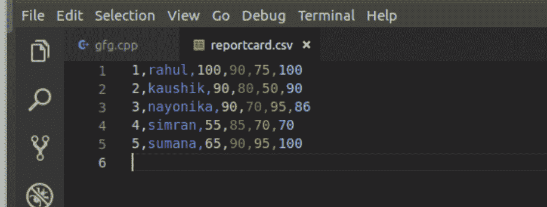
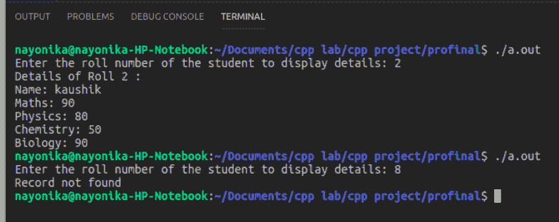
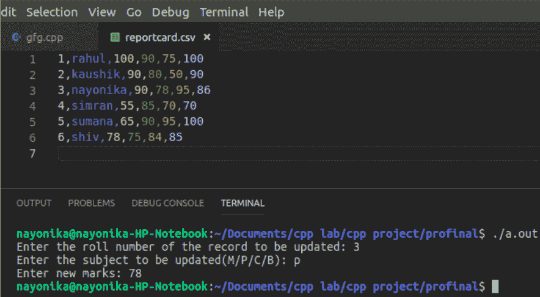
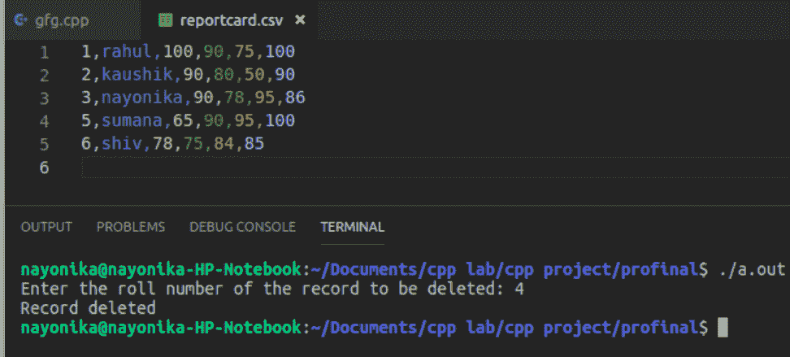

# 使用 C++进行 CSV 文件管理

> 原文:[https://www.geeksforgeeks.org/csv-file-management-using-c/](https://www.geeksforgeeks.org/csv-file-management-using-c/)

**CSV** 是一种简单的文件格式，用于存储表格数据，如电子表格或数据库。CSV 代表**逗号分隔值**。CSV 文件中的数据字段由逗号**('，')**分隔，各行由换行符 **('\n')** 分隔。C++中的 CSV 文件管理类似于文本类型的文件管理，除了一些修改。

本文讨论如何在 CSV 文件中**创建、更新和删除记录**:

**注:**这里创建了 reportcard.csv 文件，存储学生的学号、姓名以及数学、物理、化学、生物成绩。

1.  **Create operation:**

    创建操作类似于创建文本文件，即从用户输入数据，并使用文件指针和不同列之间的适当分隔符('，')以及每行结尾后的' \n '将其写入 csv 文件。

    ## 创造

    ```
    void create()
    {
        // file pointer
        fstream fout;

        // opens an existing csv file or creates a new file.
        fout.open("reportcard.csv", ios::out | ios::app);

        cout << "Enter the details of 5 students:"
             << " roll name maths phy chem bio";
        << endl;

        int i, roll, phy, chem, math, bio;
        string name;

        // Read the input
        for (i = 0; i < 5; i++) {

            cin >> roll
                >> name
                >> math
                >> phy
                >> chem
                >> bio;

            // Insert the data to file
            fout << roll << ", "
                 << name << ", "
                 << math << ", "
                 << phy << ", "
                 << chem << ", "
                 << bio
                 << "\n";
        }
    }
    ```

    **输出:**
    

2.  **Read a particular record:**

    在读取 CSV 文件时，采用了以下方法

    1.  使用 getline()，文件指针和' \n '作为分隔符，读取整行并将其存储在字符串变量中。
    2.  使用 stringstream，将行分成单词。
    3.  现在使用 getline()，stringstream 指针和'，'作为分隔符，读取行中的每个单词，将其存储在字符串变量中，并将该变量推送到字符串向量。
    4.  通过行[索引]检索所需的列数据。在这里，行[0]总是存储学生的卷号，因此将行[0]与用户输入的卷号进行比较，如果匹配，则显示学生的详细信息并脱离循环。

    **注意:**在这里，由于从文件中读取的任何数据都是以字符串格式存储的，所以在比较或计算等之前，一定要将字符串转换为所需的数据类型。

    ## 阅读

    ```
    void read_record()
    {

        // File pointer
        fstream fin;

        // Open an existing file
        fin.open("reportcard.csv", ios::in);

        // Get the roll number
        // of which the data is required
        int rollnum, roll2, count = 0;
        cout << "Enter the roll number "
             << "of the student to display details: ";
        cin >> rollnum;

        // Read the Data from the file
        // as String Vector
        vector<string> row;
        string line, word, temp;

        while (fin >> temp) {

            row.clear();

            // read an entire row and
            // store it in a string variable 'line'
            getline(fin, line);

            // used for breaking words
            stringstream s(line);

            // read every column data of a row and
            // store it in a string variable, 'word'
            while (getline(s, word, ', ')) {

                // add all the column data
                // of a row to a vector
                row.push_back(word);
            }

            // convert string to integer for comparision
            roll2 = stoi(row[0]);

            // Compare the roll number
            if (roll2 == rollnum) {

                // Print the found data
                count = 1;
                cout << "Details of Roll " << row[0] << " : \n";
                cout << "Name: " << row[1] << "\n";
                cout << "Maths: " << row[2] << "\n";
                cout << "Physics: " << row[3] << "\n";
                cout << "Chemistry: " << row[4] << "\n";
                cout << "Biology: " << row[5] << "\n";
                break;
            }
        }
        if (count == 0)
            cout << "Record not found\n";
    }
    ```

    **输出:**
    

3.  **Update a record:**

    更新记录时采用以下方法

    1.  从文件中读取数据，并将其与用户输入进行比较，如读取操作下所述。
    2.  要求用户为要更新的记录输入新值。
    3.  用新数据更新行[索引]。这里，索引是指需要更新的列字段。
    4.  将更新的记录和所有其他记录写入新文件(' reportcardnew.csv ')。
    5.  在操作结束时，删除旧文件并用旧文件名重命名新文件，即删除“reportcard.csv”并用“reportcard.csv”重命名“reportcardnew.csv”

    ## 更新

    ```
    void update_recode()
    {

        // File pointer
        fstream fin, fout;

        // Open an existing record
        fin.open("reportcard.csv", ios::in);

        // Create a new file to store updated data
        fout.open("reportcardnew.csv", ios::out);

        int rollnum, roll1, marks, count = 0, i;
        char sub;
        int index, new_marks;
        string line, word;
        vector<string> row;

        // Get the roll number from the user
        cout << "Enter the roll number "
             << "of the record to be updated: ";
        cin >> rollnum;

        // Get the data to be updated
        cout << "Enter the subject "
             << "to be updated(M/P/C/B): ";
        cin >> sub;

        // Determine the index of the subject
        // where Maths has index 2,
        // Physics has index 3, and so on
        if (sub == 'm' || sub == 'M')
            index = 2;
        else if (sub == 'p' || sub == 'P')
            index = 3;
        else if (sub == 'c' || sub == 'C')
            index = 4;
        else if (sub == 'b' || sub == 'B')
            index = 5;
        else {
            cout << "Wrong choice.Enter again\n";
            update_record();
        }

        // Get the new marks
        cout << "Enter new marks: ";
        cin >> new_marks;

        // Traverse the file
        while (!fin.eof()) {

            row.clear();

            getline(fin, line);
            stringstream s(line);

            while (getline(s, word, ', ')) {
                row.push_back(word);
            }

            roll1 = stoi(row[0]);
            int row_size = row.size();

            if (roll1 == rollnum) {
                count = 1;
                stringstream convert;

                // sending a number as a stream into output string
                convert << new_marks;

                // the str() converts number into string
                row[index] = convert.str();

                if (!fin.eof()) {
                    for (i = 0; i < row_size - 1; i++) {

                        // write the updated data
                        // into a new file 'reportcardnew.csv'
                        // using fout
                        fout << row[i] << ", ";
                    }

                    fout << row[row_size - 1] << "\n";
                }
            }
            else {
                if (!fin.eof()) {
                    for (i = 0; i < row_size - 1; i++) {

                        // writing other existing records
                        // into the new file using fout.
                        fout << row[i] << ", ";
                    }

                    // the last column data ends with a '\n'
                    fout << row[row_size - 1] << "\n";
                }
            }
            if (fin.eof())
                break;
        }
        if (count == 0)
            cout << "Record not found\n";

        fin.close();
        fout.close();

        // removing the existing file
        remove("reportcard.csv");

        // renaming the updated file with the existing file name
        rename("reportcardnew.csv", "reportcard.csv");
    }
    ```

    **输出:**
    

4.  **Delete a record:**

    删除记录时会实施以下方法

    1.  从文件中读取数据，并将其与用户输入进行比较，如读取和更新操作下所述。
    2.  将除要删除的数据之外的所有更新记录写入新文件(reportcardnew.csv)。
    3.  删除旧文件，并用旧文件的名称重命名新文件。

    ## 删除

    ```
    void delete_record()
    {

        // Open FIle pointers
        fstream fin, fout;

        // Open the existing file
        fin.open("reportcard.csv", ios::in);

        // Create a new file to store the non-deleted data
        fout.open("reportcardnew.csv", ios::out);

        int rollnum, roll1, marks, count = 0, i;
        char sub;
        int index, new_marks;
        string line, word;
        vector<string> row;

        // Get the roll number
        // to decide the data to be deleted
        cout << "Enter the roll number "
             << "of the record to be deleted: ";
        cin >> rollnum;

        // Check if this record exists
        // If exists, leave it and
        // add all other data to the new file
        while (!fin.eof()) {

            row.clear();
            getline(fin, line);
            stringstream s(line);

            while (getline(s, word, ', ')) {
                row.push_back(word);
            }

            int row_size = row.size();
            roll1 = stoi(row[0]);

            // writing all records,
            // except the record to be deleted,
            // into the new file 'reportcardnew.csv'
            // using fout pointer
            if (roll1 != rollnum) {
                if (!fin.eof()) {
                    for (i = 0; i < row_size - 1; i++) {
                        fout << row[i] << ", ";
                    }
                    fout << row[row_size - 1] << "\n";
                }
            }
            else {
                count = 1;
            }
            if (fin.eof())
                break;
        }
        if (count == 1)
            cout << "Record deleted\n";
        else
            cout << "Record not found\n";

        // Close the pointers
        fin.close();
        fout.close();

        // removing the existing file
        remove("reportcard.csv");

        // renaming the new file with the existing file name
        rename("reportcardnew.csv", "reportcard.csv");
    }
    ```

    **输出:**
    

**参考文献:**T2】https://www.geeksforgeeks.org/file-handling-c-classes/[https://www.geeksforgeeks.org/stringstream-c-applications/](https://www.geeksforgeeks.org/stringstream-c-applications/)