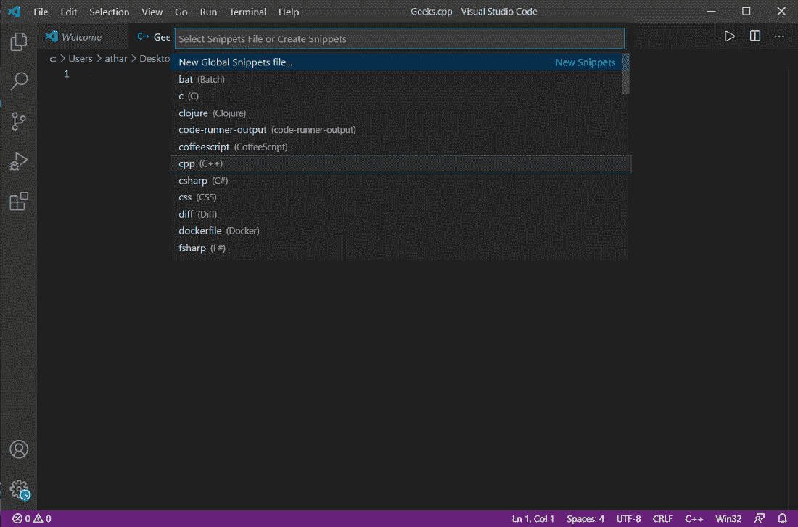
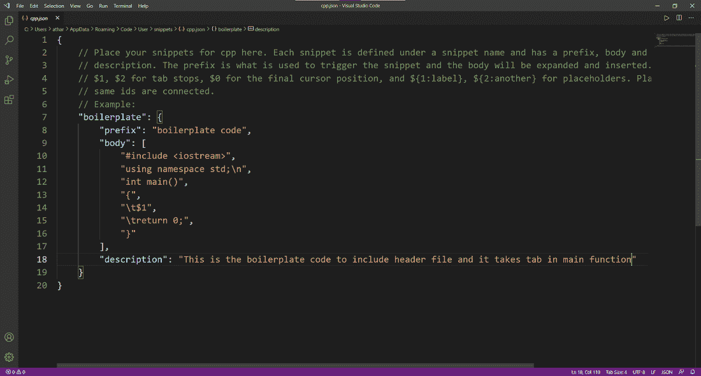
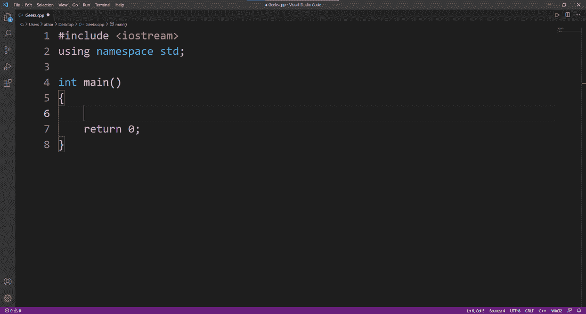

# Visual Studio 代码中的自定义 C++用户代码片段

> 原文:[https://www . geesforgeks . org/custom-c-user-snippet-in-visual studio-code/](https://www.geeksforgeeks.org/custom-c-user-snippet-in-visual-studio-code/)

代码片段是包装在某个前缀词中的一小部分可重复使用的代码，它允许程序员将特定的代码块绑定在一个前缀关键字中。Visual Studio Code 是一个轻量级且功能强大的源代码编辑器，可在 Windows、Linux 和 macOS 中使用，它带有许多用于循环、控制语句和一些关键字的内置代码片段。但是您知道，我们也可以创建自己的自定义代码片段，以节省时间并避免一次又一次地编写相同的代码。在自定义代码片段的帮助下，用户可以更快、更有效地编写代码。

### VS 代码中的现有代码段


循环的内置代码段。

现在让我们看看如何为 c++语言创建自己的代码片段。

## 需要执行的步骤。

在这里，我们将在 Windows 机器上为 C++语言头模板创建一个用户代码片段。

**第一步:**打开 Visual Studio Code，转到**【管理】**(左下角档位图标)。


**步骤 2:** 从打开的选项中，选择**“用户片段”**选项。


**步骤 3:** 选择您要创建代码片段的编程语言。(这里我们选择 C++)。



**步骤 4:** 现在，一个 *cpp.json* 文件将会打开，在这里我们必须为我们的代码片段编写一个代码。首先，取消注释他们指令下面的代码。(参考截图)。


**第五步:**在这一步中，我们要对他们的代码做适当的修改。

首先，让我们理解代码中出现的术语的含义。片段通常有四个主要属性。

> 1.  **Print to console:** is the word, and when we call it, our clip will open.
> 2.  **Prefix:** This prefix is used when selecting code fragments in intellisence.
> 3.  **Body:** In the body, we are writing the main code snippets.
> 4.  **Description:** Here we have to mention the brief description of the segment for our reference only.

**注**–

*   正文中的“$1”符号决定了代码片段在代码中被激活时光标的位置。
*   请注意，在正文中编写代码片段时，对于多行代码片段，正文变成一个数组，代码片段的每一行都变成该数组中的一个字符串。
*   为了正确格式化我们的代码，我们在行中添加了“\t”、“\n”来进行适当的缩进。

### 我们的 C++模板代码片段



在我们的代码片段中，我们使用了一个“**样板文件**”作为“打印到控制台”，这意味着当我们键入样板文件并按回车键时，我们的代码片段被执行。

前缀作为“样板代码”给出。这将在键入代码片段的名称时可见。


编写代码片段名称时，前缀是可见的

正文中我们已经包含了 *iostream* 头文件和 c++的模板代码。还添加了对代码片段的描述。添加“\t”和“\n”是为了正确格式化代码。

#### 这是代码片段的结果。

标签在第 6<sup>行，有四个空格。</sup>



片段结果

## C++

```
#include <iostream>
using namespace std;

int main()
{

    return 0;
}
```

### 视频演示:

这里，所有上述步骤都是在创建一个代码片段时执行的。这会让你有更清晰的认识。

<video class="wp-video-shortcode" id="video-569647-1" width="640" height="360" preload="metadata" controls=""><source type="video/mp4" src="https://media.geeksforgeeks.org/wp-content/uploads/20210305162052/VScode-Snippets.mp4?_=1">[https://media.geeksforgeeks.org/wp-content/uploads/20210305162052/VScode-Snippets.mp4](https://media.geeksforgeeks.org/wp-content/uploads/20210305162052/VScode-Snippets.mp4)</video>

仅此而已。这样，您就可以在 Visual Studio 代码中为不同的语言创建一个用户代码片段。每个片段都与一个特定的名称相关联，当我们键入该名称并按回车键时，就会执行片段代码。