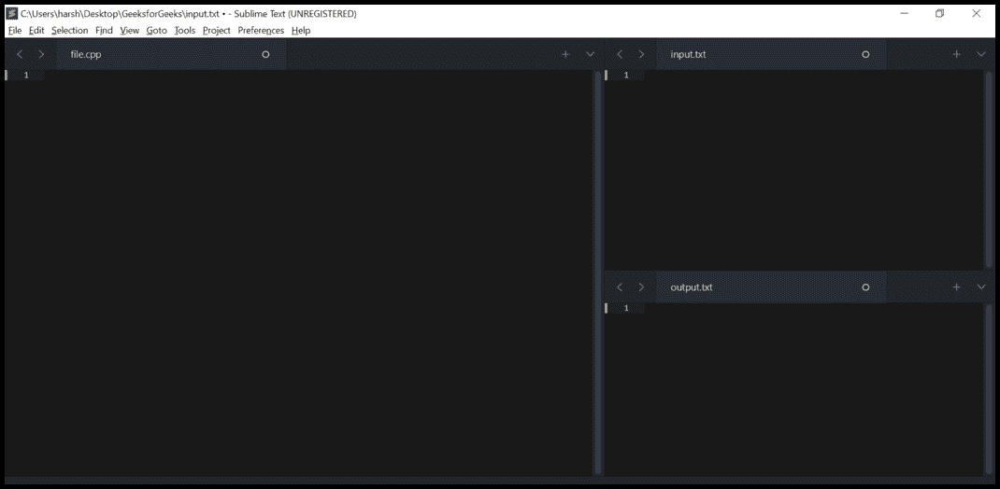

# 使用 C++ 在高级文本中进行定制调试，用于竞争性编程

> 原文:[https://www . geesforgeks . org/customized-debug-in-supreme-text-use-c-for-competitive-programming/](https://www.geeksforgeeks.org/customized-debugging-in-sublime-text-using-c-for-competitive-programming/)

[](https://www.geeksforgeeks.org/competitive-programming-a-complete-guide/)<u>竞技编程是一项脑力运动，它使我们能够在规定的约束下对给定的问题进行编码。本文的目的是指导每个人如何在竞赛中有效地调试他们的代码。</u>

<u>**先决条件:** [<u>为 C++ 竞争性编程环境设置崇高文本</u>](https://www.geeksforgeeks.org/setting-up-sublime-text-for-cpp-competitive-programming-environment/)</u>

<u>时间是宝贵的，在编码竞赛中时间非常重要。当编写代码时，错误确实会出现，程序员往往会花很多时间调试它。程序员经常在比赛中处理复杂的数据结构，并且需要在给定的时间限制内调试它们。</u>

<u>本文主要讨论如何在竞赛中高效调试 C++ 源代码，节省时间。首先，需要建立我们崇高文本的文件结构。以下是设置崇高文本文件结构的步骤。</u>

<u>**第一步:**打开**崇高文字**，按照以下步骤操作:</u>

> <u>1.创建三个文件:</u>
> 
> *   <u>**file.cpp:** 写代码的文件。</u>
> *   <u>**input TF . txt:**我们将给出输入的文件。</u>
> *   <u>**outputf.txt:** 将显示输出的文件。</u>
> 
> <u>2.现在，执行以下步骤:</u>
> 
> *   <u>**选择查看>布局>列:** **3** 。这将在工作区中创建三列。将三个文件移动到三列中。</u>
> *   <u>**选择查看>组>最大列数:2 :** input.txt 和 output . txt**T3 将堆叠成一列。**</u>

<u>您的崇高文本看起来类似于这样:</u>

<u>

**崇高文字**</u> 

<u>**第二步:**在主函数外创建一个局部函数。它用于从 input.txt 文件中获取输入，并在 output.txt 文件中显示输出。下面是相同的 C++ 代码片段。</u>

## <u>C++ </u>

```cpp
// Declare this function outside
// the main function
void local()
{
  // In case of online judges (like
  // codechef, codeforces etc) these
  // lines will be skipped. In other
  // words these lines would be executed
  // in Sublime Text only
  #ifndef ONLINE_JUDGE

  freopen("input.txt", "r", stdin);
  freopen("output.txt", "w", stdout);

  // ONLINE_JUDGE
  #endif
}
```

 <u>**第三步:**从主功能调用:</u>

```cpp
// Call from the main function
local();
```

<u>通过结合上述步骤，我们的完整计划将是:</u>

## <u>C++ </u>

```cpp
// C++ program to implement
// the above approach
#include <bits/stdc++.h>
using namespace std;

// Local function
void local()
{
  #ifndef ONLINE_JUDGE
  freopen("input.txt",
          "r", stdin);
  freopen("output.txt",
          "w", stdout);

  // ONLINE_JUDGE
  #endif
}

// Driver code
int main()
{
  local();
  return 0;
}
```

<u>**步骤 4:** 现在 IDE 看起来类似于这样:</u>

<u>

**崇高文字**</u> 

<u>**使用打印功能调试:**</u>

<u>每当我们需要打印一个变量或任何数据结构，如向量、集合、映射等时，在我们的程序中创建一个打印函数。下面是实现相同方法的 C++ 程序:</u>

## <u>C++ </u>

```cpp
// C++ program to implement
// the above approach
#include <bits/stdc++.h>
using namespace std;

// Driver code
int main()
{
  // Initializing a vector
  vector<int> vect = {2, 4, 10,
                      12, 17};

  // First operation
  for (auto& x : vect)
  {
    if (x % 2 == 0)
      x += 10;
    else
      x -= 10;
  }

  // Second operation
  for (auto& x : vect)
    x += 2;

  // Third operation
  for (auto& x : vect)
    x += 20;
}
```

<u>假设在我们的逻辑中出现了问题，由于在比赛期间没有获得期望的输出，因此在第一次操作之后要检查 [**<u>【向量】</u>**](https://www.geeksforgeeks.org/vector-in-cpp-stl/) 的状态，可以在接受向量的主函数之外创建一个打印函数。</u>

## <u>C++ </u>

```cpp
// print function outside the
// main function
void print(vector<int>& vect)
{
  cout << "vect " << ' ';
  cout << '[' << ' ';

  // Print vector elements
  for (auto x : vect)
  {
    cout << x << ' ';
  }
  cout << ']';
}
```

<u>每当需要检查向量元素时，可以调用 print() 函数，方法是将向量作为参数传递给 print 函数。</u>

```cpp
// Calling print function from main

print(vect);
```

<u>下面是完整的 C++ 程序来说明如何实现上述概念:</u>

## <u>C++ </u>

```cpp
// C++ program to implement
// the above concept
#include <bits/stdc++.h>
using namespace std;

// Print function for debugging
void print(vector<int>& vect)
{
  cout << "vect " << ' ';
  cout << '[' << ' ';

  // Print vector elements
  for (auto x : vect)
  {
    cout << x << ' ';
  }
  cout << ']';
}

// Driver code
int main()
{
  // Initializing a vector
  vector<int> vect = {2, 4, 10,
                      12, 17};

  // First operation
  for (auto& x : vect)
  {
    if (x % 2 == 0)
      x += 10;
    else
      x -= 10;
  }

  // Printing vect elements after
  // applying first operation
  // Checking the status of vect as
  // a part of debugging
  print(vect);

  // Second operation
  for (auto& x : vect)
    x += 2;

  // Third operation
  for (auto& x : vect)
    x += 20;

  int finalAnswer = 0;
  for (auto x : vect)
    finalAnswer += x;

  // Print the final answer
  cout << "\nFinal Answer: " <<
            finalAnswer;
  return 0;
}
```

<u>**Output**

```cpp
vect  [ 12 14 20 22 7 ]
Final Answer: 185
```</u> 

<u>**该方法的缺点:**</u>

*   <u>对于相同的数据结构但具有不同的数据类型，需要创建多个打印功能。比如有一个整数类型的向量和一个字符串类型的向量，那么为了打印元素，就需要在主函数之外创建两个打印函数。一个打印函数将接受整数类型的向量，另一个打印函数将接受字符串类型的向量。</u>
*   <u>向量的内容将与所需的值一起打印在同一个 output.txt 文件中，这可能会让我们感到困惑。</u>
*   <u>在最终将源代码文件提交给在线法官(Codeforces、Spoj、Codechef 等)之前，需要对用于从主功能调用打印功能的语句进行注释。</u>

<u>**使用模板调试:**</u>

<u>在上面的方法中，向量的数据类型是硬编码的。 [**<u>模板</u>**](https://www.geeksforgeeks.org/templates-cpp/) 可以在 C++ 中使用。在 C++ 中，模板是一个简单而又非常强大的工具。简单的想法是将数据类型作为参数传递，这样就不需要为不同的数据类型编写相同的代码(print 函数)。下面是模板的 C++ 代码片段:</u>

## <u>C++ </u>

```cpp
// One print function works for
// all data types.  This would work
// even for user defined types if
// operator '>' is overloaded
template <typename T>

void print(vector<T> vect)
{
    // body
}
```

<u>下面是完整的 C++ 程序来说明上述概念:</u>

## <u>C++ </u>

```cpp
// C++ program to implement
// the above approach
#include <bits/stdc++.h>
using namespace std;

// Using template so that this
// function works for all data
// types
template <typename T> void print(
          vector<T>& vect)
{
  cout << "vect " << ' ';
  cout << '[' << ' ';

  for (auto x : vect)
  {
    cout << x << ' ';
  }
  cout << ']';
  cout << '\n';
}

// Driver code
int main()
{
  vector<int> vect1 = {2, 4, 10,
                       12, 17};

  for (auto& x : vect1)
  {
    if (x % 2 == 0)
      x += 10;
    else
      x -= 10;
  }

  // Printing vect1 elements
  print(vect1);

  // Initializing a vector of
  // string type
  vector<string> vect2 = {"Geeks",
                          "for", "Geeks"};

  // Printing vect2 elements
  print(vect2);

  // Modifying vect2
  // push back string "is great"
  vect2.push_back("is the great");

  // Printing vect2 after modification
  print(vect2);

  int finalAnswer = 0;
  for (auto x : vect1)
    finalAnswer += x;
  cout << "Final Answer: " <<
           finalAnswer;
  return 0;
}
```

<u>**Output**</u>

```cpp
vect  [ 12 14 20 22 7 ]
vect  [ Geeks for Geeks ]
vect  [ Geeks for Geeks is the great ]
Final Answer: 75
```