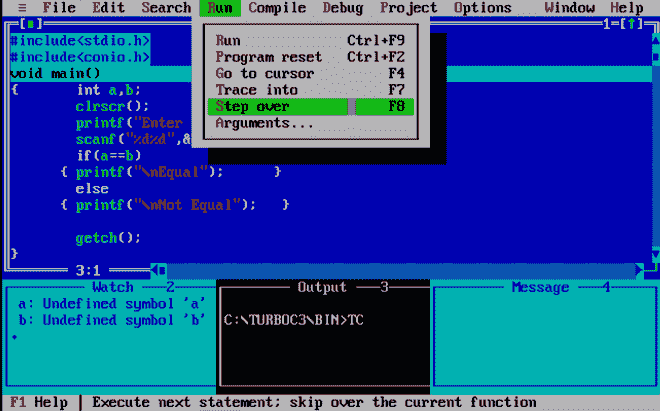

# Turbo c++中的调试

> 原文:[https://www.geeksforgeeks.org/debugging-in-turbo-cpp/](https://www.geeksforgeeks.org/debugging-in-turbo-cpp/)

调试是程序员检测并删除程序中现有或潜在的[错误/bug](https://www.geeksforgeeks.org/software-engineering-differences-between-defect-bug-and-failure/)的过程。这是编写有效代码的一个很好的实践。现在，Turbo C++为其社区提供了各种有用的特性。在我们的调试中起重要作用的一些选项是监视和跟踪。让我们通过以下程序来理解这些概念:

**示例:**编写一个程序来检查两个数字是否相等

现在通过下面提到的步骤来清楚地了解如何调试:

**第一步:**进入窗口菜单，点击下方*手表*。

**步骤 2:** 您将能够在 IDE 底部看到一个名为“Watch”的面板。

**第三步:**同样，从窗口菜单中，我们将选择*输出*和*消息*，然后点击平铺以获得更好的视图。

**第四步:**转到*调试*，然后在【手表】下选择*添加手表(或 Ctrl+F7)。*

**第五步:**屏幕上会出现一个对话框，显示“*输入表情添加为手表*”。输入“a”。

**第六步:**手表面板会显示添加‘a’作为手表表情的结果。

**第 7 步:**再次跟随第 5 步，输入‘b’。

**第 8 步:**进入运行选项，点击*追踪进入(或 F7)。*

**第九步:**你会注意到 void main()被高亮显示。这意味着我们的程序已经开始运行。

**第 10 步:**进入运行菜单，点击*跳过(或 F8)* 进入下一步。

**第 11 步:**上一步进入下一条语句。

**第 12 步:**按 F8 执行下一条语句。

**第 13 步:**步过(F8)。

**第 14 步:**进入下一步(F8)。

 **第 15 步:**在控制台输入 2 个数字。

**第 16 步:**看一下手表和输出面板。从用户获得输入后，编译器会覆盖变量中的值。

**第十七步:**按 F8。

请记住，从我们的*开始，如果条件*为真，编译器就不应该检查 *else 语句*。

**第 18 步:**按 F8 进入下一步。

**第 19 步:**按 F8 查看下一步是什么。您现在可以看到输出屏幕。

**第 20 步:**按 F8 查看接下来会发生什么。

请注意，右括号现在高亮显示，这意味着程序已经结束。如果再次按下 F8，程序将从第一步重新运行。