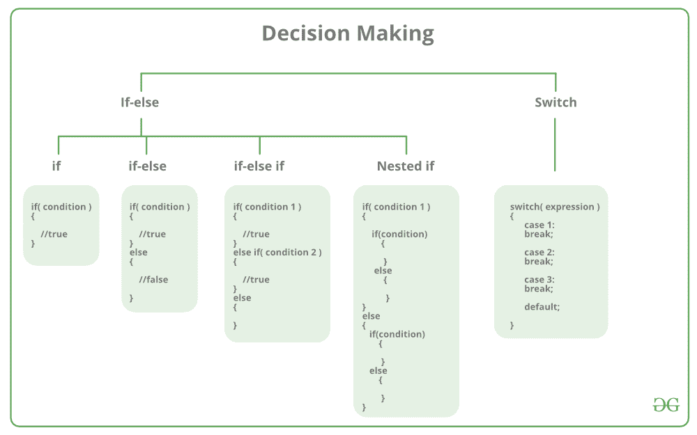
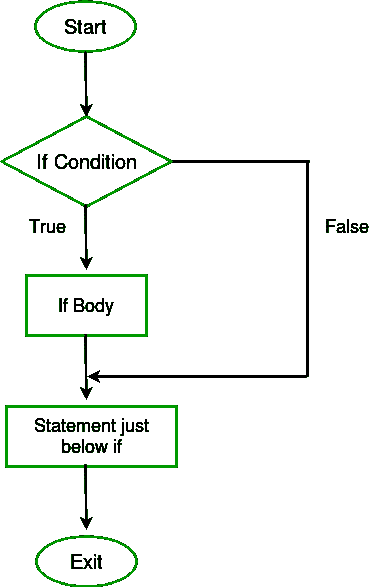
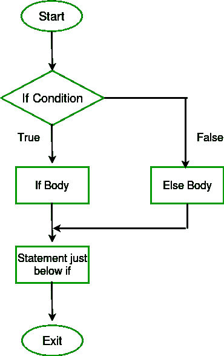
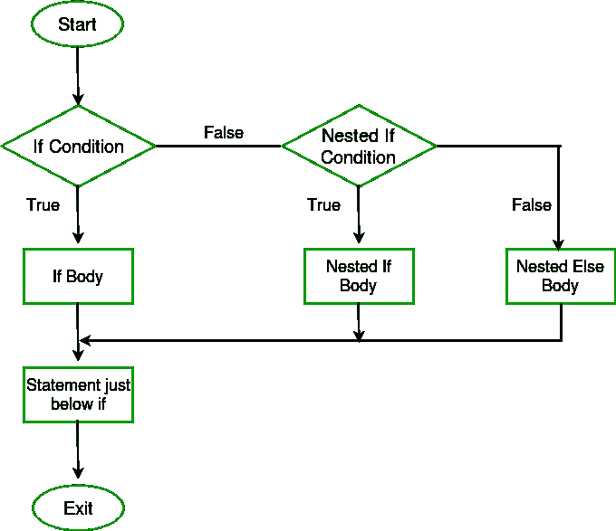
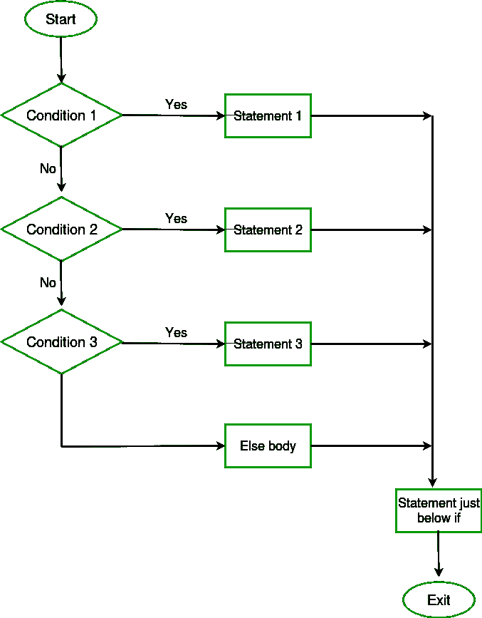
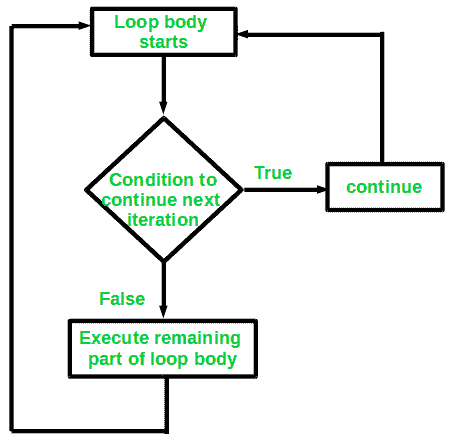
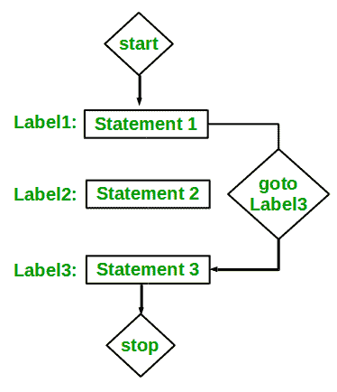

# C/c++中的决策(如果，如果..else，Nested if，if-else-if )

> 原文:[https://www . geesforgeks . org/decision-c-c-else-nested-else/](https://www.geeksforgeeks.org/decision-making-c-c-else-nested-else/)

在现实生活中，有些情况下我们需要做出一些决定，根据这些决定，我们决定下一步该做什么。类似的情况也会出现在编程中，我们需要做出一些决定，并根据这些决定执行下一个代码块。例如，在 C 中，如果 x 出现，则执行 y else 执行 z。也可以有多个条件，如在 C 中，如果 x 出现，则执行 p，否则如果条件 y 出现，则执行 q，否则执行 r。C else-if 的这个条件是导入多个条件的许多方法之一。



编程语言中的决策语句决定了程序执行流程的方向。C 或 C++中可用的决策语句有:

1.  [if 语句](#if)
2.  [如果..else 语句](#if-else)
3.  [嵌套 if 语句](#nested-if)
4.  [if-else-if 阶梯](#if-else-if)
5.  [切换语句](https://www.geeksforgeeks.org/switch-statement-cc/)
6.  [跳转语句:](#jmp)
    1.  [断开](#brk)
    2.  [继续](#cont)
    3.  [转到](#got)
    4.  [返回](#ret)

**if 语句用 C/C++**

if 语句是最简单的决策语句。它用于决定是否执行某个语句或语句块，即如果某个条件为真，则执行某个语句块，否则不执行。
**语法** :

```cpp
if(condition) 
{
   // Statements to execute if
   // condition is true
}
```

这里评估后的**条件**不是真就是假。如果语句接受布尔值-如果值为真，那么它将执行它下面的语句块，否则不执行。如果我们没有在 If(condition)之后提供花括号“{ 0 }”和“}”，那么默认情况下，if 语句会将紧接在它下面的第一个语句视为在其块内。
**例** :

```cpp
if(condition)
   statement1;
   statement2;

// Here if the condition is true, if block 
// will consider only statement1 to be inside 
// its block.
```

**流程图**



## C

```cpp
// C program to illustrate If statement
#include <stdio.h>

int main() {
    int i = 10;

    if (i > 15)
    {
       printf("10 is less than 15");
    }   

    printf("I am Not in if");
}
```

## C++

```cpp
// C++ program to illustrate If statement
#include<iostream>
using namespace std;

    int main()
    {
        int i = 10;

        if (i > 15)
        {
           cout<<"10 is less than 15";
        }   

        cout<<"I am Not in if";
    }
```

**Output:** 

```cpp
I am Not in if
```

因为 if 语句中的条件为假。所以，if 语句下面的块没有被执行。

**C/c++中的 if-else**

仅 *if* 语句就告诉我们，如果条件为真，它将执行一组语句，如果条件为假，它不会执行。但是如果条件是假的，我们想做别的事情怎么办。C *else* 语句来了。如果条件为假，我们可以使用 *else* 语句和 *if* 语句来执行一段代码。
**语法** :

```cpp
if (condition)
{
    // Executes this block if
    // condition is true
}
else
{
    // Executes this block if
    // condition is false
}
```

**流程图** :



**例:**

## C

```cpp
// C program to illustrate If statement
#include <stdio.h>

int main() {
    int i = 20;

    if (i < 15){

        printf("i is smaller than 15");
    }
    else{

        printf("i is greater than 15");
    }       
    return 0;   
}
```

## C++

```cpp
// C++ program to illustrate if-else statement
#include<iostream>
using namespace std;

int main()
 {
        int i = 20;

        if (i < 15)
            cout<<"i is smaller than 15";
        else
            cout<<"i is greater than 15";

    return 0;   
 }
```

**Output:** 

```cpp
i is greater than 15
```

如果语句为假，则*否则*语句后面的代码块将作为*中的条件执行。* 

**嵌套-如果在 C/C++中**

C 中的嵌套 if 是一个 if 语句，它是另一个 if 语句的目标。嵌套的 if 语句意味着一个 if 语句在另一个 if 语句中。是的，C 和 C++都允许我们在 if 语句中嵌套 if 语句，也就是说，我们可以将一个 if 语句放在另一个 if 语句中。
**语法:**

```cpp
if (condition1) 
{
   // Executes when condition1 is true
   if (condition2) 
   {
      // Executes when condition2 is true
   }
}
```

**流程图**



**例:**

## C

```cpp
// C program to illustrate nested-if statement
#include <stdio.h>

int main() {
    int i = 10;

    if (i == 10)
    {
        // First if statement
        if (i < 15)
           printf("i is smaller than 15\n");

        // Nested - if statement
        // Will only be executed if statement above
        // is true
        if (i < 12)
            printf("i is smaller than 12 too\n");
        else
            printf("i is greater than 15");
    }

    return 0;
}
```

## C++

```cpp
// C++ program to illustrate nested-if statement
#include <iostream>
using namespace std;

int main()
{
    int i = 10;

    if (i == 10)
    {
        // First if statement
        if (i < 15)
           cout<<"i is smaller than 15\n";

        // Nested - if statement
        // Will only be executed if statement above
        // is true
        if (i < 12)
            cout<<"i is smaller than 12 too\n";
        else
            cout<<"i is greater than 15";
    }

    return 0;
}
```

**Output:** 

```cpp
i is smaller than 15
i is smaller than 12 too
```

**C/c++中的 if-else-if 阶梯**

在这里，用户可以在多个选项中进行选择。C if 语句是从上到下执行的。一旦控制 if 的条件之一为真，就执行与该 if 相关联的语句，并绕过 C else-if 阶梯的其余部分。如果这些条件都不成立，那么将执行最后的 else 语句。
**语法:**

```cpp
if (condition)
    statement;
else if (condition)
    statement;
.
.
else
    statement;
```



**例:**

## C

```cpp
// C program to illustrate nested-if statement
#include <stdio.h>

int main() {
    int i = 20;

    if (i == 10)
        printf("i is 10");
    else if (i == 15)
        printf("i is 15");
    else if (i == 20)
        printf("i is 20");
    else
        printf("i is not present");
}
```

## C++

```cpp
// C++ program to illustrate if-else-if ladder
#include<iostream>
using namespace std;

int main()
{
    int i = 20;

    if (i == 10)
        cout<<"i is 10";
    else if (i == 15)
        cout<<"i is 15";
    else if (i == 20)
        cout<<"i is 20";
    else
        cout<<"i is not present";
}
```

**Output:** 

```cpp
i is 20
```

**C/c++中的跳转语句**

这些语句在 C orC++中用于程序中所有函数的无条件控制流。它们支持四种类型的跳转语句:

1.  [**C break:**](https://www.geeksforgeeks.org/break-statement-cc/) 此循环控制语句用于终止循环。一旦在循环中遇到 break 语句，循环迭代就停止在那里，控制立即从循环返回到循环后的第一个语句。
    **语法:**

```cpp
break;
```

1.  基本上，break 语句用于我们不确定循环的实际迭代次数或者我们想要基于某种条件终止循环的情况。


1.  **例:**

## C

```cpp
// C program to illustrate
// Linear Search

#include <stdio.h>

void findElement(int arr[], int size, int key)
{
    // loop to traverse array and search for key
    for (int i = 0; i < size; i++) {
        if (arr[i] == key) {
            printf("Element found at position: %d", (i + 1));
            break;
        }
    }
}

int main() {
    int arr[] = { 1, 2, 3, 4, 5, 6 };

    // no of elements
    int n = 6; 

    // key to be searched
    int key = 3;

    // Calling function to find the key
    findElement(arr, n, key);

    return 0;
}
```

## C++

```cpp
// CPP program to illustrate
// Linear Search
#include <iostream>
using namespace std;

void findElement(int arr[], int size, int key)
{
    // loop to traverse array and search for key
    for (int i = 0; i < size; i++) {
        if (arr[i] == key) {
            cout << "Element found at position: " << (i + 1);
            break;
        }
    }
}

// Driver program to test above function
int main()
{
    int arr[] = { 1, 2, 3, 4, 5, 6 };
    int n = 6; // no of elements
    int key = 3; // key to be searched

    // Calling function to find the key
    findElement(arr, n, key);

    return 0;
}
```

**Output:** 

```cpp
Element found at position: 3
```

2.  [**C**](https://www.geeksforgeeks.org/continue-statement-cpp/) 继续 [**:**](https://www.geeksforgeeks.org/continue-statement-cpp/) 这个循环控制语句就像 [break 语句](https://www.geeksforgeeks.org/break-statement-cc/)一样。 *continue* 语句与 break *语句*相反，它不是终止循环，而是强制执行循环的下一次迭代。
    顾名思义，continue 语句强制循环继续或执行下一次迭代。当 continue 语句在循环中执行时，将跳过 continue 语句后面的循环中的代码，并开始循环的下一次迭代。
    **语法:**

```cpp
continue;
```



1.  **例:**

## C

```cpp
// C program to explain the use
// of continue statement
#include <stdio.h>

int main() {
    // loop from 1 to 10
    for (int i = 1; i <= 10; i++) {

        // If i is equals to 6,
        // continue to next iteration
        // without printing
        if (i == 6)
            continue;

        else
            // otherwise print the value of i
            printf("%d ", i);
    }

    return 0;
}
```

## C++

```cpp
// C++ program to explain the use
// of continue statement

#include <iostream>
using namespace std;

int main()
{
    // loop from 1 to 10
    for (int i = 1; i <= 10; i++) {

        // If i is equals to 6,
        // continue to next iteration
        // without printing
        if (i == 6)
            continue;

        else
            // otherwise print the value of i
            cout << i << " ";
    }

    return 0;
}
```

**Output:** 

```cpp
1 2 3 4 5 7 8 9 10
```

如果在 C/C++的 if-else 中创建一个变量，它将只位于 if/else 块的本地。您可以在 if/else 块中使用全局变量。如果您在 if/else 中创建的变量名称与任何全局变量相同，则优先考虑“局部变量”。

## C++

```cpp
#include<iostream>
using namespace std;

int main(){
    int gfg=0; // local variable for main
    cout<<"Before if-else block "<<gfg<<endl;
    if(1){
        int gfg = 100; // new local variable of if block
        cout<<"if block "<<gfg<<endl;
    }
    cout<<"After if block "<<gfg<<endl;
    return 0;
}
/*
    Before if-else block 0
    if block 100
    After if block 0
*/
```

## C

```cpp
#include <stdio.h>

int main() {

      int gfg=0; // local variable for main
    printf("Before if-else block %d\n",gfg);
    if(1){
        int gfg = 100; // new local variable of if block
        printf("if block %d\n",gfg);
    }
    printf("After if block %d",gfg);
  return 0;
}
```

1.  [**C goto:**](https://www.geeksforgeeks.org/goto-statement-in-c-cpp/)C/c++中的 goto 语句也称为无条件跳转语句，可以用来在函数内从一个点跳转到另一个点。
    **语法** :

```cpp
Syntax1      |   Syntax2
----------------------------
goto label;  |    label:  
.            |    .
.            |    .
.            |    .
label:       |    goto label;
```

1.  在上面的语法中，第一行告诉编译器转到或跳转到标记为标签的语句。这里的标签是用户定义的标识符，表示目标语句。紧跟在“label:”后面的语句是目标语句。“label:”也可以出现在“goto label 之前语句。



1.  下面是一些如何使用 goto 语句的例子:
    **例子:**

## C

```cpp
// C program to print numbers
// from 1 to 10 using goto statement
#include <stdio.h>

// function to print numbers from 1 to 10
void printNumbers()
{
    int n = 1;
label:
    printf("%d ",n);
    n++;
    if (n <= 10)
        goto label;
}

// Driver program to test above function
int main() {
    printNumbers();
    return 0;
}
```

## C++

```cpp
// C++ program to print numbers
// from 1 to 10 using goto statement
#include <iostream>
using namespace std;

// function to print numbers from 1 to 10
void printNumbers()
{
    int n = 1;
label:
    cout << n << " ";
    n++;
    if (n <= 10)
        goto label;
}

// Driver program to test above function
int main()
{
    printNumbers();
    return 0;
}
```

**Output:** 

```cpp
1 2 3 4 5 6 7 8 9 10
```

2.  [**C 返回:**](https://www.geeksforgeeks.org/return-statement-in-c-cpp-with-examples/)C 或 C++中的返回将执行的流程返回到调用它的函数。这个语句不一定需要任何条件语句。语句一执行，程序流就立即停止，并从调用它的地方返回控件。return 语句可以为 void 函数返回任何东西，也可以不返回任何东西，但是对于非 void 函数，必须返回一个返回值。
    **语法:**

```cpp
return[expression];
```

1.  **例:**

## C

```cpp
// C code to illustrate return
// statement
#include <stdio.h>

// non-void return type
// function to calculate sum
int SUM(int a, int b)
{
    int s1 = a + b;
    return s1;
}

// returns void
// function to print
void Print(int s2)
{
    printf("The sum is %d", s2);
    return;
}

int main()
{
    int num1 = 10;
    int num2 = 10;
    int sum_of = SUM(num1, num2);
    Print(sum_of);
    return 0;
}
```

## C++

```cpp
// C++ code to illustrate return
// statement
#include <iostream>
using namespace std;

// non-void return type
// function to calculate sum
int SUM(int a, int b)
{
    int s1 = a + b;
    return s1;
}

// returns void
// function to print
void Print(int s2)
{
    cout << "The sum is "<< s2;
    return;
}

int main()
{
    int num1 = 10;
    int num2 = 10;
    int sum_of = SUM(num1, num2);
    Print(sum_of);
    return 0;
}
```

**Output:** 

```cpp
The sum is 20
```

？list = plqm 7 alhxfysgg 6 gsrme 2 ini 4k 8 fph 5 qvb

This article is contributed by [**Harsh Agarwal**](https://www.facebook.com/harsh.agarwal.16752). If you like GeeksforGeeks and would like to contribute, you can also write an article using [write.geeksforgeeks.org](https://write.geeksforgeeks.org) or mail your article to review-team@geeksforgeeks.org. See your article appearing on the GeeksforGeeks main page and help other Geeks.Please write comments if you find anything incorrect, or you want to share more information about the topic discussed above.